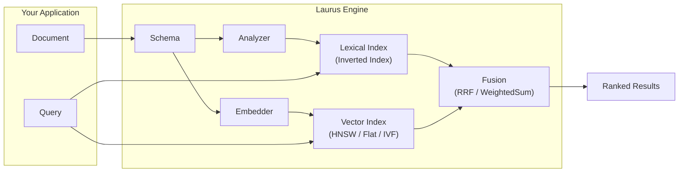

# Laurus

**Rust 向けの高速で多機能なハイブリッド検索ライブラリ。**

Laurus は、**Lexical 検索**（転置インデックス（Inverted Index）によるキーワードマッチング）と **Vector 検索**（エンベディングによるセマンティック類似度検索）を単一のエンジンに統合した、純 Rust ライブラリです。外部サーバーを必要とせず、Rust アプリケーションに直接組み込んで使用できます。

## 主な機能

| 機能 | 説明 |
| :--- | :--- |
| **Lexical 検索** | BM25 スコアリングを備えた転置インデックスによる全文検索 |
| **Vector 検索** | Flat、HNSW、IVF インデックスを用いた近似最近傍探索（ANN） |
| **ハイブリッド検索** | Lexical と Vector の検索結果を融合アルゴリズム（RRF、WeightedSum）で統合 |
| **テキスト解析** | プラガブルなアナライザパイプライン — トークナイザ、フィルタ、ステマー、シノニム |
| **エンベディング** | Candle（ローカル BERT/CLIP）、OpenAI API、カスタムエンベッダをビルトインサポート |
| **ストレージ** | プラガブルなバックエンド — インメモリ、ファイルベース、メモリマップド |
| **Query DSL** | Lexical、Vector、ハイブリッド検索のための人間が読みやすいクエリ構文 |
| **純 Rust** | コアに C/C++ 依存なし — 安全でポータブル、ビルドも容易 |

## 仕組み



1. **スキーマを定義する** — フィールドとその型（text、integer、vector など）を宣言します
2. **Engine を構築する** — テキスト用のアナライザと Vector 用のエンベッダを接続します
3. **ドキュメントをインデックスする** — Engine が各フィールドを適切なインデックスに自動的に振り分けます
4. **検索する** — Lexical、Vector、またはハイブリッドクエリを実行し、ランク付けされた結果を取得します

## ドキュメントマップ

| セクション | 学べること |
| :--- | :--- |
| [はじめに](getting_started.md) | Laurus をインストールし、数分で最初の検索を実行する |
| [アーキテクチャ](architecture.md) | Engine のコンポーネントとデータフローを理解する |
| [コアコンセプト](concepts/schema_and_fields.md) | スキーマ、テキスト解析、エンベディング、ストレージ |
| [インデクシング](concepts/indexing.md) | 転置インデックスと Vector インデックスの内部動作 |
| [検索](concepts/search.md) | クエリの種類、Vector 検索、ハイブリッド融合 |
| [Query DSL](concepts/query_dsl.md) | すべての検索タイプに対応した人間が読みやすいクエリ構文 |
| [ライブラリ (laurus)](laurus/overview.md) | Engine の内部構造、スコアリング、ファセット、拡張性 |
| [CLI (laurus-cli)](cli/overview.md) | インデックス管理と検索のためのコマンドラインツール |
| [サーバー (laurus-server)](server/overview.md) | HTTP Gateway を備えた gRPC サーバー |
| [開発ガイド](development/build_and_test.md) | Laurus のビルド、テスト、コントリビュート |

## クイックサンプル

```rust
use std::sync::Arc;
use laurus::{Document, Engine, Schema, SearchRequestBuilder, Result};
use laurus::lexical::{TextOption, TermQuery};
use laurus::storage::memory::MemoryStorage;

#[tokio::main]
async fn main() -> Result<()> {
    // 1. Storage
    let storage = Arc::new(MemoryStorage::new(Default::default()));

    // 2. Schema
    let schema = Schema::builder()
        .add_text_field("title", TextOption::default())
        .add_text_field("body", TextOption::default())
        .add_default_field("body")
        .build();

    // 3. Engine
    let engine = Engine::builder(storage, schema).build().await?;

    // 4. Index a document
    let doc = Document::builder()
        .add_text("title", "Hello Laurus")
        .add_text("body", "A fast search library for Rust")
        .build();
    engine.add_document("doc-1", doc).await?;
    engine.commit().await?;

    // 5. Search
    let request = SearchRequestBuilder::new()
        .lexical_search_request(
            laurus::LexicalSearchRequest::new(
                Box::new(TermQuery::new("body", "rust"))
            )
        )
        .limit(10)
        .build();
    let results = engine.search(request).await?;

    for r in &results {
        println!("{}: score={:.4}", r.id, r.score);
    }
    Ok(())
}
```

## ライセンス

Laurus は [MIT ライセンス](https://opensource.org/licenses/MIT) のもとで提供されています。
