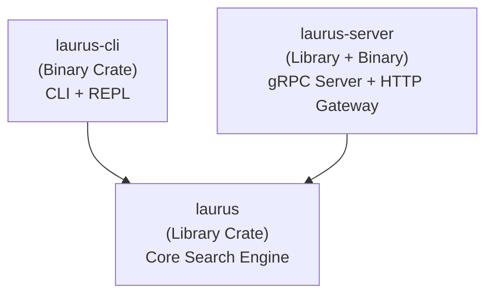
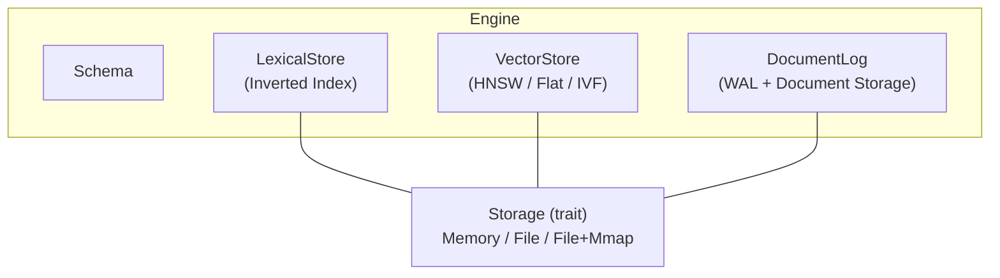
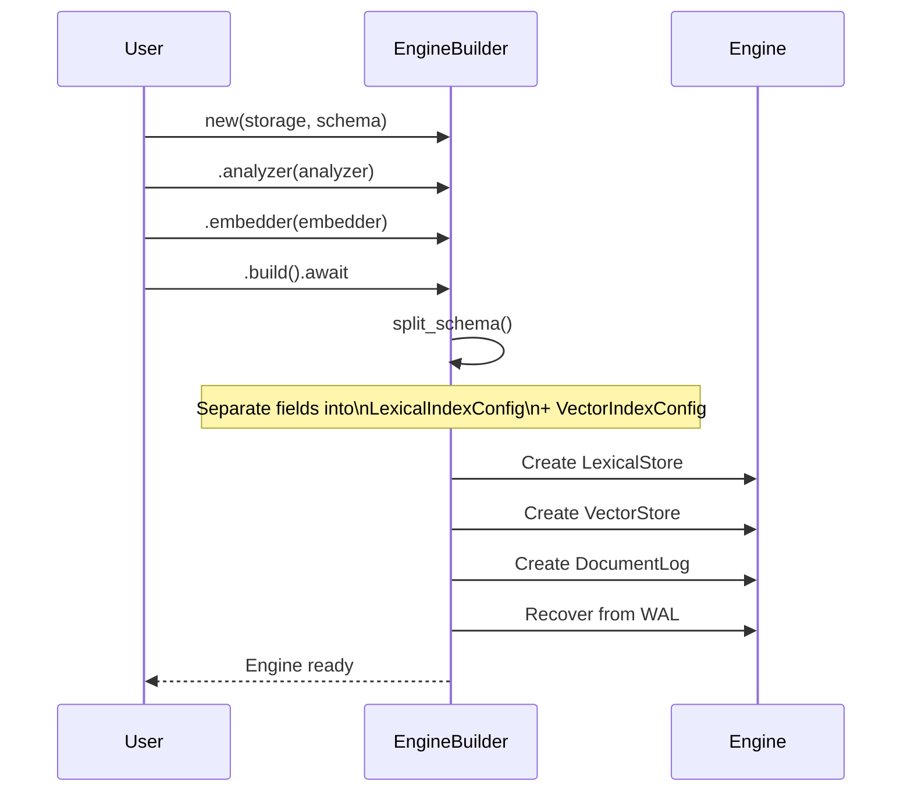
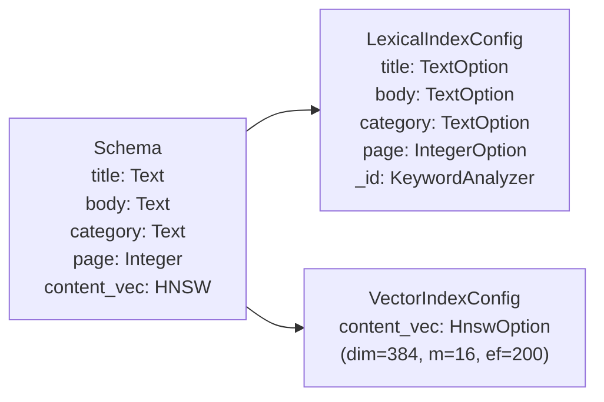
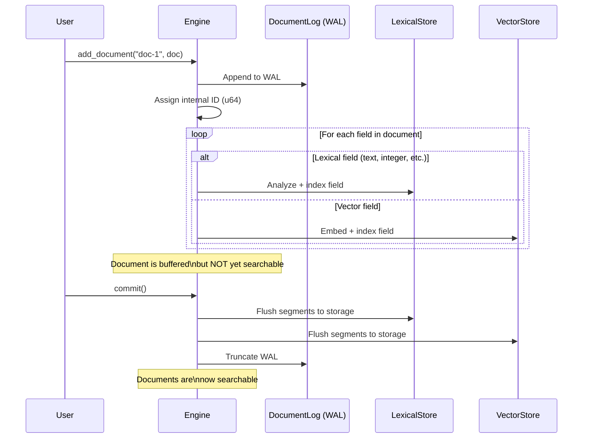
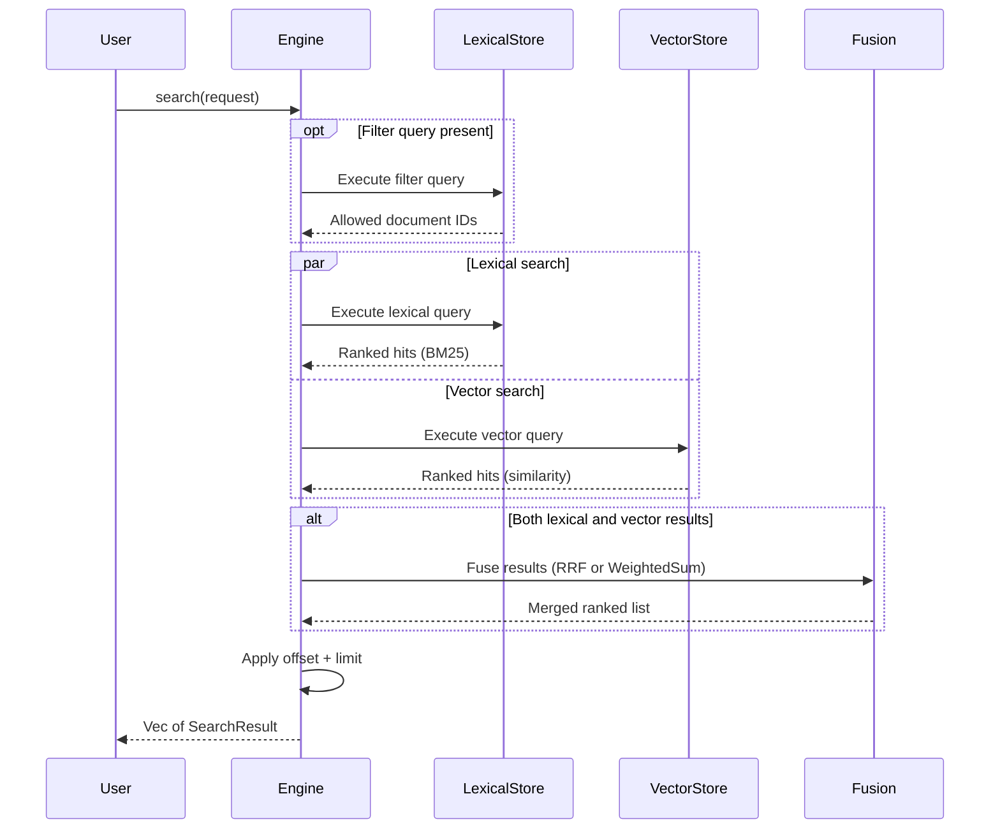
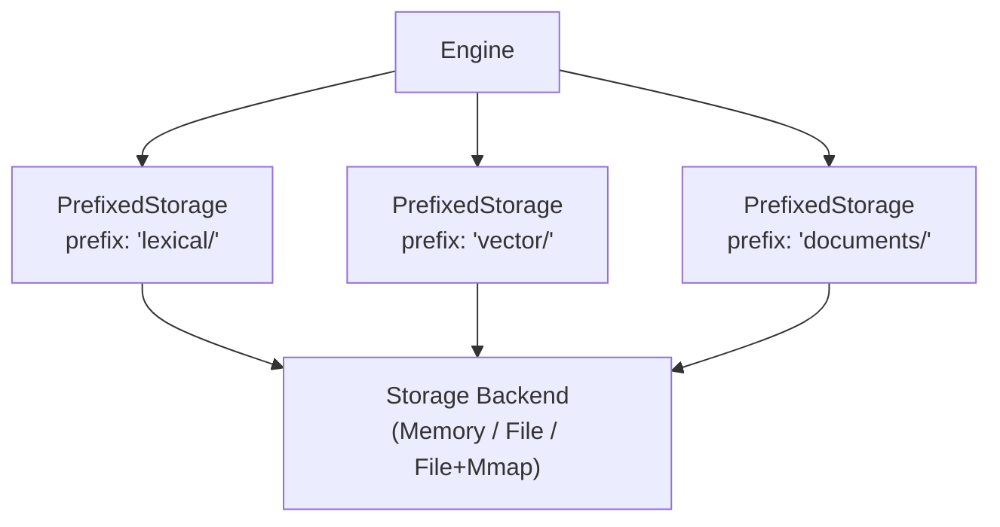
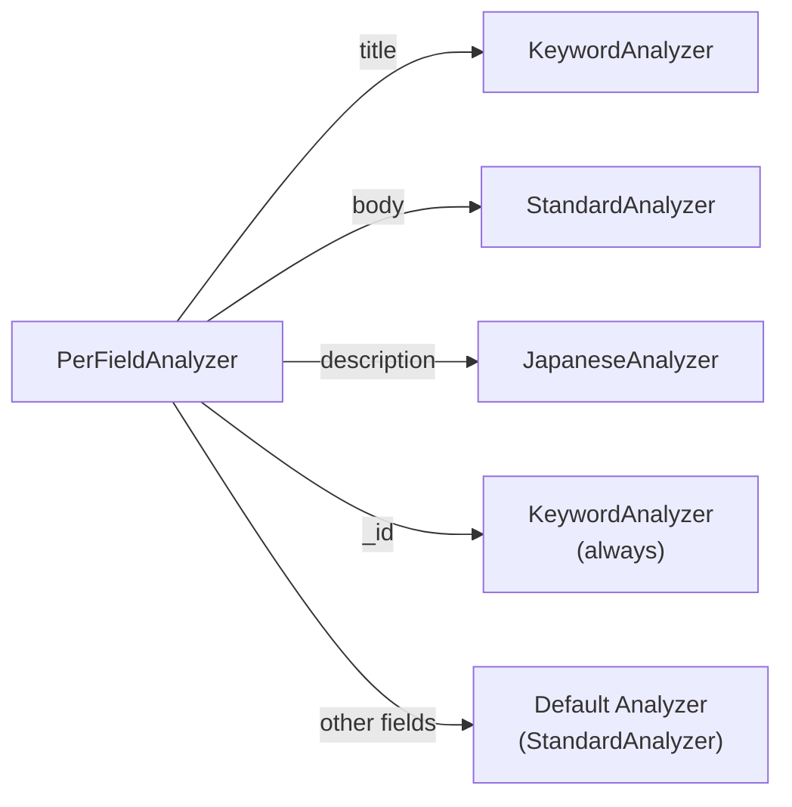

# アーキテクチャ

このページでは、Laurus の内部構造について説明します。アーキテクチャを理解することで、スキーマ設計、Analyzer の選択、検索戦略についてより適切な判断ができるようになります。

## プロジェクト構成

Laurus は Cargo workspace として 3 つのクレートで構成されています。



| クレート | 種類 | 説明 |
| :--- | :--- | :--- |
| **laurus** | Library | コア検索エンジン -- Lexical 検索、Vector 検索、ハイブリッド検索 |
| **laurus-cli** | Binary | インデックス管理と検索のためのコマンドラインインターフェース |
| **laurus-server** | Library + Binary | オプションの HTTP/JSON ゲートウェイ付き gRPC サーバー |

各クレートの詳細については以下を参照してください。

- [ライブラリ概要](laurus.md)
- [CLI 概要](laurus-cli.md)
- [サーバー概要](laurus-server.md)

## 全体概要

Laurus は単一の `Engine` を中心に構成されており、4 つの内部コンポーネントを統括します。



| コンポーネント | 役割 |
| :--- | :--- |
| **Schema** | フィールドとその型を宣言し、各フィールドのルーティング先を決定する |
| **LexicalStore** | キーワード検索のための転置インデックス（Inverted Index）（BM25 スコアリング） |
| **VectorStore** | 類似度検索のためのベクトルインデックス（Flat、HNSW、または IVF） |
| **DocumentLog** | 耐久性のための WAL（Write-Ahead Log）+ ドキュメントストレージ |

3 つのストアはすべて単一の `Storage` バックエンドを共有し、キープレフィックス（`lexical/`、`vector/`、`documents/`）によって分離されています。

## Engine のライフサイクル

### Engine の構築

`EngineBuilder` が各パーツから Engine を組み立てます。

```rust
let engine = Engine::builder(storage, schema)
    .analyzer(analyzer)      // optional: for text fields
    .embedder(embedder)      // optional: for vector fields
    .build()
    .await?;
```



`build()` 時に Engine は以下の処理を行います。

1. **スキーマの分割** — Lexical フィールドは `LexicalIndexConfig` へ、Vector フィールドは `VectorIndexConfig` へ振り分けられる
2. **プレフィックス付きストレージの作成** — 各コンポーネントが分離された名前空間を取得する（`lexical/`、`vector/`、`documents/`）
3. **ストアの初期化** — `LexicalStore` と `VectorStore` がそれぞれの設定で構築される
4. **WAL からの復旧** — 前回のセッションからの未コミット操作を再生する

### スキーマの分割

`Schema` には Lexical フィールドと Vector フィールドの両方が含まれています。ビルド時に `split_schema()` がこれらを分離します。



主なポイント:

- 予約フィールド `_id` は常に `KeywordAnalyzer`（完全一致）で Lexical 設定に追加される
- `PerFieldAnalyzer` はフィールドごとの Analyzer 設定をラップする。単純な `StandardAnalyzer` を渡した場合、すべてのテキストフィールドのデフォルトとなる
- `PerFieldEmbedder` も Vector フィールドに対して同様に動作する

## インデクシングのデータフロー

`engine.add_document(id, doc)` を呼び出した場合の処理:



主なポイント:

- **WAL 優先**: すべての書き込みは、インメモリ構造を変更する前にログに記録される
- **デュアルインデクシング**: 各フィールドはスキーマに基づいて Lexical ストアまたは Vector ストアのいずれかにルーティングされる
- **コミットが必要**: ドキュメントは `commit()` の後にのみ検索可能になる

## 検索のデータフロー

`engine.search(request)` を呼び出した場合の処理:



検索パイプラインは 3 つのステージで構成されています。

1. **フィルタ**（オプション） — Lexical インデックスに対してフィルタクエリを実行し、許可されたドキュメント ID のセットを取得する
2. **検索** — Lexical クエリと Vector クエリを並列に実行する
3. **フュージョン** — 両方のクエリタイプが存在する場合、RRF（デフォルト、k=60）または WeightedSum を使用して結果をマージする

## ストレージアーキテクチャ

すべてのコンポーネントは単一の `Storage` trait 実装を共有しますが、キープレフィックスを使用してデータを分離します。



| バックエンド | 説明 | 最適な用途 |
| :--- | :--- | :--- |
| `MemoryStorage` | すべてのデータをメモリ上に保持 | テスト、小規模データセット、一時的な利用 |
| `FileStorage` | 標準的なファイル I/O | 一般的な本番利用 |
| `FileStorage` (mmap) | メモリマップドファイル（`use_mmap = true`） | 大規模データセット、読み取り負荷の高いワークロード |

## フィールドごとのディスパッチ

`PerFieldAnalyzer` が提供されている場合、Engine はフィールド固有の Analyzer に解析処理をディスパッチします。同様のパターンが `PerFieldEmbedder` にも適用されます。



これにより、同一 Engine 内で異なるフィールドに異なる解析戦略を使用できます。

## まとめ

| 項目 | 詳細 |
| :--- | :--- |
| **コア構造体** | `Engine` — すべての操作を統括する |
| **ビルダー** | `EngineBuilder` — Storage + Schema + Analyzer + Embedder から Engine を組み立てる |
| **スキーマ分割** | Lexical フィールド → `LexicalIndexConfig`、Vector フィールド → `VectorIndexConfig` |
| **書き込みパス** | WAL → インメモリバッファ → `commit()` → 永続ストレージ |
| **読み取りパス** | クエリ → 並列 Lexical/Vector 検索 → フュージョン → ランク付き結果 |
| **ストレージ分離** | `PrefixedStorage` による `lexical/`、`vector/`、`documents/` プレフィックス |
| **フィールドごとのディスパッチ** | `PerFieldAnalyzer` と `PerFieldEmbedder` がフィールド固有の実装にルーティングする |

## 次のステップ

- フィールドタイプとスキーマ設計を理解する: [スキーマとフィールド](concepts/schema_and_fields.md)
- テキスト解析について学ぶ: [テキスト解析](concepts/analysis.md)
- Embedding について学ぶ: [Embedding](concepts/embedding.md)
