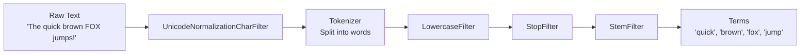
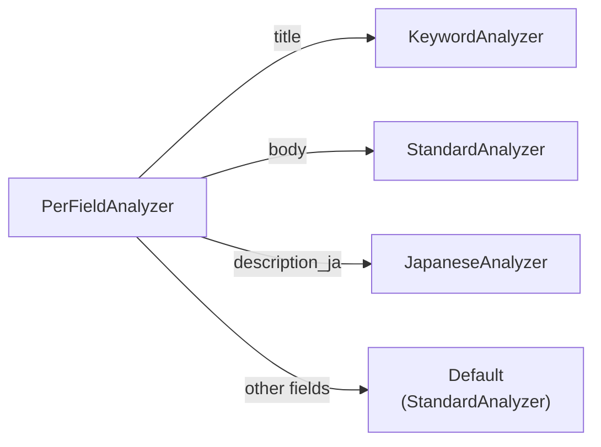

# テキスト解析

テキスト解析（Text Analysis）は、生のテキストを検索可能なトークンに変換するプロセスです。ドキュメントがインデクシングされる際、Analyzer がテキストフィールドを個々のタームに分割します。クエリが実行される際も、同じ Analyzer がクエリテキストを処理し、一貫性を確保します。

## 解析パイプライン



解析パイプラインは以下で構成されます。

1. **Char Filter** — トークン化の前に文字レベルで生テキストを正規化する
2. **Tokenizer** — テキストを生トークン（単語、文字、n-gram）に分割する
3. **Token Filter** — トークンの変換、削除、展開を行う（小文字化、ストップワード除去、ステミング、同義語展開）

## Analyzer トレイト

すべての Analyzer は `Analyzer` トレイトを実装します。

```rust
pub trait Analyzer: Send + Sync + Debug {
    fn analyze(&self, text: &str) -> Result<TokenStream>;
    fn name(&self) -> &str;
    fn as_any(&self) -> &dyn Any;
}
```

`TokenStream` は `Box<dyn Iterator<Item = Token> + Send>` であり、トークンの遅延イテレータです。

`Token` には以下のフィールドが含まれます。

| フィールド | 型 | 説明 |
| :--- | :--- | :--- |
| `text` | `String` | トークンテキスト |
| `position` | `usize` | 元テキスト内の位置 |
| `start_offset` | `usize` | 元テキスト内の開始バイトオフセット |
| `end_offset` | `usize` | 元テキスト内の終了バイトオフセット |
| `position_increment` | `usize` | 前のトークンからの距離 |
| `position_length` | `usize` | トークンのスパン（同義語の場合は 1 より大きい） |
| `boost` | `f32` | トークンレベルのスコアリング重み |
| `stopped` | `bool` | ストップワードとしてマークされているかどうか |
| `metadata` | `Option<TokenMetadata>` | 追加のトークンメタデータ |

## 組み込み Analyzer

### StandardAnalyzer

デフォルトの Analyzer です。ほとんどの西洋言語に適しています。

パイプライン: `RegexTokenizer`（Unicode 単語境界） → `LowercaseFilter` → `StopFilter`（128 個の一般的な英語ストップワード）

```rust
use laurus::analysis::analyzer::standard::StandardAnalyzer;

let analyzer = StandardAnalyzer::default();
// "The Quick Brown Fox" → ["quick", "brown", "fox"]
// ("The" is removed by stop word filtering)
```

### JapaneseAnalyzer

日本語テキストの分割に形態素解析を使用します。

パイプライン: `UnicodeNormalizationCharFilter`（NFKC） → `JapaneseIterationMarkCharFilter` → `LinderaTokenizer` → `LowercaseFilter` → `StopFilter`（日本語ストップワード）

```rust
use laurus::analysis::analyzer::japanese::JapaneseAnalyzer;

let analyzer = JapaneseAnalyzer::new()?;
// "東京都に住んでいる" → ["東京", "都", "に", "住ん", "で", "いる"]
```

### KeywordAnalyzer

入力全体を単一のトークンとして扱います。トークン化や正規化は行いません。

```rust
use laurus::analysis::analyzer::keyword::KeywordAnalyzer;

let analyzer = KeywordAnalyzer::new();
// "Hello World" → ["Hello World"]
```

完全一致が必要なフィールド（カテゴリ、タグ、ステータスコード）に使用してください。

### SimpleAnalyzer

フィルタリングなしでテキストをトークン化します。元の大文字小文字とすべてのトークンが保持されます。解析パイプラインを完全に制御したい場合や、Tokenizer を単独でテストしたい場合に便利です。

パイプライン: ユーザー指定の `Tokenizer` のみ（Char Filter なし、Token Filter なし）

```rust
use laurus::analysis::analyzer::simple::SimpleAnalyzer;
use laurus::analysis::tokenizer::regex::RegexTokenizer;
use std::sync::Arc;

let tokenizer = Arc::new(RegexTokenizer::new()?);
let analyzer = SimpleAnalyzer::new(tokenizer);
// "Hello World" → ["Hello", "World"]
// (no lowercasing, no stop word removal)
```

Tokenizer のテストや、別のステップで手動で Token Filter を適用したい場合に使用してください。

### EnglishAnalyzer

英語に特化した Analyzer です。トークン化、小文字化、一般的な英語ストップワードの除去を行います。

パイプライン: `RegexTokenizer`（Unicode 単語境界） → `LowercaseFilter` → `StopFilter`（128 個の一般的な英語ストップワード）

```rust
use laurus::analysis::analyzer::language::english::EnglishAnalyzer;

let analyzer = EnglishAnalyzer::new()?;
// "The Quick Brown Fox" → ["quick", "brown", "fox"]
// ("The" is removed by stop word filtering, remaining tokens are lowercased)
```

### PipelineAnalyzer

任意の Char Filter、Tokenizer、Token Filter のシーケンスを組み合わせてカスタムパイプラインを構築します。

```rust
use laurus::analysis::analyzer::pipeline::PipelineAnalyzer;
use laurus::analysis::char_filter::unicode_normalize::{
    NormalizationForm, UnicodeNormalizationCharFilter,
};
use laurus::analysis::tokenizer::regex::RegexTokenizer;
use laurus::analysis::token_filter::lowercase::LowercaseFilter;
use laurus::analysis::token_filter::stop::StopFilter;
use laurus::analysis::token_filter::stem::StemFilter;

let analyzer = PipelineAnalyzer::new(Arc::new(RegexTokenizer::new()?))
    .add_char_filter(Arc::new(UnicodeNormalizationCharFilter::new(NormalizationForm::NFKC)))
    .add_filter(Arc::new(LowercaseFilter::new()))
    .add_filter(Arc::new(StopFilter::new()))
    .add_filter(Arc::new(StemFilter::new()));  // Porter stemmer
```

## PerFieldAnalyzer

`PerFieldAnalyzer` を使用すると、同一 Engine 内で異なるフィールドに異なる Analyzer を割り当てることができます。



```rust
use std::sync::Arc;
use laurus::analysis::analyzer::standard::StandardAnalyzer;
use laurus::analysis::analyzer::keyword::KeywordAnalyzer;
use laurus::analysis::analyzer::per_field::PerFieldAnalyzer;

// Default analyzer for fields not explicitly configured
let per_field = PerFieldAnalyzer::new(
    Arc::new(StandardAnalyzer::default())
);

// Use KeywordAnalyzer for exact-match fields
per_field.add_analyzer("category", Arc::new(KeywordAnalyzer::new()));
per_field.add_analyzer("status", Arc::new(KeywordAnalyzer::new()));

let engine = Engine::builder(storage, schema)
    .analyzer(Arc::new(per_field))
    .build()
    .await?;
```

> **注意:** `_id` フィールドは設定に関係なく、常に `KeywordAnalyzer` で解析されます。

## Char Filter

Char Filter は Tokenizer に渡される**前の**生入力テキストに対して動作します。Unicode 正規化、文字マッピング、パターンベースの置換などの文字レベルの正規化を行います。これにより、Tokenizer がクリーンで正規化されたテキストを受け取ることが保証されます。

すべての Char Filter は `CharFilter` トレイトを実装します。

```rust
pub trait CharFilter: Send + Sync {
    fn filter(&self, input: &str) -> (String, Vec<Transformation>);
    fn name(&self) -> &'static str;
}
```

`Transformation` レコードは文字位置がどのようにシフトしたかを記述し、Engine がトークン位置を元テキストにマッピングできるようにします。

| Char Filter | 説明 |
| :--- | :--- |
| `UnicodeNormalizationCharFilter` | Unicode 正規化（NFC、NFD、NFKC、NFKD） |
| `MappingCharFilter` | マッピング辞書に基づいて文字シーケンスを置換 |
| `PatternReplaceCharFilter` | 正規表現パターンに一致する文字を置換 |
| `JapaneseIterationMarkCharFilter` | 日本語の踊り字を基本文字に展開 |

### UnicodeNormalizationCharFilter

入力テキストに Unicode 正規化を適用します。検索用途では NFKC が推奨されます。互換文字と合成形式の両方を正規化するためです。

```rust
use laurus::analysis::char_filter::unicode_normalize::{
    NormalizationForm, UnicodeNormalizationCharFilter,
};

let filter = UnicodeNormalizationCharFilter::new(NormalizationForm::NFKC);
// "Ｓｏｎｙ" (fullwidth) → "Sony" (halfwidth)
// "㌂" → "アンペア"
```

| 形式 | 説明 |
| :--- | :--- |
| NFC | 正準分解後に正準合成 |
| NFD | 正準分解 |
| NFKC | 互換分解後に正準合成 |
| NFKD | 互換分解 |

### MappingCharFilter

辞書を使用して文字シーケンスを置換します。Aho-Corasick アルゴリズム（最左最長一致）によりマッチングが行われます。

```rust
use std::collections::HashMap;
use laurus::analysis::char_filter::mapping::MappingCharFilter;

let mut mapping = HashMap::new();
mapping.insert("ph".to_string(), "f".to_string());
mapping.insert("qu".to_string(), "k".to_string());

let filter = MappingCharFilter::new(mapping)?;
// "phone queue" → "fone keue"
```

### PatternReplaceCharFilter

正規表現パターンのすべての出現箇所を固定文字列で置換します。

```rust
use laurus::analysis::char_filter::pattern_replace::PatternReplaceCharFilter;

// Remove hyphens
let filter = PatternReplaceCharFilter::new(r"-", "")?;
// "123-456-789" → "123456789"

// Normalize numbers
let filter = PatternReplaceCharFilter::new(r"\d+", "NUM")?;
// "Year 2024" → "Year NUM"
```

### JapaneseIterationMarkCharFilter

日本語の踊り字を基本文字に展開します。漢字（`々`）、ひらがな（`ゝ`、`ゞ`）、カタカナ（`ヽ`、`ヾ`）の踊り字をサポートします。

```rust
use laurus::analysis::char_filter::japanese_iteration_mark::JapaneseIterationMarkCharFilter;

let filter = JapaneseIterationMarkCharFilter::new(
    true,  // normalize kanji iteration marks
    true,  // normalize kana iteration marks
);
// "佐々木" → "佐佐木"
// "いすゞ" → "いすず"
```

### パイプラインでの Char Filter の使用

`PipelineAnalyzer` に `add_char_filter()` で Char Filter を追加します。複数の Char Filter は追加された順序で適用され、すべて Tokenizer の実行前に処理されます。

```rust
use std::sync::Arc;
use laurus::analysis::analyzer::pipeline::PipelineAnalyzer;
use laurus::analysis::char_filter::unicode_normalize::{
    NormalizationForm, UnicodeNormalizationCharFilter,
};
use laurus::analysis::char_filter::pattern_replace::PatternReplaceCharFilter;
use laurus::analysis::tokenizer::regex::RegexTokenizer;
use laurus::analysis::token_filter::lowercase::LowercaseFilter;

let analyzer = PipelineAnalyzer::new(Arc::new(RegexTokenizer::new()?))
    .add_char_filter(Arc::new(
        UnicodeNormalizationCharFilter::new(NormalizationForm::NFKC),
    ))
    .add_char_filter(Arc::new(
        PatternReplaceCharFilter::new(r"-", "")?,
    ))
    .add_filter(Arc::new(LowercaseFilter::new()));
// "Ｔｏｋｙｏ-2024" → NFKC → "Tokyo-2024" → remove hyphens → "Tokyo2024" → tokenize → lowercase → ["tokyo2024"]
```

## Tokenizer

| Tokenizer | 説明 |
| :--- | :--- |
| `RegexTokenizer` | Unicode 単語境界で分割。空白と句読点で区切る |
| `UnicodeWordTokenizer` | Unicode 単語境界で分割 |
| `WhitespaceTokenizer` | 空白のみで分割 |
| `WholeTokenizer` | 入力全体を単一のトークンとして返す |
| `LinderaTokenizer` | 日本語形態素解析（Lindera/MeCab） |
| `NgramTokenizer` | 設定可能なサイズの n-gram トークンを生成 |

## Token Filter

| フィルタ | 説明 |
| :--- | :--- |
| `LowercaseFilter` | トークンを小文字に変換 |
| `StopFilter` | 一般的な単語を除去（"the"、"is"、"a"） |
| `StemFilter` | 単語を語幹に縮約（"running" → "run"） |
| `SynonymGraphFilter` | 同義語辞書でトークンを展開 |
| `BoostFilter` | トークンのブースト値を調整 |
| `LimitFilter` | トークン数を制限 |
| `StripFilter` | トークンの先頭/末尾の空白を除去 |
| `FlattenGraphFilter` | トークングラフをフラット化（同義語展開用） |
| `RemoveEmptyFilter` | 空トークンを除去 |

### 同義語展開

`SynonymGraphFilter` は同義語辞書を使用してタームを展開します。

```rust
use laurus::analysis::synonym::dictionary::SynonymDictionary;
use laurus::analysis::token_filter::synonym_graph::SynonymGraphFilter;

let mut dict = SynonymDictionary::new(None)?;
dict.add_synonym_group(vec!["ml".into(), "machine learning".into()]);
dict.add_synonym_group(vec!["ai".into(), "artificial intelligence".into()]);

// keep_original=true means original token is preserved alongside synonyms
let filter = SynonymGraphFilter::new(dict, true)
    .with_boost(0.8);  // synonyms get 80% weight
```

`boost` パラメータは、元のトークンに対する同義語の重みを制御します。値 `0.8` は、同義語のマッチが完全一致のスコアの 80% を寄与することを意味します。
