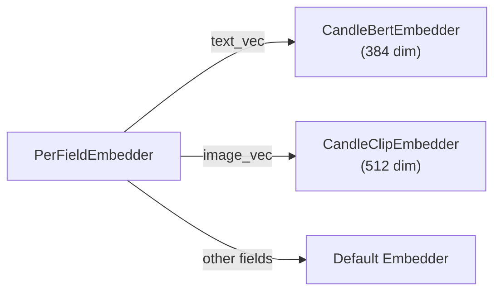

# Embedding

Embedding は、テキスト（または画像）を意味的な情報を捉えた密なベクトル（数値ベクトル）に変換します。類似した意味を持つ 2 つのテキストは、ベクトル空間内で近い位置のベクトルを生成するため、類似度ベースの検索が可能になります。

## Embedder トレイト

すべての Embedder は `Embedder` トレイトを実装します。

```rust
#[async_trait]
pub trait Embedder: Send + Sync + Debug {
    async fn embed(&self, input: &EmbedInput<'_>) -> Result<Vector>;
    async fn embed_batch(&self, inputs: &[EmbedInput<'_>]) -> Result<Vec<Vector>>;
    fn supported_input_types(&self) -> Vec<EmbedInputType>;
    fn name(&self) -> &str;
    fn as_any(&self) -> &dyn Any;
}
```

`embed()` メソッドは `Vector`（`Vec<f32>` をラップした構造体）を返します。

`EmbedInput` は 2 つのモダリティをサポートします。

| バリアント | 説明 |
| :--- | :--- |
| `EmbedInput::Text(&str)` | テキスト入力 |
| `EmbedInput::Bytes(&[u8], Option<&str>)` | バイナリ入力（オプションの MIME タイプ付き、画像用） |

## 組み込み Embedder

### CandleBertEmbedder

Hugging Face Candle を使用して BERT モデルをローカルで実行します。API キーは不要です。

**Feature flag:** `embeddings-candle`

```rust
use laurus::CandleBertEmbedder;

// Downloads model on first run (~80MB)
let embedder = CandleBertEmbedder::new(
    "sentence-transformers/all-MiniLM-L6-v2"  // model name
)?;
// Output: 384-dimensional vector
```

| プロパティ | 値 |
| :--- | :--- |
| モデル | `sentence-transformers/all-MiniLM-L6-v2` |
| 次元数 | 384 |
| 実行環境 | ローカル（CPU） |
| 初回ダウンロード | 約 80 MB |

### OpenAIEmbedder

OpenAI Embeddings API を呼び出します。API キーが必要です。

**Feature flag:** `embeddings-openai`

```rust
use laurus::OpenAIEmbedder;

let embedder = OpenAIEmbedder::new(
    api_key,
    "text-embedding-3-small".to_string()
).await?;
// Output: 1536-dimensional vector
```

| プロパティ | 値 |
| :--- | :--- |
| モデル | `text-embedding-3-small`（または任意の OpenAI モデル） |
| 次元数 | 1536（text-embedding-3-small の場合） |
| 実行環境 | リモート API 呼び出し |
| 必要条件 | `OPENAI_API_KEY` 環境変数 |

### CandleClipEmbedder

マルチモーダル（テキスト + 画像）Embedding のために CLIP モデルをローカルで実行します。

**Feature flag:** `embeddings-multimodal`

```rust
use laurus::CandleClipEmbedder;

let embedder = CandleClipEmbedder::new(
    "openai/clip-vit-base-patch32"
)?;
// Text or images → 512-dimensional vector
```

| プロパティ | 値 |
| :--- | :--- |
| モデル | `openai/clip-vit-base-patch32` |
| 次元数 | 512 |
| 入力タイプ | テキストおよび画像 |
| ユースケース | テキストから画像への検索、画像から画像への検索 |

### PrecomputedEmbedder

Embedding 計算を行わず、事前計算済みのベクトルを直接使用します。ベクトルが外部で生成される場合に便利です。

```rust
use laurus::PrecomputedEmbedder;

let embedder = PrecomputedEmbedder::new();  // no parameters needed
```

`PrecomputedEmbedder` を使用する場合、ドキュメントには Embedding 用のテキストではなく、ベクトルを直接指定します。

```rust
let doc = Document::builder()
    .add_vector("embedding", vec![0.1, 0.2, 0.3, ...])
    .build();
```

## PerFieldEmbedder

`PerFieldEmbedder` は Embedding リクエストをフィールド固有の Embedder にルーティングします。



```rust
use std::sync::Arc;
use laurus::PerFieldEmbedder;

let bert = Arc::new(CandleBertEmbedder::new("...")?);
let clip = Arc::new(CandleClipEmbedder::new("...")?);


let per_field = PerFieldEmbedder::new(bert.clone());
per_field.add_embedder("text_vec", bert.clone());
per_field.add_embedder("image_vec", clip.clone());

let engine = Engine::builder(storage, schema)
    .embedder(Arc::new(per_field))
    .build()
    .await?;
```

これは以下の場合に特に有用です。

- 異なる Vector フィールドに異なるモデルが必要な場合（例: テキスト用に BERT、画像用に CLIP）
- 異なるフィールドが異なるベクトル次元を持つ場合
- ローカル Embedder とリモート Embedder を混在させたい場合

## Embedding の使用方法

### インデクシング時

Vector フィールドにテキスト値を追加すると、Engine が自動的に Embedding を生成します。

```rust
let doc = Document::builder()
    .add_text("text_vec", "Rust is a systems programming language")
    .build();
engine.add_document("doc-1", doc).await?;
// The embedder converts the text to a vector before indexing
```

### 検索時

テキストで検索すると、Engine がクエリテキストも同様に Embedding 化します。

```rust
// Builder API
let request = VectorSearchRequestBuilder::new()
    .add_text("text_vec", "systems programming")
    .build();

// Query DSL
let request = vector_parser.parse(r#"text_vec:"systems programming""#).await?;
```

どちらのアプローチも、インデクシング時と同じ Embedder を使用してクエリテキストを Embedding 化するため、一貫したベクトル空間が保証されます。

## Feature Flag まとめ

各 Embedder は `Cargo.toml` で特定の Feature Flag を有効にする必要があります。

| Embedder | Feature Flag | 依存関係 |
| :--- | :--- | :--- |
| `CandleBertEmbedder` | `embeddings-candle` | candle-core, candle-nn, candle-transformers, hf-hub, tokenizers |
| `OpenAIEmbedder` | `embeddings-openai` | reqwest |
| `CandleClipEmbedder` | `embeddings-multimodal` | image + embeddings-candle |
| `PrecomputedEmbedder` | *（なし -- 常に利用可能）* | -- |

`embeddings-all` Feature ですべての Embedding 機能を一括で有効にできます。詳細は [Feature Flags](../development/feature_flags.md) を参照してください。

## Embedder の選択

| シナリオ | 推奨 Embedder |
| :--- | :--- |
| クイックプロトタイピング、オフライン利用 | `CandleBertEmbedder` |
| 高精度が求められる本番環境 | `OpenAIEmbedder` |
| テキスト + 画像検索 | `CandleClipEmbedder` |
| 外部パイプラインからの事前計算済みベクトル | `PrecomputedEmbedder` |
| フィールドごとに複数モデルを使用 | 他の Embedder をラップした `PerFieldEmbedder` |
