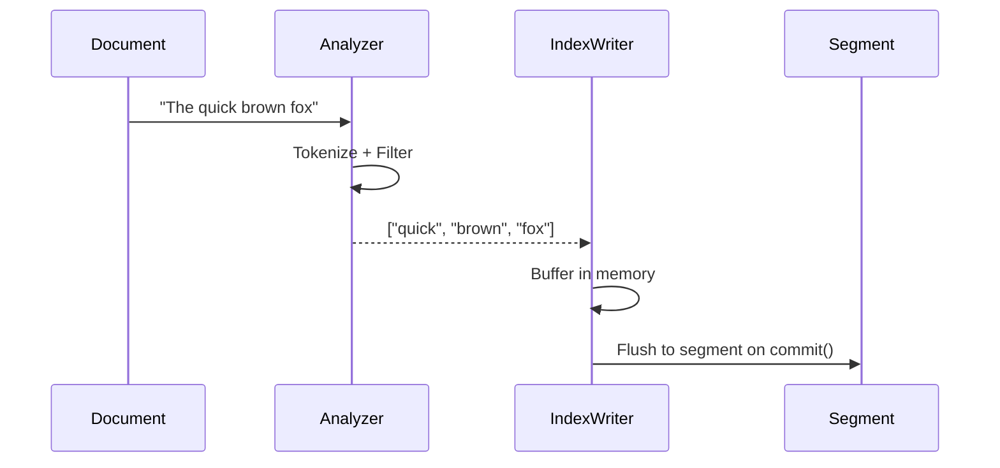
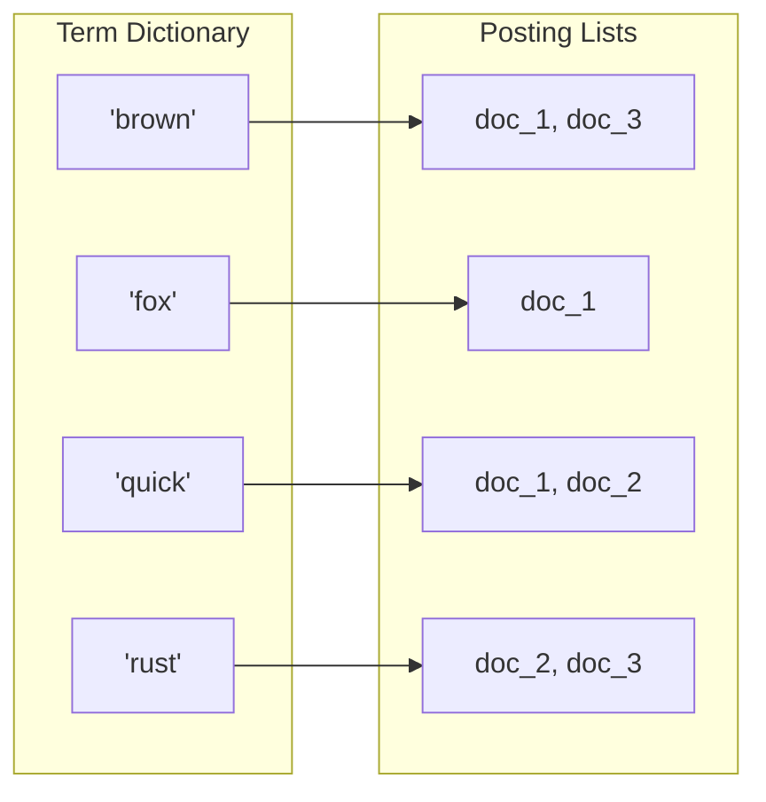
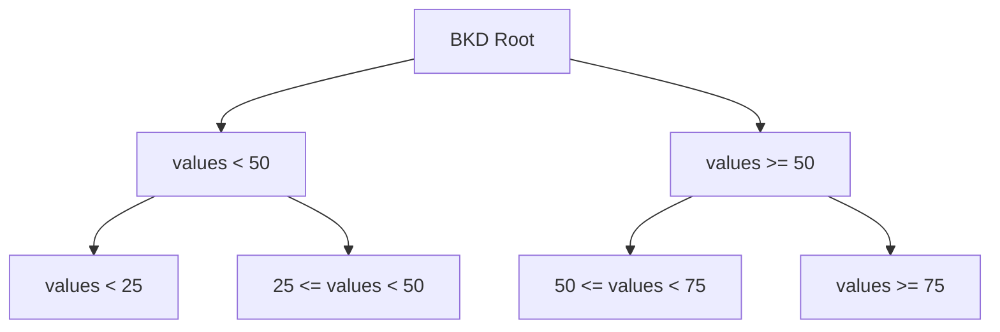
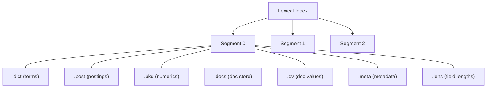

# Lexical インデキシング

Lexical インデキシングは、キーワードベースの検索を支える仕組みです。ドキュメントのテキストフィールドがインデキシングされると、Laurus は**転置インデックス（Inverted Index）** を構築します。これは、タームからそのタームを含むドキュメントへのマッピングを行うデータ構造です。

## Lexical インデキシングの仕組み



### ステップごとの流れ

1. **解析（Analyze）**: テキストが設定されたアナライザー（トークナイザー + フィルター）を通過し、正規化されたタームのストリームが生成される
2. **バッファリング（Buffer）**: タームはフィールドごとに整理され、インメモリの書き込みバッファに格納される
3. **コミット（Commit）**: `commit()` の呼び出し時に、バッファがストレージ上の新しいセグメントにフラッシュされる

## 転置インデックス（Inverted Index）

転置インデックスは、基本的にタームからドキュメントリストへのマップです。



| コンポーネント | 説明 |
| :--- | :--- |
| **Term Dictionary** | インデックス内のすべてのユニークなタームのソート済みリスト。高速なプレフィックス検索をサポート |
| **Posting Lists** | 各タームに対する、ドキュメント ID とメタデータ（ターム頻度、位置情報）のリスト |
| **Doc Values** | 数値フィールドや日付フィールドでのソート/フィルター操作のためのカラム指向ストレージ |

### Posting List の内容

Posting List の各エントリには以下の情報が含まれます。

| フィールド | 説明 |
| :--- | :--- |
| Document ID | 内部 `u64` 識別子 |
| Term Frequency | そのドキュメント内でタームが出現する回数 |
| Positions（オプション） | ドキュメント内でタームが出現する位置（フレーズクエリに必要） |
| Weight | このポスティングのスコアウェイト |

## 数値フィールドと日付フィールド

整数、浮動小数点数、日時フィールドは、**BKD ツリー** を使用してインデキシングされます。BKD ツリーは範囲クエリに最適化された空間分割データ構造です。



BKD ツリーにより、`price:[10 TO 100]` や `date:[2024-01-01 TO 2024-12-31]` のような範囲クエリを効率的に評価できます。

## 地理フィールド（Geo Fields）

地理フィールドは緯度/経度のペアを格納します。以下のクエリをサポートする空間データ構造を使用してインデキシングされます。

- **半径クエリ（Radius queries）**: 中心点から N キロメートル以内のすべてのポイントを検索
- **バウンディングボックスクエリ（Bounding box queries）**: 矩形領域内のすべてのポイントを検索

## セグメント（Segments）

Lexical インデックスは**セグメント**に分割されて構成されます。各セグメントはイミュータブルで自己完結型のミニインデックスです。



| ファイル拡張子 | 内容 |
| :--- | :--- |
| `.dict` | Term Dictionary（ソート済みターム + メタデータオフセット） |
| `.post` | Posting Lists（ドキュメント ID、ターム頻度、位置情報） |
| `.bkd` | 数値フィールドおよび日付フィールドの BKD ツリーデータ |
| `.docs` | 格納されたフィールド値（元のドキュメント内容） |
| `.dv` | ソートおよびフィルタリング用の Doc Values |
| `.meta` | セグメントメタデータ（ドキュメント数、ターム数など） |
| `.lens` | フィールド長の正規化値（BM25 スコアリング用） |

### セグメントのライフサイクル

1. **作成（Create）**: `commit()` が呼び出されるたびに新しいセグメントが作成される
2. **検索（Search）**: すべてのセグメントが並列に検索され、結果がマージされる
3. **マージ（Merge）**: 定期的に、複数の小さなセグメントがより大きなセグメントにマージされ、クエリパフォーマンスが向上する
4. **削除（Delete）**: ドキュメントが削除された場合、物理的に削除されるのではなく、削除ビットマップに ID が追加される（[Deletions & Compaction](../../laurus/deletions.md) を参照）

## BM25 スコアリング

Laurus は Lexical 検索結果のスコアリングに BM25 アルゴリズムを使用します。BM25 は以下の要素を考慮します。

- **ターム頻度（Term Frequency, TF）**: ドキュメント内でタームが出現する頻度（多いほど良いが、収穫逓減あり）
- **逆文書頻度（Inverse Document Frequency, IDF）**: 全ドキュメントにおけるタームの希少性（希少なほど重要）
- **フィールド長の正規化（Field Length Normalization）**: 短いフィールドは長いフィールドに対してブーストされる

計算式:

```text
score(q, d) = IDF(q) * (TF(q, d) * (k1 + 1)) / (TF(q, d) + k1 * (1 - b + b * |d| / avgdl))
```

`k1 = 1.2` と `b = 0.75` がデフォルトのチューニングパラメータです。

## SIMD 最適化

ベクトル距離計算では、利用可能な場合に SIMD（Single Instruction, Multiple Data）命令が活用され、ベクトル検索における類似度計算が大幅に高速化されます。

## コード例

```rust
use std::sync::Arc;
use laurus::{Document, Engine, Schema};
use laurus::lexical::TextOption;
use laurus::lexical::core::field::IntegerOption;
use laurus::storage::memory::MemoryStorage;

#[tokio::main]
async fn main() -> laurus::Result<()> {
    let storage = Arc::new(MemoryStorage::new(Default::default()));
    let schema = Schema::builder()
        .add_text_field("title", TextOption::default())
        .add_text_field("body", TextOption::default())
        .add_integer_field("year", IntegerOption::default())
        .build();

    let engine = Engine::builder(storage, schema).build().await?;

    // Index documents
    engine.add_document("doc-1", Document::builder()
        .add_text("title", "Rust Programming")
        .add_text("body", "Rust is a systems programming language.")
        .add_integer("year", 2024)
        .build()
    ).await?;

    // Commit to flush segments to storage
    engine.commit().await?;

    Ok(())
}
```

## 次のステップ

- ベクトルインデックスの仕組みを学ぶ: [Vector インデキシング](vector_indexing.md)
- Lexical インデックスに対してクエリを実行する: [Lexical 検索](../search/lexical_search.md)
