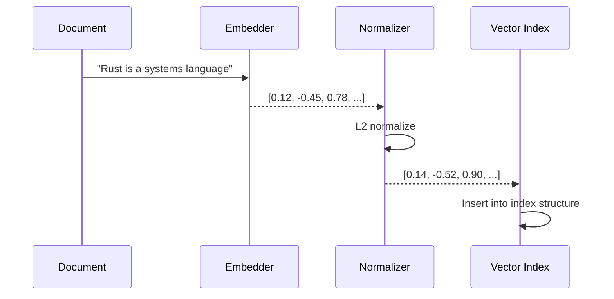
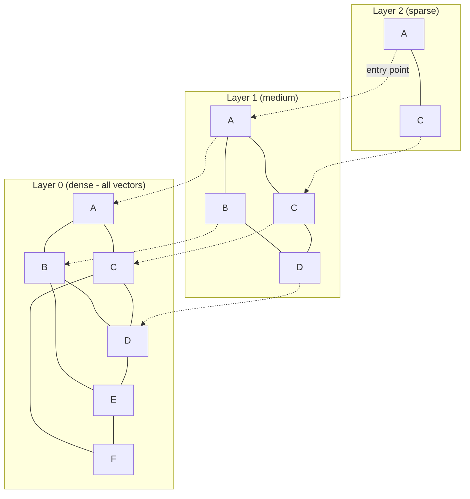
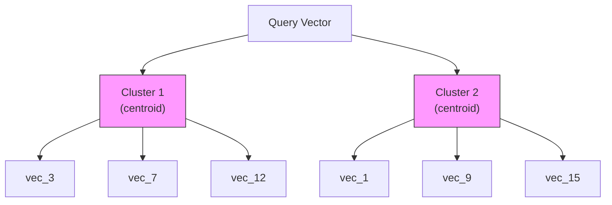

# Vector インデキシング

Vector インデキシングは、類似性ベースの検索を支える仕組みです。ドキュメントのベクトルフィールドがインデキシングされると、Laurus はエンベディングベクトルを専用のインデックス構造に格納し、高速な近似最近傍探索（Approximate Nearest Neighbor, ANN）を可能にします。

## Vector インデキシングの仕組み



### ステップごとの流れ

1. **エンベディング（Embed）**: テキスト（または画像）が、設定されたエンベッダーによってベクトルに変換される
2. **正規化（Normalize）**: ベクトルが L2 正規化される（コサイン類似度のため）
3. **インデキシング（Index）**: ベクトルが設定されたインデックス構造（Flat、HNSW、または IVF）に挿入される
4. **コミット（Commit）**: `commit()` の呼び出し時に、インデックスが永続ストレージにフラッシュされる

## インデックスタイプ

Laurus は 3 種類のベクトルインデックスタイプをサポートしており、それぞれ異なるパフォーマンス特性を持ちます。

### 比較

| 特性 | Flat | HNSW | IVF |
| :--- | :--- | :--- | :--- |
| **精度** | 100%（厳密） | 約 95-99%（近似） | 約 90-98%（近似） |
| **検索速度** | O(n) 線形スキャン | O(log n) グラフ走査 | O(n/k) クラスタスキャン |
| **メモリ使用量** | 低 | 高（グラフエッジ） | 中程度（セントロイド） |
| **インデックス構築時間** | 高速 | 中程度 | 低速（クラスタリング） |
| **最適な用途** | 1 万ベクトル未満 | 1 万 - 1,000 万ベクトル | 100 万ベクトル以上 |

### Flat インデックス

最もシンプルなインデックスです。クエリベクトルを格納されたすべてのベクトルと比較します（総当たり）。

```rust
use laurus::vector::FlatOption;
use laurus::vector::core::distance::DistanceMetric;

let opt = FlatOption {
    dimension: 384,
    distance: DistanceMetric::Cosine,
    ..Default::default()
};
```

- **利点**: 100% の再現率（厳密な結果）、シンプル、低メモリ
- **欠点**: 大規模データセットでは低速（線形スキャン）
- **使用場面**: ベクトル数が約 1 万未満の場合、または厳密な結果が必要な場合

### HNSW インデックス

**Hierarchical Navigable Small World** グラフ。デフォルトで最も一般的に使用されるインデックスタイプです。



HNSW アルゴリズムは、上位の疎なレイヤーから下位の密なレイヤーへと検索し、各レベルで検索空間を絞り込みます。

```rust
use laurus::vector::HnswOption;
use laurus::vector::core::distance::DistanceMetric;

let opt = HnswOption {
    dimension: 384,
    distance: DistanceMetric::Cosine,
    m: 16,                  // max connections per node per layer
    ef_construction: 200,   // search width during index building
    ..Default::default()
};
```

#### HNSW パラメータ

| パラメータ | デフォルト | 説明 | 影響 |
| :--- | :--- | :--- | :--- |
| `m` | 16 | レイヤーごとのノードあたりの最大双方向接続数 | 大きいほど再現率が向上するが、メモリ消費が増加 |
| `ef_construction` | 200 | インデックス構築時の探索幅 | 大きいほど再現率が向上するが、構築が低速に |
| `dimension` | 128 | ベクトルの次元数 | エンベッダーの出力と一致させる必要あり |
| `distance` | Cosine | 距離メトリクス | 下記の距離メトリクスを参照 |

**チューニングのヒント:**

- 再現率を向上させるには `m` を増やす（例: 32 または 64）。ただしメモリ消費が増加する
- インデックス品質を向上させるには `ef_construction` を増やす（例: 400）。ただし構築時間が増加する
- 検索時には、検索リクエストで設定する `ef_search` パラメータが探索幅を制御する

### IVF インデックス

**Inverted File Index**。ベクトルをクラスタに分割し、関連するクラスタのみを検索します。



```rust
use laurus::vector::IvfOption;
use laurus::vector::core::distance::DistanceMetric;

let opt = IvfOption {
    dimension: 384,
    distance: DistanceMetric::Cosine,
    n_clusters: 100,   // number of clusters
    n_probe: 10,       // clusters to search at query time
    ..Default::default()
};
```

#### IVF パラメータ

| パラメータ | デフォルト | 説明 | 影響 |
| :--- | :--- | :--- | :--- |
| `n_clusters` | 100 | ボロノイセル（Voronoi Cell）の数 | クラスタ数が多いほど検索は高速になるが、再現率は低下 |
| `n_probe` | 1 | クエリ時に検索するクラスタ数 | 大きいほど再現率が向上するが、検索が低速に |
| `dimension` | （必須） | ベクトルの次元数 | エンベッダーの出力と一致させる必要あり |
| `distance` | Cosine | 距離メトリクス | 下記の距離メトリクスを参照 |

**チューニングのヒント:**

- `n_clusters` はベクトル数 `n` に対して `sqrt(n)` 程度に設定する
- 再現率と速度のバランスを取るため、`n_probe` を `n_clusters` の 5-20% に設定する
- IVF はトレーニングフェーズが必要なため、初回のインデキシングが遅くなる場合がある

## 距離メトリクス（Distance Metrics）

| メトリクス | 説明 | 値の範囲 | 最適な用途 |
| :--- | :--- | :--- | :--- |
| `Cosine` | 1 - コサイン類似度 | [0, 2] | テキストエンベディング（最も一般的） |
| `Euclidean` | L2 距離 | [0, +inf) | 空間データ |
| `Manhattan` | L1 距離 | [0, +inf) | 特徴ベクトル |
| `DotProduct` | 負の内積 | (-inf, +inf) | 事前正規化済みベクトル |
| `Angular` | 角度距離 | [0, pi] | 方向の類似性 |

```rust
use laurus::vector::core::distance::DistanceMetric;

let metric = DistanceMetric::Cosine;      // Default for text
let metric = DistanceMetric::Euclidean;    // For spatial data
let metric = DistanceMetric::Manhattan;    // L1 distance
let metric = DistanceMetric::DotProduct;   // For pre-normalized vectors
let metric = DistanceMetric::Angular;      // Angular distance
```

> **注意:** コサイン類似度の場合、ベクトルはインデキシング前に自動的に L2 正規化されます。距離が小さいほど、より類似していることを示します。

## 量子化（Quantization）

量子化は、精度をある程度犠牲にしてベクトルを圧縮し、メモリ使用量を削減します。

| 方式 | Enum バリアント | 説明 | メモリ削減率 |
| :--- | :--- | :--- | :--- |
| **スカラー 8 ビット** | `Scalar8Bit` | 8 ビット整数へのスカラー量子化 | 約 4 倍 |
| **プロダクト量子化** | `ProductQuantization { subvector_count }` | ベクトルをサブベクトルに分割して各々を量子化 | 約 16-64 倍 |

```rust
use laurus::vector::HnswOption;
use laurus::vector::core::quantization::QuantizationMethod;

let opt = HnswOption {
    dimension: 384,
    quantizer: Some(QuantizationMethod::Scalar8Bit),
    ..Default::default()
};
```

### VectorQuantizer

`VectorQuantizer` は量子化のライフサイクルを管理します。

| メソッド | 説明 |
| :--- | :--- |
| `new(method, dimension)` | 未トレーニングの量子化器を作成 |
| `train(vectors)` | 代表的なベクトルでトレーニング（Scalar8Bit の場合、次元ごとの最小/最大値を計算） |
| `quantize(vector)` | トレーニング済みパラメータを使用してベクトルを圧縮 |
| `dequantize(quantized)` | 量子化されたベクトルをフル精度に復元 |

`Scalar8Bit` の場合、トレーニングで各次元の最小値と最大値が計算されます。各成分は [0, 255] の範囲にマッピングされます。逆量子化ではこのマッピングが逆変換されますが、多少の精度損失が生じます。

> **注意:** `ProductQuantization` は API 上定義されていますが、現在未実装です。使用するとエラーが返されます。

## セグメントファイル

各ベクトルインデックスタイプは、データを単一のセグメントファイルに格納します。

| インデックスタイプ | ファイル拡張子 | 内容 |
| :--- | :--- | :--- |
| HNSW | `.hnsw` | グラフ構造、ベクトル、メタデータ |
| Flat | `.flat` | 生ベクトルとメタデータ |
| IVF | `.ivf` | クラスタセントロイド、割り当て済みベクトル、メタデータ |

## コード例

```rust
use std::sync::Arc;
use laurus::{Document, Engine, Schema};
use laurus::lexical::TextOption;
use laurus::vector::HnswOption;
use laurus::vector::core::distance::DistanceMetric;
use laurus::storage::memory::MemoryStorage;

#[tokio::main]
async fn main() -> laurus::Result<()> {
    let storage = Arc::new(MemoryStorage::new(Default::default()));
    let schema = Schema::builder()
        .add_text_field("title", TextOption::default())
        .add_hnsw_field("embedding", HnswOption {
            dimension: 384,
            distance: DistanceMetric::Cosine,
            m: 16,
            ef_construction: 200,
            ..Default::default()
        })
        .build();

    // With an embedder, text in vector fields is automatically embedded
    let engine = Engine::builder(storage, schema)
        .embedder(my_embedder)
        .build()
        .await?;

    // Add text to the vector field — it will be embedded automatically
    engine.add_document("doc-1", Document::builder()
        .add_text("title", "Rust Programming")
        .add_text("embedding", "Rust is a systems programming language.")
        .build()
    ).await?;

    engine.commit().await?;

    Ok(())
}
```

## 次のステップ

- ベクトルインデックスを検索する: [Vector 検索](../search/vector_search.md)
- Lexical 検索と組み合わせる: [ハイブリッド検索](../search/hybrid_search.md)
