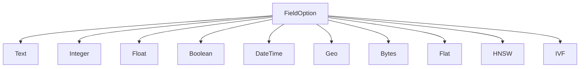
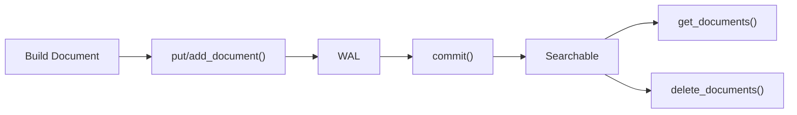

# スキーマとフィールド

`Schema` はドキュメントの構造を定義します。どのフィールドが存在し、各フィールドがどのようにインデクシングされるかを指定します。Schema は Engine にとって唯一の情報源です。

> CLI で使用される TOML ファイル形式については、[スキーマフォーマットリファレンス](../cli/schema_format.md)を参照してください。

## Schema

`Schema` は名前付きフィールドのコレクションです。各フィールドは**Lexical フィールド**（キーワード検索用）または **Vector フィールド**（類似度検索用）のいずれかです。

```rust
use laurus::Schema;
use laurus::lexical::TextOption;
use laurus::lexical::core::field::IntegerOption;
use laurus::vector::HnswOption;

let schema = Schema::builder()
    .add_text_field("title", TextOption::default())
    .add_text_field("body", TextOption::default())
    .add_integer_field("year", IntegerOption::default())
    .add_hnsw_field("embedding", HnswOption::default())
    .add_default_field("body")
    .build();
```

### デフォルトフィールド

`add_default_field()` は、クエリがフィールド名を明示的に指定しない場合に検索対象となるフィールドを指定します。これは [Query DSL](../concepts/query_dsl.md) パーサーで使用されます。

## フィールドタイプ



### Lexical フィールド

Lexical フィールドは転置インデックス（Inverted Index）を使用してインデクシングされ、キーワードベースのクエリをサポートします。

| タイプ | Rust 型 | SchemaBuilder メソッド | 説明 |
| :--- | :--- | :--- | :--- |
| **Text** | `TextOption` | `add_text_field()` | 全文検索可能。Analyzer によりトークン化される |
| **Integer** | `IntegerOption` | `add_integer_field()` | 64 ビット符号付き整数。範囲クエリをサポート |
| **Float** | `FloatOption` | `add_float_field()` | 64 ビット浮動小数点数。範囲クエリをサポート |
| **Boolean** | `BooleanOption` | `add_boolean_field()` | `true` / `false` |
| **DateTime** | `DateTimeOption` | `add_datetime_field()` | UTC タイムスタンプ。範囲クエリをサポート |
| **Geo** | `GeoOption` | `add_geo_field()` | 緯度/経度のペア。半径検索とバウンディングボックスクエリをサポート |
| **Bytes** | `BytesOption` | `add_bytes_field()` | バイナリデータ |

#### Text フィールドオプション

`TextOption` はテキストのインデクシング方法を制御します。

```rust
use laurus::lexical::TextOption;

// Default: indexed + stored + term vectors (all true)
let opt = TextOption::default();

// Customize
let opt = TextOption::default()
    .indexed(true)
    .stored(true)
    .term_vectors(true);
```

| オプション | デフォルト | 説明 |
| :--- | :--- | :--- |
| `indexed` | `true` | フィールドが検索可能かどうか |
| `stored` | `true` | 元の値が取得用に保存されるかどうか |
| `term_vectors` | `true` | ターム位置が保存されるかどうか（フレーズクエリやハイライトに必要） |

### Vector フィールド

Vector フィールドは近似最近傍（ANN: Approximate Nearest Neighbor）検索のためのベクトルインデックスを使用してインデクシングされます。

| タイプ | Rust 型 | SchemaBuilder メソッド | 説明 |
| :--- | :--- | :--- | :--- |
| **Flat** | `FlatOption` | `add_flat_field()` | ブルートフォース線形スキャン。正確な結果 |
| **HNSW** | `HnswOption` | `add_hnsw_field()` | Hierarchical Navigable Small World グラフ。高速な近似検索 |
| **IVF** | `IvfOption` | `add_ivf_field()` | Inverted File Index。クラスタベースの近似検索 |

#### HNSW フィールドオプション（最も一般的）

```rust
use laurus::vector::HnswOption;
use laurus::vector::core::distance::DistanceMetric;

let opt = HnswOption {
    dimension: 384,                          // vector dimensions
    distance: DistanceMetric::Cosine,        // distance metric
    m: 16,                                   // max connections per layer
    ef_construction: 200,                    // construction search width
    base_weight: 1.0,                        // default scoring weight
    quantizer: None,                         // optional quantization
};
```

パラメータの詳細なガイダンスについては、[Vector インデクシング](indexing/vector_indexing.md)を参照してください。

## Document

`Document` は名前付きフィールド値のコレクションです。`DocumentBuilder` を使用してドキュメントを構築します。

```rust
use laurus::Document;

let doc = Document::builder()
    .add_text("title", "Introduction to Rust")
    .add_text("body", "Rust is a systems programming language.")
    .add_integer("year", 2024)
    .add_float("rating", 4.8)
    .add_boolean("published", true)
    .build();
```

### ドキュメントのインデクシング

`Engine` はドキュメントを追加するための 2 つのメソッドを提供しており、それぞれ異なるセマンティクスを持ちます。

| メソッド | 動作 | ユースケース |
| :--- | :--- | :--- |
| `put_document(id, doc)` | **Upsert** — 同じ ID のドキュメントが存在する場合、置き換えられる | 標準的なドキュメントインデクシング |
| `add_document(id, doc)` | **Append** — 新しいチャンクとしてドキュメントを追加。同じ ID で複数のチャンクを持てる | チャンク分割されたドキュメント（例: 段落に分割された長い記事） |

```rust
// Upsert: replaces any existing document with id "doc1"
engine.put_document("doc1", doc).await?;

// Append: adds another chunk under the same id "doc1"
engine.add_document("doc1", chunk2).await?;

// Always commit after indexing
engine.commit().await?;
```

### ドキュメントの取得

`get_documents` を使用して、外部 ID でドキュメント（チャンクを含む）を取得します。

```rust
let docs = engine.get_documents("doc1").await?;
for doc in &docs {
    if let Some(title) = doc.get("title") {
        println!("Title: {:?}", title);
    }
}
```

### ドキュメントの削除

外部 ID を共有するすべてのドキュメントとチャンクを削除します。

```rust
engine.delete_documents("doc1").await?;
engine.commit().await?;
```

### ドキュメントのライフサイクル



> **重要:** ドキュメントは `commit()` が呼び出されるまで検索可能になりません。

### DocumentBuilder メソッド

| メソッド | 値の型 | 説明 |
| :--- | :--- | :--- |
| `add_text(name, value)` | `String` | テキストフィールドを追加 |
| `add_integer(name, value)` | `i64` | 整数フィールドを追加 |
| `add_float(name, value)` | `f64` | 浮動小数点数フィールドを追加 |
| `add_boolean(name, value)` | `bool` | ブールフィールドを追加 |
| `add_datetime(name, value)` | `DateTime<Utc>` | 日時フィールドを追加 |
| `add_vector(name, value)` | `Vec<f32>` | 事前計算済みベクトルフィールドを追加 |
| `add_geo(name, lat, lon)` | `(f64, f64)` | 地理座標フィールドを追加 |
| `add_bytes(name, data)` | `Vec<u8>` | バイナリデータを追加 |
| `add_field(name, value)` | `DataValue` | 任意の値型を追加 |

## DataValue

`DataValue` は Laurus におけるフィールド値を表す統合列挙型です。

```rust
pub enum DataValue {
    Null,
    Bool(bool),
    Int64(i64),
    Float64(f64),
    Text(String),
    Bytes(Vec<u8>, Option<String>),  // (data, optional MIME type)
    Vector(Vec<f32>),
    DateTime(DateTime<Utc>),
    Geo(f64, f64),          // (latitude, longitude)
}
```

`DataValue` は一般的な型に対して `From<T>` を実装しているため、`.into()` 変換が使用できます。

```rust
use laurus::DataValue;

let v: DataValue = "hello".into();       // Text
let v: DataValue = 42i64.into();         // Int64
let v: DataValue = 3.14f64.into();       // Float64
let v: DataValue = true.into();          // Bool
let v: DataValue = vec![0.1f32, 0.2].into(); // Vector
```

## 予約フィールド

`_id` フィールドは Laurus の内部使用のために予約されています。外部ドキュメント ID を格納し、常に `KeywordAnalyzer`（完全一致）でインデクシングされます。スキーマに追加する必要はありません。自動的に管理されます。

## 動的フィールド追加

`Engine::add_field()` を使用すると、稼働中のエンジンにフィールドを動的に追加できます。
フィールドの追加のみサポートされており、削除や型の変更はできません。

### Lexical フィールドの追加

```rust,ignore
let updated_schema = engine.add_field(
    "category",
    FieldOption::Text(TextOption::default()),
).await?;
```

### Vector フィールドの追加

```rust,ignore
let updated_schema = engine.add_field(
    "embedding",
    FieldOption::Flat(FlatOption::default().dimension(384)),
).await?;
```

既存のドキュメントには影響がありません（新しいフィールドの値が存在しないだけです）。
返却された `Schema` は呼び出し側で永続化する必要があります（例: `schema.toml` への書き出し）。

## スキーマ設計のヒント

1. **Lexical フィールドと Vector フィールドを分離する** — フィールドは Lexical か Vector のいずれかであり、両方にはなりません。ハイブリッド検索には、別々のフィールドを作成してください（例: テキスト用に `body`、ベクトル用に `body_vec`）。

2. **完全一致フィールドには `KeywordAnalyzer` を使用する** — カテゴリ、ステータス、タグフィールドは `PerFieldAnalyzer` 経由で `KeywordAnalyzer` を使用し、トークン化を避けてください。

3. **適切なベクトルインデックスを選択する** — ほとんどの場合は HNSW、小規模データセットには Flat、非常に大規模なデータセットには IVF を使用してください。詳細は [Vector インデクシング](indexing/vector_indexing.md)を参照。

4. **デフォルトフィールドを設定する** — Query DSL を使用する場合、デフォルトフィールドを設定することで、ユーザーは `body:hello` の代わりに `hello` と記述できます。

5. **スキーマジェネレータを使用する** — `laurus create schema` を実行して、手書きの代わりにインタラクティブにスキーマ TOML ファイルを構築できます。詳細は [CLI コマンド](../cli/commands.md#create-schema)を参照。
