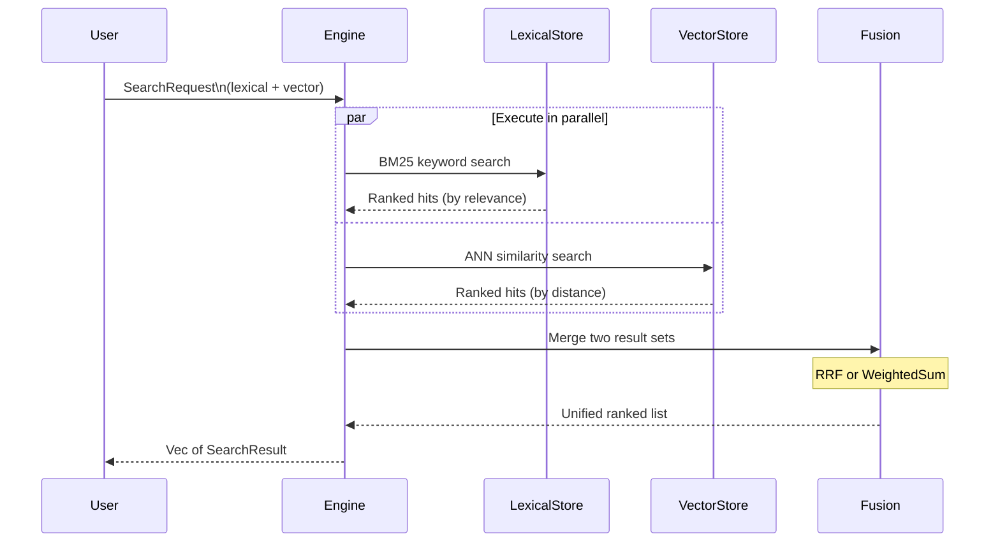

# ハイブリッド検索（Hybrid Search）

ハイブリッド検索は、**Lexical 検索**（キーワードマッチング）と **Vector 検索**（意味的類似性）を組み合わせることで、精度と意味的な関連性の両方を兼ね備えた結果を提供します。これは Laurus の最も強力な検索モードです。

## なぜハイブリッド検索なのか

| 検索タイプ | 強み | 弱み |
| :--- | :--- | :--- |
| **Lexical のみ** | 正確なキーワードマッチング、希少なタームに強い | 同義語や言い換えを見逃す |
| **Vector のみ** | 意味を理解し、同義語に対応 | 正確なキーワードを見逃す場合がある、精度が低い |
| **ハイブリッド** | 両方の長所を活用 | 設定がやや複雑 |

## 仕組み



## 基本的な使い方

### Builder API

```rust
use laurus::{SearchRequestBuilder, FusionAlgorithm};
use laurus::lexical::TermQuery;
use laurus::lexical::search::searcher::LexicalSearchQuery;
use laurus::vector::VectorSearchRequestBuilder;

let request = SearchRequestBuilder::new()
    // Lexical component
    .lexical_query(
        LexicalSearchQuery::Obj(
            Box::new(TermQuery::new("body", "rust"))
        )
    )
    // Vector component
    .vector_query(
        VectorSearchRequestBuilder::new()
            .add_text("text_vec", "systems programming")
            .build()
    )
    // Fusion algorithm
    .fusion_algorithm(FusionAlgorithm::RRF { k: 60.0 })
    .limit(10)
    .build();

let results = engine.search(request).await?;
```

### Query DSL

単一のクエリ文字列内で Lexical 句と Vector 句を混在させることができます。

```rust
use laurus::UnifiedQueryParser;
use laurus::lexical::QueryParser;
use laurus::vector::VectorQueryParser;

let unified = UnifiedQueryParser::new(
    QueryParser::new(analyzer).with_default_field("body"),
    VectorQueryParser::new(embedder),
);

// Lexical + vector in one query
let request = unified.parse(r#"body:rust text_vec:~"systems programming""#).await?;
let results = engine.search(request).await?;
```

`~"..."` 構文は Vector 句を識別します。それ以外はすべて Lexical として解析されます。

## フュージョンアルゴリズム（Fusion Algorithms）

Lexical と Vector の両方の結果が存在する場合、それらを単一のランキングリストにマージする必要があります。Laurus は 2 つのフュージョンアルゴリズムをサポートしています。

### RRF（Reciprocal Rank Fusion）

デフォルトのアルゴリズムです。生のスコアではなく、ランク位置に基づいて結果を結合します。

```text
score(doc) = sum( 1 / (k + rank_i) )
```

`rank_i` は各結果リストにおけるドキュメントの位置、`k` はスムージングパラメータ（デフォルト 60）です。

```rust
use laurus::FusionAlgorithm;

let fusion = FusionAlgorithm::RRF { k: 60.0 };
```

**利点:**

- Lexical と Vector の結果間のスコア分布の違いに対してロバスト
- ウェイトのチューニングが不要
- すぐに使える（out of the box）

### WeightedSum

正規化された Lexical スコアと Vector スコアを線形結合します。

```text
score(doc) = lexical_weight * lexical_score + vector_weight * vector_score
```

```rust
use laurus::FusionAlgorithm;

let fusion = FusionAlgorithm::WeightedSum {
    lexical_weight: 0.3,
    vector_weight: 0.7,
};
```

**使用場面:**

- Lexical と Vector の関連性のバランスを明示的に制御したい場合
- 一方のシグナルが他方よりも重要であることがわかっている場合

## SearchRequest のフィールド

| フィールド | 型 | デフォルト | 説明 |
| :--- | :--- | :--- | :--- |
| `query` | `SearchQuery` | `Dsl("")` | 検索クエリ仕様（Dsl / Lexical / Vector / Hybrid） |
| `limit` | `usize` | 10 | 返される結果の最大件数 |
| `offset` | `usize` | 0 | スキップする結果の数（ページネーション用） |
| `fusion_algorithm` | `Option<FusionAlgorithm>` | None（ハイブリッド時は `RRF { k: 60.0 }` を使用） | Lexical と Vector の結果をマージする方法 |
| `filter_query` | `Option<Box<dyn Query>>` | None | Lexical クエリによるプレフィルター（Lexical と Vector の両方の結果を制限） |
| `lexical_options` | `LexicalSearchOptions` | デフォルト | Lexical 検索の動作パラメータ |
| `vector_options` | `VectorSearchOptions` | デフォルト | Vector 検索の動作パラメータ |

## SearchResult

各結果には以下が含まれます。

| フィールド | 型 | 説明 |
| :--- | :--- | :--- |
| `id` | `String` | 外部ドキュメント ID |
| `score` | `f32` | フュージョン後の関連性スコア |
| `document` | `Option<Document>` | ドキュメントの全内容（ロードされた場合） |

## フィルター付きハイブリッド検索

フィルターを適用して、Lexical と Vector の両方の結果を制限できます。

```rust
let request = SearchRequestBuilder::new()
    .lexical_query(
        LexicalSearchQuery::Obj(Box::new(TermQuery::new("body", "rust")))
    )
    .vector_query(
        VectorSearchRequestBuilder::new()
            .add_text("text_vec", "systems programming")
            .build()
    )
    // Only search within "tutorial" category
    .filter_query(Box::new(TermQuery::new("category", "tutorial")))
    .fusion_algorithm(FusionAlgorithm::RRF { k: 60.0 })
    .limit(10)
    .build();
```

### フィルタリングの仕組み

1. フィルタークエリが Lexical インデックス上で実行され、許可されるドキュメント ID のセットが生成される
2. Lexical 検索: フィルターがユーザークエリとブーリアン AND で結合される
3. Vector 検索: 許可された ID が ANN 検索の制限として渡される

## ページネーション

`offset` と `limit` を使用してページネーションを実現します。

```rust
// Page 1: results 0-9
let page1 = SearchRequestBuilder::new()
    .lexical_query(/* ... */)
    .vector_query(/* ... */)
    .offset(0)
    .limit(10)
    .build();

// Page 2: results 10-19
let page2 = SearchRequestBuilder::new()
    .lexical_query(/* ... */)
    .vector_query(/* ... */)
    .offset(10)
    .limit(10)
    .build();
```

## 完全な例

```rust
use std::sync::Arc;
use laurus::{
    Document, Engine, Schema, SearchRequestBuilder,
    FusionAlgorithm, PerFieldEmbedder,
};
use laurus::lexical::{TextOption, TermQuery};
use laurus::lexical::core::field::IntegerOption;
use laurus::lexical::search::searcher::LexicalSearchQuery;
use laurus::vector::{HnswOption, VectorSearchRequestBuilder};
use laurus::storage::memory::MemoryStorage;

#[tokio::main]
async fn main() -> laurus::Result<()> {
    let storage = Arc::new(MemoryStorage::new(Default::default()));

    // Schema with both lexical and vector fields
    let schema = Schema::builder()
        .add_text_field("title", TextOption::default())
        .add_text_field("body", TextOption::default())
        .add_text_field("category", TextOption::default())
        .add_integer_field("year", IntegerOption::default())
        .add_hnsw_field("body_vec", HnswOption {
            dimension: 384,
            ..Default::default()
        })
        .build();

    // Configure analyzer and embedder (see Text Analysis and Embeddings docs)
    // let analyzer = Arc::new(StandardAnalyzer::new()?);
    // let embedder = Arc::new(CandleBertEmbedder::new("sentence-transformers/all-MiniLM-L6-v2")?);
    let engine = Engine::builder(storage, schema)
        // .analyzer(analyzer)
        // .embedder(embedder)
        .build()
        .await?;

    // Index documents with both text and vector fields
    engine.add_document("doc-1", Document::builder()
        .add_text("title", "Rust Programming Guide")
        .add_text("body", "Rust is a systems programming language.")
        .add_text("category", "programming")
        .add_integer("year", 2024)
        .add_text("body_vec", "Rust is a systems programming language.")
        .build()
    ).await?;
    engine.commit().await?;

    // Hybrid search: keyword "rust" + semantic "systems language"
    let results = engine.search(
        SearchRequestBuilder::new()
            .lexical_query(
                LexicalSearchQuery::Obj(Box::new(TermQuery::new("body", "rust")))
            )
            .vector_query(
                VectorSearchRequestBuilder::new()
                    .add_text("body_vec", "systems language")
                    .build()
            )
            .fusion_algorithm(FusionAlgorithm::RRF { k: 60.0 })
            .limit(10)
            .build()
    ).await?;

    for r in &results {
        println!("{}: score={:.4}", r.id, r.score);
    }

    Ok(())
}
```

## 次のステップ

- クエリ構文の完全なリファレンス: [Query DSL](../query_dsl.md)
- ID 解決の仕組み: [ID Management](../../laurus/id_management.md)
- データの永続性: [Persistence & WAL](../../laurus/persistence.md)
