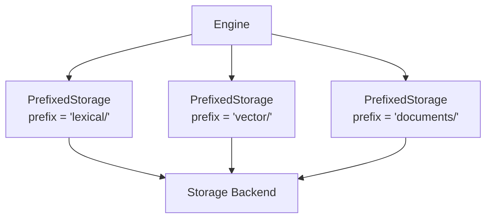

# ストレージ

Laurus はプラガブルなストレージレイヤーを使用し、インデックスデータの永続化方法と保存場所を抽象化します。すべてのコンポーネント（Lexical インデックス、Vector インデックス、ドキュメントログ）は単一のストレージバックエンドを共有します。

## Storage トレイト

すべてのバックエンドは `Storage` トレイトを実装します。

```rust
pub trait Storage: Send + Sync + Debug {
    fn loading_mode(&self) -> LoadingMode;
    fn open_input(&self, name: &str) -> Result<Box<dyn StorageInput>>;
    fn create_output(&self, name: &str) -> Result<Box<dyn StorageOutput>>;
    fn file_exists(&self, name: &str) -> bool;
    fn delete_file(&self, name: &str) -> Result<()>;
    fn list_files(&self) -> Result<Vec<String>>;
    fn file_size(&self, name: &str) -> Result<u64>;
    // ... additional methods
}
```

このインターフェースはファイル指向です。すべてのデータ（インデックスセグメント、メタデータ、WAL エントリ、ドキュメント）は名前付きファイルとして保存され、ストリーミング `StorageInput` / `StorageOutput` ハンドルを通じてアクセスされます。

## ストレージバックエンド

### MemoryStorage

すべてのデータがメモリ上に保持されます。高速でシンプルですが、耐久性はありません。

```rust
use std::sync::Arc;
use laurus::Storage;
use laurus::storage::memory::MemoryStorage;

let storage: Arc<dyn Storage> = Arc::new(
    MemoryStorage::new(Default::default())
);
```

| プロパティ | 値 |
| :--- | :--- |
| 耐久性 | なし（プロセス終了時にデータ消失） |
| 速度 | 最速 |
| ユースケース | テスト、プロトタイピング、一時的なデータ |

### FileStorage

標準的なファイルシステムベースの永続化です。各キーがディスク上のファイルにマッピングされます。

```rust
use std::sync::Arc;
use laurus::Storage;
use laurus::storage::file::{FileStorage, FileStorageConfig};

let config = FileStorageConfig::new("/tmp/laurus-data");
let storage: Arc<dyn Storage> = Arc::new(FileStorage::new("/tmp/laurus-data", config)?);
```

| プロパティ | 値 |
| :--- | :--- |
| 耐久性 | 完全（ディスクに永続化） |
| 速度 | 中程度（ディスク I/O） |
| ユースケース | 一般的な本番利用 |

### メモリマッピング付き FileStorage

`FileStorage` は `use_mmap` 設定フラグによるメモリマップドファイルアクセスをサポートします。有効にすると、OS がメモリとディスク間のページングを管理します。

```rust
use std::sync::Arc;
use laurus::Storage;
use laurus::storage::file::{FileStorage, FileStorageConfig};

let mut config = FileStorageConfig::new("/tmp/laurus-data");
config.use_mmap = true;  // enable memory-mapped I/O
let storage: Arc<dyn Storage> = Arc::new(FileStorage::new("/tmp/laurus-data", config)?);
```

| プロパティ | 値 |
| :--- | :--- |
| 耐久性 | 完全（ディスクに永続化） |
| 速度 | 高速（OS 管理のメモリマッピング） |
| ユースケース | 大規模データセット、読み取り負荷の高いワークロード |

## StorageFactory

設定を使用してストレージを作成することもできます。

```rust
use laurus::storage::{StorageConfig, StorageFactory};
use laurus::storage::memory::MemoryStorageConfig;

let storage = StorageFactory::create(
    StorageConfig::Memory(MemoryStorageConfig::default())
)?;
```

## PrefixedStorage

Engine は `PrefixedStorage` を使用して、単一のストレージバックエンド内でコンポーネントを分離します。



Lexical ストアがキー `segments/seg-001.dict` を書き込む場合、実際には基盤バックエンドでは `lexical/segments/seg-001.dict` として保存されます。これにより、コンポーネント間のキー衝突が防止されます。

`PrefixedStorage` を自分で作成する必要はありません。`EngineBuilder` が自動的に処理します。

## ColumnStorage

主要なストレージバックエンドに加えて、Laurus はフィールドレベルの高速アクセスのための `ColumnStorage` レイヤーを提供します。これはファセッティング、ソート、集計などの操作で内部的に使用され、ドキュメント全体をデシリアライズせずに個々のフィールド値にアクセスすることが重要な場合に利用されます。

### ColumnValue

`ColumnValue` は単一の格納されたカラム値を表します。

| バリアント | 説明 |
| :--- | :--- |
| `String(String)` | UTF-8 テキスト |
| `I32(i32)` | 32 ビット符号付き整数 |
| `I64(i64)` | 64 ビット符号付き整数 |
| `U32(u32)` | 32 ビット符号なし整数 |
| `U64(u64)` | 64 ビット符号なし整数 |
| `F32(f32)` | 32 ビット浮動小数点数 |
| `F64(f64)` | 64 ビット浮動小数点数 |
| `Bool(bool)` | ブール値 |
| `DateTime(i64)` | Unix タイムスタンプ（秒） |
| `Null` | 値なし |

ColumnStorage は Engine が内部的に管理するため、直接操作する必要はありません。

## バックエンドの選択

| 要因 | MemoryStorage | FileStorage | FileStorage (mmap) |
| :--- | :--- | :--- | :--- |
| **耐久性** | なし | 完全 | 完全 |
| **読み取り速度** | 最速 | 中程度 | 高速 |
| **書き込み速度** | 最速 | 中程度 | 中程度 |
| **メモリ使用量** | データサイズに比例 | 少ない | OS 管理 |
| **最大データサイズ** | RAM による制限 | ディスクによる制限 | ディスク + アドレス空間による制限 |
| **最適な用途** | テスト、小規模データセット | 一般的な利用 | 大規模な読み取り負荷の高いデータセット |

### 推奨事項

- **開発 / テスト**: ファイルクリーンアップなしで高速に反復するために `MemoryStorage` を使用
- **本番（一般）**: 信頼性の高い永続化のために `FileStorage` を使用
- **本番（大規模）**: 大規模なインデックスがあり OS のページキャッシュを活用したい場合は `FileStorage` の `use_mmap = true` を使用

## 次のステップ

- Lexical インデックスの仕組みを学ぶ: [Lexical インデクシング](indexing/lexical_indexing.md)
- Vector インデックスの仕組みを学ぶ: [Vector インデクシング](indexing/vector_indexing.md)
