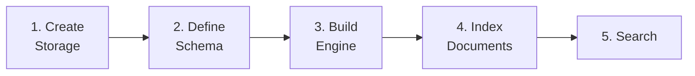

# はじめに

Laurus へようこそ! このセクションでは、ライブラリのインストールから最初の検索の実行までをガイドします。

## 作成するもの

このガイドを終えると、以下の機能を持つ検索エンジンが動作するようになります:

- テキストドキュメントのインデックス
- キーワード（Lexical）検索の実行
- セマンティック（Vector）検索の実行
- ハイブリッド検索による両者の統合

## 前提条件

- **Rust** 1.85 以降（edition 2024）
- **Cargo**（Rust に同梱）
- **Tokio** ランタイム（Laurus は非同期 API を使用します）

## ステップ

1. **[インストール](getting_started/installation.md)** — Laurus をプロジェクトに追加し、Feature Flags を選択する
2. **[クイックスタート](getting_started/quickstart.md)** — 5 つのステップで完全な検索エンジンを構築する

## ワークフロー概要

Laurus を使った検索アプリケーションの構築は、一貫したパターンに従います:

| ステップ | 内容 |
| :--- | :--- |
| **Storage の作成** | データの保存先を選択する — インメモリ、ディスク、メモリマップド |
| **Schema の定義** | フィールドとその型（text、integer、vector など）を宣言する |
| **Engine の構築** | アナライザ（テキスト用）とエンベッダ（Vector 用）を接続する |
| **ドキュメントのインデックス** | ドキュメントを追加すると、Engine がフィールドを適切なインデックスに振り分ける |
| **検索** | Lexical、Vector、またはハイブリッドクエリを実行し、ランク付けされた結果を取得する |
