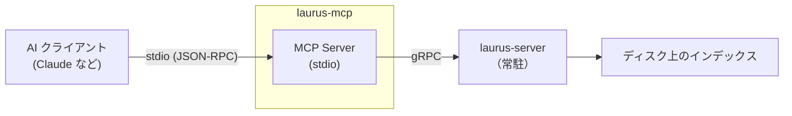

# MCP サーバー概要

`laurus-mcp` クレートは、Laurus 検索エンジン用の [Model Context Protocol (MCP)](https://modelcontextprotocol.io/) サーバーを提供します。実行中の `laurus-server` インスタンスへの gRPC クライアントとして動作し、Claude などの AI アシスタントが標準 MCP stdio トランスポートを通じてドキュメントのインデックス登録や検索を行えるようにします。

## 機能

- **MCP stdio トランスポート** — サブプロセスとして起動し、stdin/stdout 経由で AI クライアントと通信
- **gRPC クライアント** — すべてのツール呼び出しを実行中の `laurus-server` インスタンスにプロキシ
- **全 laurus 検索モード** — Lexical（BM25）、Vector（HNSW/Flat/IVF）、ハイブリッド検索
- **動的接続** — `connect` ツールで任意の laurus-server エンドポイントに接続可能
- **ドキュメントライフサイクル** — MCP ツールを通じてドキュメントの追加・更新・削除・取得が可能

## アーキテクチャ



MCP サーバーは AI クライアントによって起動される子プロセスとして動作します。すべてのツール呼び出しを gRPC 経由で `laurus-server` インスタンスにプロキシします。`laurus-server` は MCP サーバーとは別途、事前に起動しておく必要があります。

## クイックスタート

```bash
# ステップ 1: laurus-server を起動
laurus serve --port 50051

# ステップ 2: Claude Code で MCP サーバーを設定
claude mcp add laurus -- laurus mcp --endpoint http://localhost:50051
```

または手動で設定ファイルを編集：

```json
{
  "mcpServers": {
    "laurus": {
      "command": "laurus",
      "args": ["mcp", "--endpoint", "http://localhost:50051"]
    }
  }
}
```

## セクション

- [はじめに](laurus-mcp/getting_started.md) — インストール、設定、最初のステップ
- [ツールリファレンス](laurus-mcp/tools.md) — 全 MCP ツールの完全なリファレンス
