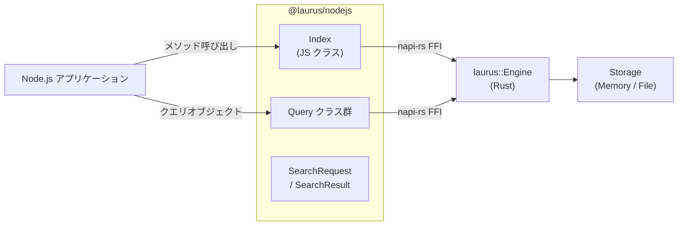

# Node.js バインディング概要

`@laurus/nodejs` パッケージは、Laurus 検索エンジンの
Node.js/TypeScript バインディングです。
[napi-rs](https://napi.rs) を使用したネイティブアドオンとして
ビルドされており、Node.js プログラムから Laurus の Lexical 検索、
Vector 検索、ハイブリッド検索機能にネイティブに近い性能で
アクセスできます。

## 特徴

- **Lexical 検索** -- BM25 スコアリングによる転置インデックスベースの全文検索
- **Vector 検索** -- Flat、HNSW、IVF インデックスによる近似最近傍（ANN）検索
- **ハイブリッド検索** -- RRF、WeightedSum による
  Lexical と Vector の結果融合
- **豊富なクエリ DSL** -- Term、Phrase、Fuzzy、Wildcard、
  NumericRange、Geo、Boolean、Span クエリ
- **テキスト解析** -- トークナイザー、フィルター、ステマー、同義語展開
- **柔軟なストレージ** -- インメモリ（揮発性）またはファイルベース（永続）
- **TypeScript 型定義** -- `.d.ts` ファイルの自動生成
- **非同期 API** -- 全 I/O 操作が Promise を返す

## アーキテクチャ



JavaScript クラスは Rust エンジンの薄いラッパーです。
各呼び出しは napi-rs の FFI 境界を一度だけ越え、
Rust エンジンが完全にネイティブコードで処理を実行します。

全 I/O メソッド（`search`、`commit`、`putDocument` 等）は
**async** で Promise を返します。napi-rs 内蔵の tokio
ランタイムで実行され、Node.js のイベントループをブロック
しません。Schema 構築、Query 作成、`stats()` は I/O を
伴わないため同期メソッドです。

> **注意:** Python バインディング（`laurus-python`）では、
> 同じ Rust エンジンのメソッドを**同期関数**として公開
> しています。Python の GIL（Global Interpreter Lock）の
> 制約により非同期 API が煩雑になるためです。Node.js には
> この制約がないため、非同期 Rust エンジンを直接 Promise
> として公開しています。

## クイックスタート

```javascript
import { Index, Schema } from "@laurus/nodejs";

// インメモリインデックスを作成
const schema = new Schema();
schema.addTextField("name");
schema.addTextField("description");
schema.setDefaultFields(["name", "description"]);

const index = await Index.create(null, schema);

// ドキュメントをインデックス
await index.putDocument("express", {
  name: "Express",
  description: "Fast minimalist web framework for Node.js.",
});
await index.putDocument("fastify", {
  name: "Fastify",
  description: "Fast and low overhead web framework.",
});
await index.commit();

// 検索
const results = await index.search("framework", 5);
for (const r of results) {
  console.log(`[${r.id}] score=${r.score.toFixed(4)}  ${r.document.name}`);
}
```

## セクション

- [インストール](laurus-nodejs/installation.md) --
  パッケージのインストール方法
- [クイックスタート](laurus-nodejs/quickstart.md) --
  サンプルを使ったハンズオン入門
- [API リファレンス](laurus-nodejs/api_reference.md) --
  クラスとメソッドの完全なリファレンス
- [開発](laurus-nodejs/development.md) --
  ソースからのビルド、テスト、プロジェクト構成
