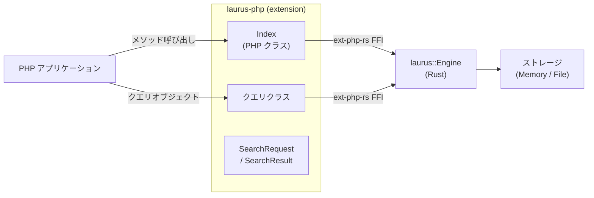

# PHP バインディング概要

`laurus` PHP エクステンションは Laurus 検索エンジンの PHP バインディングです。[ext-php-rs](https://github.com/davidcole1340/ext-php-rs) を使ってネイティブ Rust 拡張としてビルドされており、PHP プログラムからネイティブに近いパフォーマンスで Laurus の Lexical 検索、Vector 検索、ハイブリッド検索機能を利用できます。

## 機能

- **Lexical 検索** -- BM25 スコアリングを備えた転置インデックスによる全文検索
- **Vector 検索** -- Flat、HNSW、IVF インデックスを使用した近似最近傍（ANN）検索
- **ハイブリッド検索** -- フュージョンアルゴリズム（RRF、WeightedSum）で Lexical と Vector の結果を統合
- **豊富なクエリ DSL** -- Term、Phrase、Fuzzy、Wildcard、NumericRange、Geo、Boolean、Span クエリ
- **テキスト解析** -- トークナイザー、フィルター、ステマー、同義語展開
- **柔軟なストレージ** -- インメモリ（一時的）またはファイルベース（永続的）インデックス
- **PHP らしい API** -- `Laurus\` 名前空間の直感的な PHP クラス

## アーキテクチャ



PHP クラスは Rust エンジンの薄いラッパーです。
各呼び出しは ext-php-rs の FFI 境界を一度だけ越え、その後
Rust エンジンが操作をネイティブコードで実行します。

Rust エンジン内部は非同期 I/O を使用していますが、
PHP 側のメソッドはすべて**同期関数**として公開されています。
各メソッドは内部で `tokio::Runtime::block_on()` を呼び出し、
非同期 Rust を同期 PHP にブリッジしています。

## クイックスタート

```php
<?php

use Laurus\Index;

// インメモリインデックスを作成
$index = new Index();

// ドキュメントをインデックス
$index->putDocument("doc1", ["title" => "Introduction to Rust", "body" => "Systems programming language."]);
$index->putDocument("doc2", ["title" => "PHP for Web Development", "body" => "Web applications with PHP."]);
$index->commit();

// 検索
$results = $index->search("title:rust", 5);
foreach ($results as $r) {
    printf("[%s] score=%.4f  %s\n", $r->getId(), $r->getScore(), $r->getDocument()["title"]);
}
```

## セクション

- [インストール](laurus-php/installation.md) -- エクステンションのインストール方法
- [クイックスタート](laurus-php/quickstart.md) -- サンプルによるハンズオン入門
- [API リファレンス](laurus-php/api_reference.md) -- クラスとメソッドの完全リファレンス
- [開発](laurus-php/development.md) -- ソースからのビルドとテスト実行
