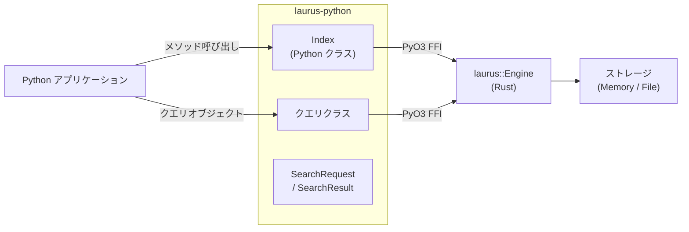

# Python バインディング概要

`laurus-python` パッケージは Laurus 検索エンジンの Python バインディングです。[PyO3](https://github.com/PyO3/pyo3) と [Maturin](https://github.com/PyO3/maturin) を使ってネイティブ Rust 拡張としてビルドされており、Python プログラムからネイティブに近いパフォーマンスで Laurus の Lexical 検索、Vector 検索、ハイブリッド検索機能を利用できます。

## 機能

- **Lexical 検索** -- BM25 スコアリングを備えた転置インデックスによる全文検索
- **Vector 検索** -- Flat、HNSW、IVF インデックスを使用した近似最近傍（ANN）検索
- **ハイブリッド検索** -- フュージョンアルゴリズム（RRF、WeightedSum）で Lexical と Vector の結果を統合
- **豊富なクエリ DSL** -- Term、Phrase、Fuzzy、Wildcard、NumericRange、Geo、Boolean、Span クエリ
- **テキスト解析** -- トークナイザー、フィルター、ステマー、同義語展開
- **柔軟なストレージ** -- インメモリ（一時的）またはファイルベース（永続的）インデックス
- **Python らしい API** -- 型情報を備えた直感的な Python クラス

## アーキテクチャ



Python クラスは Rust エンジンの薄いラッパーです。
各呼び出しは PyO3 の FFI 境界を一度だけ越え、その後
Rust エンジンが操作をネイティブコードで実行します。

Rust エンジン内部は非同期 I/O を使用していますが、
Python 側のメソッドはすべて**同期関数**として公開されています。
これは Python の GIL（Global Interpreter Lock）の制約により、
単一インタプリタ内での真の並行実行ができないためです。
非同期 API にすると `asyncio.run()` が常に必要になり、
API が煩雑になります。代わりに、各メソッドは内部で
`tokio::Runtime::block_on()` を呼び出し、非同期 Rust を
同期 Python にブリッジしています。

> **注意:** Node.js バインディング（`laurus-nodejs`）では、
> 同じ Rust エンジンのメソッドをネイティブな
> `async` / `Promise` API として公開しています。
> Node.js のイベントループは非同期をネイティブにサポート
> しているためです。

## クイックスタート

```python
import laurus

# インメモリインデックスを作成
index = laurus.Index()

# ドキュメントをインデックス
index.put_document("doc1", {"title": "Rust 入門", "body": "システムプログラミング言語です。"})
index.put_document("doc2", {"title": "Python データサイエンス", "body": "Python によるデータ解析。"})
index.commit()

# 検索
results = index.search("title:rust", limit=5)
for r in results:
    print(f"[{r.id}] score={r.score:.4f}  {r.document['title']}")
```

## セクション

- [インストール](laurus-python/installation.md) -- パッケージのインストール方法
- [クイックスタート](laurus-python/quickstart.md) -- サンプルによるハンズオン入門
- [API リファレンス](laurus-python/api_reference.md) -- クラスとメソッドの完全リファレンス
