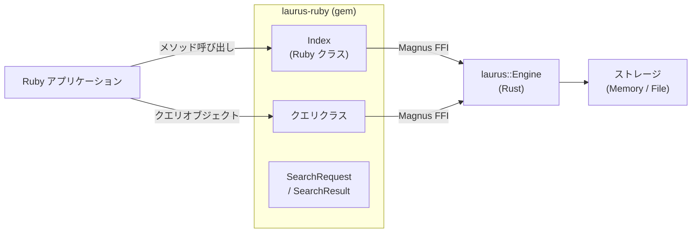

# Ruby バインディング概要

`laurus` gem は Laurus 検索エンジンの Ruby バインディングです。[Magnus](https://github.com/matsadler/magnus) と [rb_sys](https://github.com/oxidize-rb/rb-sys) を使ってネイティブ Rust 拡張としてビルドされており、Ruby プログラムからネイティブに近いパフォーマンスで Laurus の Lexical 検索、Vector 検索、ハイブリッド検索機能を利用できます。

## 機能

- **Lexical 検索** -- BM25 スコアリングを備えた転置インデックスによる全文検索
- **Vector 検索** -- Flat、HNSW、IVF インデックスを使用した近似最近傍（ANN）検索
- **ハイブリッド検索** -- フュージョンアルゴリズム（RRF、WeightedSum）で Lexical と Vector の結果を統合
- **豊富なクエリ DSL** -- Term、Phrase、Fuzzy、Wildcard、NumericRange、Geo、Boolean、Span クエリ
- **テキスト解析** -- トークナイザー、フィルター、ステマー、同義語展開
- **柔軟なストレージ** -- インメモリ（一時的）またはファイルベース（永続的）インデックス
- **Ruby らしい API** -- `Laurus::` 名前空間の直感的な Ruby クラス

## アーキテクチャ



Ruby クラスは Rust エンジンの薄いラッパーです。
各呼び出しは Magnus の FFI 境界を一度だけ越え、その後
Rust エンジンが操作をネイティブコードで実行します。

Rust エンジン内部は非同期 I/O を使用していますが、
Ruby 側のメソッドはすべて**同期関数**として公開されています。
各メソッドは内部で `tokio::Runtime::block_on()` を呼び出し、
非同期 Rust を同期 Ruby にブリッジしています。

## クイックスタート

```ruby
require "laurus"

# インメモリインデックスを作成
index = Laurus::Index.new

# ドキュメントをインデックス
index.put_document("doc1", { "title" => "Rust 入門", "body" => "システムプログラミング言語です。" })
index.put_document("doc2", { "title" => "Ruby Web 開発", "body" => "Ruby による Web アプリケーション。" })
index.commit

# 検索
results = index.search("title:rust", limit: 5)
results.each do |r|
  puts "[#{r.id}] score=#{format('%.4f', r.score)}  #{r.document['title']}"
end
```

## セクション

- [インストール](laurus-ruby/installation.md) -- gem のインストール方法
- [クイックスタート](laurus-ruby/quickstart.md) -- サンプルによるハンズオン入門
- [API リファレンス](laurus-ruby/api_reference.md) -- クラスとメソッドの完全リファレンス
- [開発](laurus-ruby/development.md) -- ソースからのビルドとテスト実行
