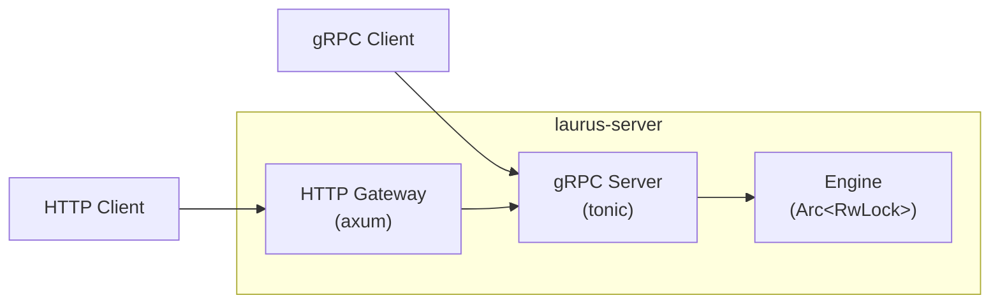

# サーバー概要

`laurus-server` クレートは、Laurus 検索エンジン用の gRPC サーバーとオプションの HTTP/JSON ゲートウェイを提供します。エンジンをメモリに常駐させることで、コマンド実行ごとの起動オーバーヘッドを排除します。

## 機能

- **永続エンジン** -- インデックスはリクエスト間で開いたまま維持され、呼び出しごとの WAL リプレイが不要
- **フル gRPC API** -- インデックス管理、ドキュメント CRUD、コミット、検索（単発 + ストリーミング）
- **HTTP ゲートウェイ** -- gRPC と併用可能なオプションの HTTP/JSON ゲートウェイで REST スタイルのアクセスを提供
- **ヘルスチェック** -- ロードバランサーやオーケストレーター向けの標準ヘルスチェックエンドポイント
- **グレースフルシャットダウン** -- Ctrl+C / SIGINT で保留中の変更を自動的にコミット
- **TOML 設定** -- オプションの設定ファイルと CLI・環境変数によるオーバーライド

## アーキテクチャ



gRPC サーバーは常に起動します。HTTP ゲートウェイはオプションで、HTTP/JSON リクエストを内部的に gRPC サーバーへプロキシします。

## クイックスタート

```bash
# デフォルト設定で起動（gRPC ポート 50051）
laurus serve

# HTTP ゲートウェイ付きで起動
laurus serve --http-port 8080

# 設定ファイルを指定して起動
laurus serve --config config.toml
```

## セクション

- [はじめに](getting_started.md) -- 起動オプションと最初のステップ
- [設定](configuration.md) -- TOML 設定、環境変数、優先順位
- [gRPC API リファレンス](grpc_api.md) -- 全サービスと RPC の完全な API ドキュメント
- [HTTP ゲートウェイ](http_gateway.md) -- HTTP/JSON エンドポイントリファレンス
