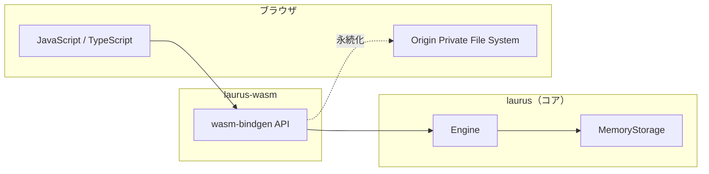

# WASM バインディング概要

`laurus-wasm` パッケージは、Laurus 検索エンジンの WebAssembly バインディングです。
サーバーなしで、ブラウザやエッジランタイム（Cloudflare Workers、Vercel Edge Functions、Deno Deploy）
上で直接、レキシカル検索・ベクトル検索・ハイブリッド検索を実行できます。

## 機能

- **レキシカル検索** -- BM25 スコアリングによる転置インデックスベースの全文検索
- **ベクトル検索** -- Flat、HNSW、IVF インデックスによる近似最近傍探索
- **ハイブリッド検索** -- RRF、WeightedSum による融合アルゴリズム
- **クエリ DSL** -- Term、Phrase、Fuzzy、Wildcard、NumericRange、Geo、Boolean、Span
- **テキスト分析** -- トークナイザー、フィルター、同義語展開
- **インメモリストレージ** -- 高速な一時インデックス
- **OPFS 永続化** -- Origin Private File System によるページリロード後のデータ保持
- **TypeScript 型定義** -- 自動生成される `.d.ts` ファイル
- **非同期 API** -- すべての I/O 操作は Promise を返す

## アーキテクチャ



## 制限事項: エンジン内自動 Embedding の非対応

ネイティブ環境での Laurus の特徴の一つに**自動 Embedding** があります。
ドキュメントをインデックスする際、エンジンが登録された Embedder（Candle BERT、
Candle CLIP、OpenAI API）を使ってテキストフィールドを自動的にベクトル埋め込みに
変換します。これにより `searchVectorText("field", "query text")` がシームレスに
動作し、呼び出し側で埋め込みを計算する必要がありません。

**laurus-wasm ではこの機能を利用できません。** `precomputed`（事前計算済み）
Embedder のみがサポートされます。理由は以下の通りです:

| Embedder | Dependency | Why it cannot run in WASM |
| --- | --- | --- |
| `candle_bert` | candle (GPU/SIMD) | Requires native SIMD intrinsics and file system for models |
| `candle_clip` | candle | Same as above |
| `openai` | reqwest (HTTP) | Requires a full async HTTP client (tokio + TLS) |

これらの依存は Feature Flags（`embeddings-candle`、`embeddings-openai`）で
管理されており、`wasm32-unknown-unknown` ビルドで無効化される `native` feature
に依存しているため除外されます。

### 推奨される代替手段

**JavaScript 側で埋め込みを計算**し、事前計算済みベクトルを `putDocument()` と
`searchVector()` に渡します:

```javascript
// Transformers.js を使用（all-MiniLM-L6-v2、384次元）
import { pipeline } from '@huggingface/transformers';

const embedder = await pipeline('feature-extraction', 'Xenova/all-MiniLM-L6-v2');

async function embed(text) {
  const output = await embedder(text, { pooling: 'mean', normalize: true });
  return Array.from(output.data);
}

// 事前計算済み埋め込みでインデックス
const vec = await embed("Rust 入門");
await index.putDocument("doc1", { title: "Rust 入門", embedding: vec });
await index.commit();

// 事前計算済みクエリ埋め込みで検索
const queryVec = await embed("安全なシステムプログラミング");
const results = await index.searchVector("embedding", queryVec);
```

このアプローチにより、ネイティブ環境と同じ Sentence Transformer モデルを使った
セマンティック検索がブラウザ内で実現できます。埋め込み計算は candle ではなく
Transformers.js（ONNX Runtime Web）が担当します。

## laurus-wasm と laurus-nodejs の使い分け

| 基準           | `laurus-wasm`              | `laurus-nodejs`                    |
| -------------- | -------------------------- | ---------------------------------- |
| 実行環境       | ブラウザ、エッジランタイム | Node.js サーバー                   |
| パフォーマンス | 良好（シングルスレッド）   | 最高（ネイティブ、マルチスレッド） |
| ストレージ     | インメモリ + OPFS          | インメモリ + ファイルシステム      |
| 埋め込み       | 事前計算のみ               | Candle、OpenAI、事前計算           |
| パッケージ     | `npm install laurus-wasm`  | `npm install laurus-nodejs`        |
| バイナリサイズ | 約 5-10 MB（WASM）         | プラットフォームネイティブ         |
