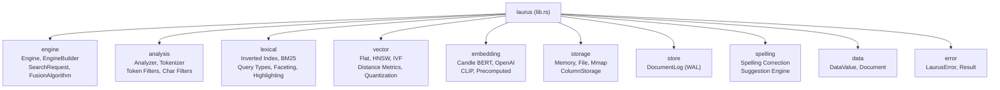

# ライブラリ概要

`laurus` クレートは検索エンジンのコアライブラリです。Lexical検索（転置インデックス（Inverted Index）によるキーワードマッチング）、Vector検索（Embeddingによるセマンティック類似度検索）、およびハイブリッド検索（両者の組み合わせ）を統一的なAPIで提供します。

## モジュール構成



## 主要な型

| 型 | モジュール | 説明 |
| :--- | :--- | :--- |
| `Engine` | `engine` | Lexical検索とVector検索を統合する検索エンジン |
| `EngineBuilder` | `engine` | Engineの設定・構築を行うBuilderパターン |
| `Schema` | `engine` | フィールド定義とルーティング設定 |
| `SearchRequest` | `engine` | 統一的な検索リクエスト（Lexical、Vector、またはハイブリッド） |
| `FusionAlgorithm` | `engine` | 結果マージ戦略（RRFまたはWeightedSum） |
| `Document` | `data` | 名前付きフィールド値のコレクション |
| `DataValue` | `data` | すべてのフィールド型に対応する統一的な値のenum |
| `LaurusError` | `error` | 各サブシステムのバリアントを含む包括的なエラー型 |

## Feature Flag

`laurus` クレートはデフォルトではFeatureが有効化されていません。必要に応じてEmbeddingサポートを有効にしてください。

| Feature | 説明 | 依存クレート |
| :--- | :--- | :--- |
| `embeddings-candle` | Hugging Face CandleによるローカルBERT Embedding | candle-core, candle-nn, candle-transformers, hf-hub, tokenizers |
| `embeddings-openai` | OpenAI API Embedding | reqwest |
| `embeddings-multimodal` | CLIPマルチモーダルEmbedding（テキスト + 画像） | image, embeddings-candle |
| `embeddings-all` | すべてのEmbedding Featureを含む | 上記すべて |

```toml
# Lexical検索のみ（Embeddingなし）
[dependencies]
laurus = "0.1.0"

# ローカルBERT Embeddingを使用
[dependencies]
laurus = { version = "0.1.0", features = ["embeddings-candle"] }

# すべてのFeatureを有効化
[dependencies]
laurus = { version = "0.1.0", features = ["embeddings-all"] }
```

## セクション

- [Engine](laurus/engine.md) -- EngineとEngineBuilderの内部構造
- [スコアリングとランキング](laurus/scoring.md) -- BM25、TF-IDF、およびベクトル類似度スコアリング
- [ファセット](laurus/faceting.md) -- 階層的なファセット検索
- [ハイライト](laurus/highlighting.md) -- 検索結果のハイライト表示
- [スペル修正](laurus/spelling_correction.md) -- スペル候補の提案と自動修正
- [ID管理](laurus/id_management.md) -- 二層構造のドキュメントID管理
- [永続化とWAL](laurus/persistence.md) -- Write-Ahead Loggingとデータの耐久性
- [削除とコンパクション](laurus/deletions.md) -- 論理削除と領域の再利用
- [エラーハンドリング](laurus/error_handling.md) -- LaurusErrorとResult型
- [拡張性](laurus/extensibility.md) -- カスタムAnalyzer、Embedder、Storageバックエンド
- [APIリファレンス](laurus/api_reference.md) -- 主要な型とメソッドの一覧
