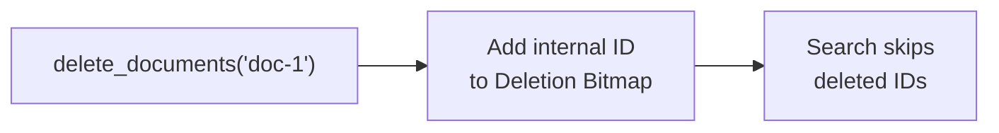
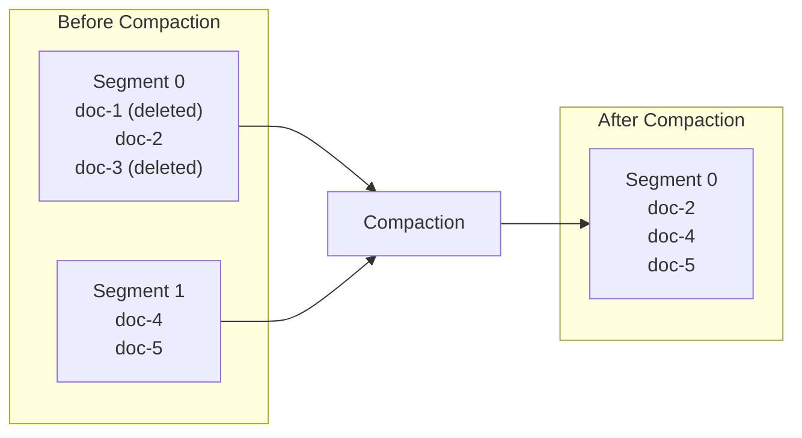

# 削除とコンパクション

Laurusは二段階の削除戦略を採用しています。高速な**論理削除（Logical Deletion）**と、それに続く定期的な**物理コンパクション（Physical Compaction）**です。

## ドキュメントの削除

```rust
// 外部IDでドキュメントを削除
engine.delete_documents("doc-1").await?;
engine.commit().await?;
```

## 論理削除

ドキュメントが削除された場合、インデックスファイルから即座に削除されるわけでは**ありません**。代わりに以下の処理が行われます。



1. ドキュメントの内部IDが**削除ビットマップ（Deletion Bitmap）**に追加されます
2. 検索時にビットマップがチェックされ、削除されたドキュメントが結果からフィルタリングされます
3. 元のデータはセグメントファイルに残ったままです

### 論理削除を採用する理由

| メリット | 説明 |
| :--- | :--- |
| **速度** | O(1) -- ビットの反転は即座に完了 |
| **不変セグメント** | セグメントファイルはインプレースで変更されないため、並行性の管理が簡素化 |
| **安全なリカバリ** | クラッシュが発生しても、削除ビットマップはWALから再構築可能 |

## Upsert（更新 = 削除 + 挿入）

既存の外部IDでドキュメントをインデックスすると、Laurusは自動的にUpsertを実行します。

1. 古いドキュメントが論理削除されます（そのIDが削除ビットマップに追加）
2. 新しい内部IDで新しいドキュメントが挿入されます
3. 外部IDから内部IDへのマッピングが更新されます

```rust
// 最初の挿入
engine.put_document("doc-1", doc_v1).await?;
engine.commit().await?;

// 更新: 古いバージョンが論理削除され、新しいバージョンが挿入される
engine.put_document("doc-1", doc_v2).await?;
engine.commit().await?;
```

## 物理コンパクション

時間の経過とともに、論理削除されたドキュメントが蓄積されスペースを浪費します。コンパクションは、削除済みエントリを含まないセグメントファイルを再書き込みすることでスペースを回収します。



### コンパクションの処理内容

1. 既存セグメントからすべての生存（未削除）ドキュメントを読み取ります
2. 削除済みエントリを含まない転置インデックスやベクトルインデックスを再構築します
3. 新しいクリーンなセグメントファイルを書き込みます
4. 古いセグメントファイルを削除します
5. 削除ビットマップをリセットします

### コストと頻度

| 側面 | 詳細 |
| :--- | :--- |
| **CPUコスト** | 高い -- インデックス構造をゼロから再構築 |
| **I/Oコスト** | 高い -- すべてのデータを読み取り、新しいセグメントを書き込み |
| **ブロッキング** | コンパクション中も検索は継続可能（新しいセグメントが準備できるまで古いセグメントが参照される） |
| **頻度** | 削除済みドキュメントがしきい値を超えた場合に実行（例: 全体の10-20%） |

### コンパクションのタイミング

- **書き込みが少ないワークロード**: 定期的にコンパクション（例: 毎日または毎週）
- **書き込みが多いワークロード**: 削除率がしきい値を超えた場合にコンパクション
- **バルク更新後**: 大量のUpsertバッチの後にコンパクション

## 削除ビットマップ

削除ビットマップは、どの内部IDが削除されたかを追跡します。

- **保存**: 削除済みドキュメントIDのHashSet（`AHashSet<u64>`）
- **検索**: O(1) -- ハッシュセットによる検索

ビットマップはインデックスセグメントと一緒に永続化され、リカバリ時にWALから再構築されます。

## 次のステップ

- データの永続化方法: [永続化とWAL](persistence.md)
- IDの管理と内部/外部IDのマッピング: [ID管理](id_management.md)
