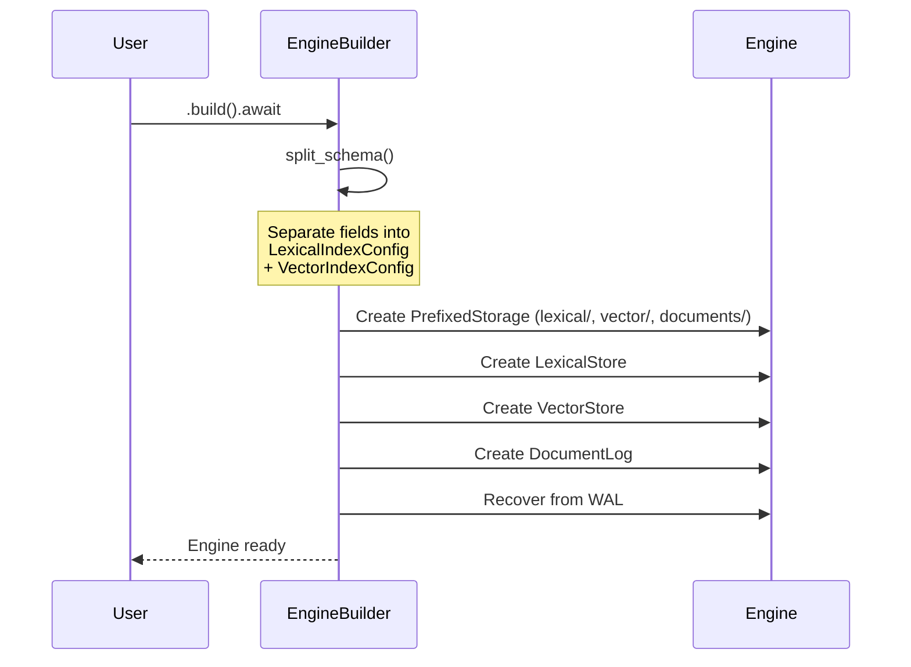
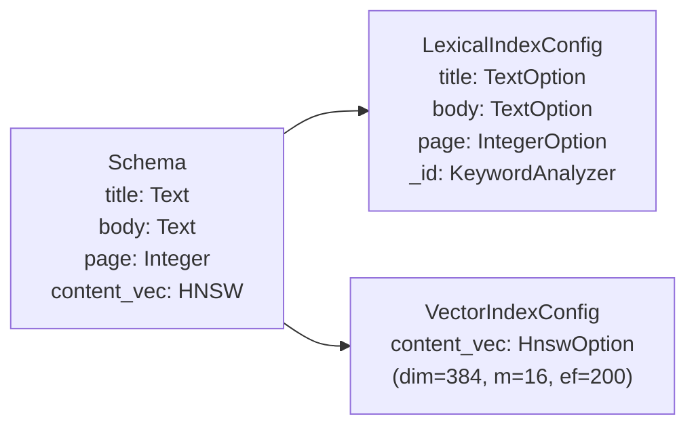
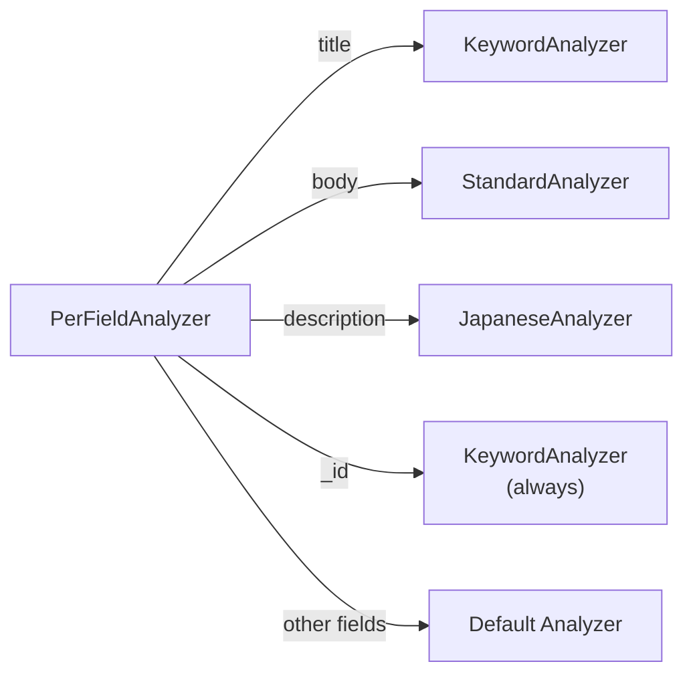
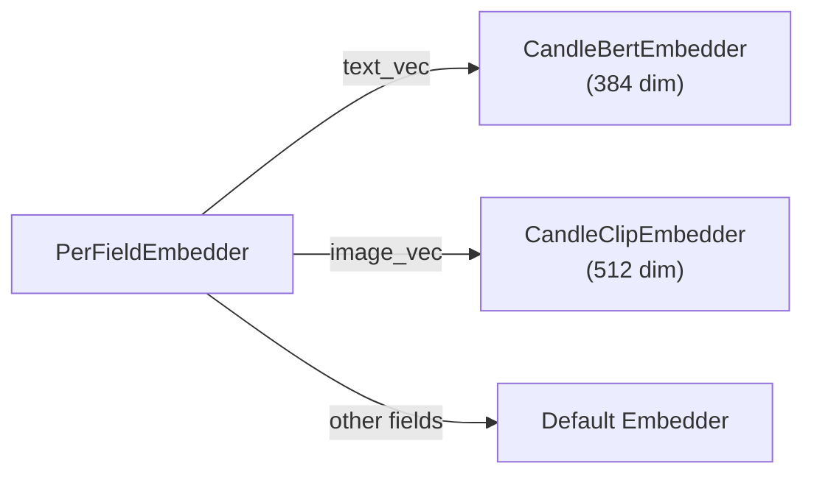

# Engine

`Engine` はLaurusの中心的な型です。Lexicalインデックス、Vectorインデックス、およびドキュメントログを単一の非同期APIで統合します。

## Engine構造体

```rust
pub struct Engine {
    schema: Schema,
    lexical: LexicalStore,
    vector: VectorStore,
    log: Arc<DocumentLog>,
}
```

| フィールド | 型 | 説明 |
| :--- | :--- | :--- |
| `schema` | `Schema` | フィールド定義とルーティングルール |
| `lexical` | `LexicalStore` | キーワード検索用の転置インデックス（Inverted Index） |
| `vector` | `VectorStore` | 類似度検索用のベクトルインデックス |
| `log` | `Arc<DocumentLog>` | クラッシュリカバリとドキュメント保存のためのWrite-Ahead Log |

## EngineBuilder

`EngineBuilder` を使用してEngineを設定・構築します。

```rust
use std::sync::Arc;
use laurus::{Engine, Schema};
use laurus::lexical::TextOption;
use laurus::storage::memory::MemoryStorage;

let storage = Arc::new(MemoryStorage::new(Default::default()));
let schema = Schema::builder()
    .add_text_field("title", TextOption::default())
    .add_text_field("body", TextOption::default())
    .add_default_field("body")
    .build();

let engine = Engine::builder(storage, schema)
    .analyzer(my_analyzer)    // オプション: カスタムテキストAnalyzer
    .embedder(my_embedder)    // オプション: ベクトルEmbedder
    .build()
    .await?;
```

### Builderメソッド

| メソッド | パラメータ | デフォルト | 説明 |
| :--- | :--- | :--- | :--- |
| `analyzer()` | `Arc<dyn Analyzer>` | `StandardAnalyzer` | Lexicalフィールド用のテキスト解析パイプライン |
| `embedder()` | `Arc<dyn Embedder>` | None | Vectorフィールド用のEmbeddingモデル |
| `build()` | -- | -- | Engineを構築（非同期） |

### Buildライフサイクル

`build()` が呼び出されると、以下の処理が実行されます。



1. **スキーマの分割** -- Lexicalフィールド（Text、Integer、Floatなど）は `LexicalIndexConfig` に、Vectorフィールド（HNSW、Flat、IVF）は `VectorIndexConfig` に分割されます
2. **プレフィックス付きストレージの作成** -- 各コンポーネントに独立した名前空間が割り当てられます（`lexical/`、`vector/`、`documents/`）
3. **ストアの初期化** -- `LexicalStore` と `VectorStore` がそれぞれの設定で作成されます
4. **WALからのリカバリ** -- 前回のセッションでコミットされなかった操作がリプレイされます

## スキーマの分割

Schemaにはlexicalフィールドとvectorフィールドの両方が含まれています。ビルド時に `split_schema()` がこれらを分離します。



予約フィールド `_id` は、完全一致検索のために `KeywordAnalyzer` を用いて常にLexical設定に追加されます。

## フィールドごとのディスパッチ

### PerFieldAnalyzer

`PerFieldAnalyzer` が指定された場合、テキスト解析はフィールドごとのAnalyzerにディスパッチされます。



### PerFieldEmbedder

同様に、`PerFieldEmbedder` はフィールドごとのEmbedderにEmbedding処理をルーティングします。



## Engineメソッド

### ドキュメント操作

| メソッド | 説明 |
| :--- | :--- |
| `put_document(id, doc)` | Upsert -- 同じIDのドキュメントが既存の場合は置き換え |
| `add_document(id, doc)` | 追加 -- 新しいチャンクとして追加（複数のチャンクが同一IDを共有可能） |
| `get_documents(id)` | 外部IDによるすべてのドキュメント/チャンクの取得 |
| `delete_documents(id)` | 外部IDによるすべてのドキュメント/チャンクの削除 |
| `commit()` | 保留中の変更をストレージにフラッシュ（ドキュメントが検索可能になる） |
| `recover()` | クラッシュ後にWALをリプレイして未コミット状態を復元 |
| `add_field(name, field_option)` | 稼働中のエンジンにフィールドを動的に追加し、更新後の `Schema` を返す |
| `delete_field(name)` | 稼働中のエンジンからフィールドを動的に削除し、更新後の `Schema` を返す |
| `schema()` | 現在の `Schema` への参照を返す |

### 検索

| メソッド | 説明 |
| :--- | :--- |
| `search(request)` | 統一検索の実行（Lexical、Vector、またはハイブリッド） |

`search()` メソッドは `SearchRequest` を受け取ります。SearchRequestにはLexicalクエリ、Vectorクエリ、またはその両方を含めることができます。両方が指定された場合、結果は指定された `FusionAlgorithm` で統合されます。

```rust
use laurus::{SearchRequestBuilder, LexicalSearchRequest, FusionAlgorithm};
use laurus::lexical::TermQuery;

// Lexicalのみの検索
let request = SearchRequestBuilder::new()
    .lexical_search_request(
        LexicalSearchRequest::new(Box::new(TermQuery::new("body", "rust")))
    )
    .limit(10)
    .build();

// RRFフュージョンによるハイブリッド検索
let request = SearchRequestBuilder::new()
    .lexical_search_request(lexical_req)
    .vector_search_request(vector_req)
    .fusion_algorithm(FusionAlgorithm::RRF { k: 60.0 })
    .limit(10)
    .build();

let results = engine.search(request).await?;
```

## SearchRequest

| フィールド | 型 | デフォルト | 説明 |
| :--- | :--- | :--- | :--- |
| `lexical_search_request` | `Option<LexicalSearchRequest>` | None | Lexicalクエリ |
| `vector_search_request` | `Option<VectorSearchRequest>` | None | Vectorクエリ |
| `limit` | `usize` | 10 | 返却する最大結果数 |
| `offset` | `usize` | 0 | ページネーションのオフセット |
| `fusion_algorithm` | `Option<FusionAlgorithm>` | RRF (k=60) | LexicalとVectorの結果を統合する方法 |
| `filter_query` | `Option<Box<dyn Query>>` | None | 両方の検索タイプに適用されるフィルタ |

## FusionAlgorithm

| バリアント | 説明 |
| :--- | :--- |
| `RRF { k: f64 }` | Reciprocal Rank Fusion -- ランクベースの結合。スコア = sum(1 / (k + rank))。比較不可能なスコアの大きさを処理します。 |
| `WeightedSum { lexical_weight, vector_weight }` | min-maxスコア正規化を用いた加重結合。重みは[0.0, 1.0]にクランプされます。 |

関連項目: [アーキテクチャ](../architecture.md) -- 高レベルのデータフロー図
