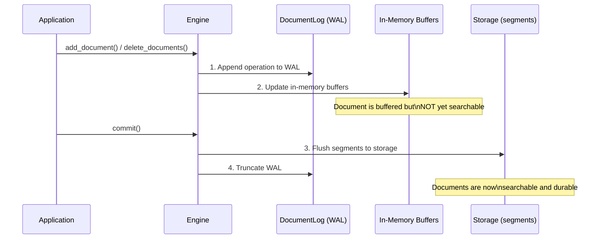
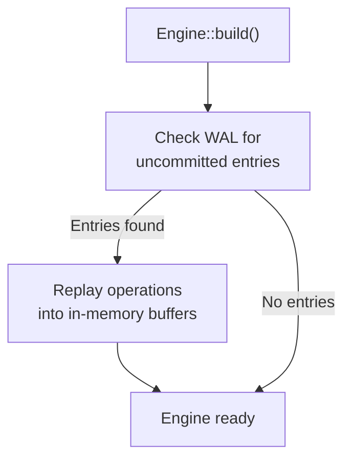

# 永続化とWAL

Laurusはデータの耐久性を確保するために**Write-Ahead Log（WAL）**を使用します。すべての書き込み操作はインメモリ構造を変更する前にWALに永続化され、プロセスがクラッシュした場合でもデータが失われないことを保証します。

## 書き込みパス



### 主要な原則

1. **WALファースト**: すべての書き込み（追加または削除）はインメモリ構造を更新する前にWALに追記されます
2. **バッファリング書き込み**: インメモリバッファが `commit()` が呼ばれるまで変更を蓄積します
3. **アトミックコミット**: `commit()` はすべてのバッファリングされた変更をセグメントファイルにフラッシュし、WALを切り捨てます
4. **クラッシュセーフティ**: 書き込みとコミットの間にプロセスがクラッシュした場合、次回起動時にWALがリプレイされます

## Write-Ahead Log（WAL）

WALは `DocumentLog` コンポーネントによって管理され、ストレージバックエンドのルートレベル（`engine.wal`）に保存されます。

### WALエントリタイプ

| エントリタイプ | 説明 |
| :--- | :--- |
| **Upsert** | ドキュメント内容 + 外部ID + 割り当てられた内部ID |
| **Delete** | 削除するドキュメントの外部ID |

### WALファイル

WALファイル（`engine.wal`）は追記専用のバイナリログです。各エントリは以下を含む自己完結型です。

- 操作タイプ（add/delete）
- シーケンス番号
- ペイロード（ドキュメントデータまたはID）

## リカバリ

エンジンがビルドされる際（`Engine::builder(...).build().await`）、残っているWALエントリが自動的にチェックされ、リプレイされます（WALはコミット時に切り捨てられるため、残っているエントリはクラッシュしたセッションのものです）。



リカバリは透過的に行われるため、手動で処理する必要はありません。

## コミットライフサイクル

```rust
// 1. ドキュメントを追加（バッファリングされ、まだ検索不可）
engine.add_document("doc-1", doc1).await?;
engine.add_document("doc-2", doc2).await?;

// 2. コミット — 永続ストレージにフラッシュ
engine.commit().await?;
// ドキュメントが検索可能に

// 3. さらにドキュメントを追加
engine.add_document("doc-3", doc3).await?;

// 4. ここでプロセスがクラッシュした場合、doc-3はWAL内にあり
//    次回起動時にリカバリされます
```

### コミットのタイミング

| 戦略 | 説明 | ユースケース |
| :--- | :--- | :--- |
| **ドキュメントごと** | 最大の耐久性、最小の検索遅延 | 書き込みが少ないリアルタイム検索 |
| **バッチごと** | スループットと遅延の良いバランス | バルクインデキシング |
| **定期的** | 最大の書き込みスループット | 大量データの取り込み |

> **ヒント:** コミットはセグメントをストレージにフラッシュするため比較的コストが高い操作です。バルクインデキシングでは、`commit()` を呼び出す前に多数のドキュメントをバッチ処理してください。

## ストレージレイアウト

エンジンは `PrefixedStorage` を使用してデータを整理します。

```text
<storage root>/
├── lexical/          # 転置インデックスセグメント
│   ├── seg-000/
│   │   ├── terms.dict
│   │   ├── postings.post
│   │   └── ...
│   └── metadata.json
├── vector/           # ベクトルインデックスセグメント
│   ├── seg-000/
│   │   ├── graph.hnsw
│   │   ├── vectors.vecs
│   │   └── ...
│   └── metadata.json
├── documents/        # ドキュメントストレージ
│   └── ...
└── engine.wal        # Write-Ahead Log
```

## 次のステップ

- 削除の処理方法: [削除とコンパクション](deletions.md)
- ストレージバックエンド: [Storage](../concepts/storage.md)
