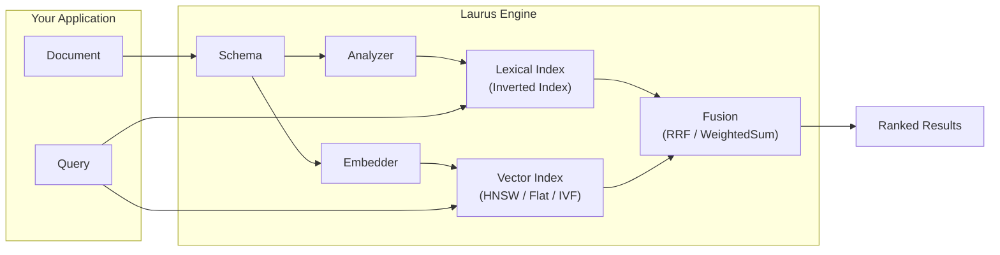

# Laurus

**A fast, featureful hybrid search library for Rust.**

Laurus is a pure-Rust library that combines **lexical search** (keyword matching via inverted index) and **vector search** (semantic similarity via embeddings) into a single, unified engine. It is designed to be embedded directly into your Rust application — no external server required.

## Key Features

| Feature | Description |
| :--- | :--- |
| **Lexical Search** | Full-text search powered by an inverted index with BM25 scoring |
| **Vector Search** | Approximate nearest neighbor (ANN) search using Flat, HNSW, or IVF indexes |
| **Hybrid Search** | Combine lexical and vector results with fusion algorithms (RRF, WeightedSum) |
| **Text Analysis** | Pluggable analyzer pipeline — tokenizers, filters, stemmers, synonyms |
| **Embeddings** | Built-in support for Candle (local BERT/CLIP), OpenAI API, or custom embedders |
| **Storage** | Pluggable backends — in-memory, file-based, or memory-mapped |
| **Query DSL** | Human-readable query syntax for lexical, vector, and hybrid search |
| **Pure Rust** | No C/C++ dependencies in the core — safe, portable, easy to build |

## How It Works



1. **Define a Schema** — declare your fields and their types (text, integer, vector, etc.)
2. **Build an Engine** — attach an analyzer for text and an embedder for vectors
3. **Index Documents** — the engine routes each field to the correct index automatically
4. **Search** — run lexical, vector, or hybrid queries and get ranked results

## Document Map

| Section | What You Will Learn |
| :--- | :--- |
| [Getting Started](getting_started.md) | Install Laurus and run your first search in minutes |
| [Architecture](architecture.md) | Understand the Engine, its components, and data flow |
| [Core Concepts](concepts.md) | Schema, text analysis, embeddings, and storage |
| [Indexing](indexing/lexical_indexing.md) | How inverted indexes and vector indexes work internally |
| [Search](search/lexical_search.md) | Query types, vector search, and hybrid fusion |
| [Advanced Features](advanced.md) | Query DSL, ID management, WAL, and compaction |
| [API Reference](api_reference.md) | Key types and methods at a glance |

## Quick Example

```rust
use std::sync::Arc;
use laurus::{Document, Engine, Schema, SearchRequestBuilder, Result};
use laurus::lexical::{TextOption, TermQuery};
use laurus::storage::memory::MemoryStorage;

#[tokio::main]
async fn main() -> Result<()> {
    // 1. Storage
    let storage = Arc::new(MemoryStorage::new(Default::default()));

    // 2. Schema
    let schema = Schema::builder()
        .add_text_field("title", TextOption::default())
        .add_text_field("body", TextOption::default())
        .add_default_field("body")
        .build();

    // 3. Engine
    let engine = Engine::builder(storage, schema).build().await?;

    // 4. Index a document
    let doc = Document::builder()
        .add_text("title", "Hello Laurus")
        .add_text("body", "A fast search library for Rust")
        .build();
    engine.add_document("doc-1", doc).await?;
    engine.commit().await?;

    // 5. Search
    let request = SearchRequestBuilder::new()
        .lexical_search_request(
            laurus::LexicalSearchRequest::new(
                Box::new(TermQuery::new("body", "rust"))
            )
        )
        .limit(10)
        .build();
    let results = engine.search(request).await?;

    for r in &results {
        println!("{}: score={:.4}", r.id, r.score);
    }
    Ok(())
}
```

## License

Laurus is dual-licensed under [MIT](https://opensource.org/licenses/MIT) and [Apache 2.0](https://www.apache.org/licenses/LICENSE-2.0).
