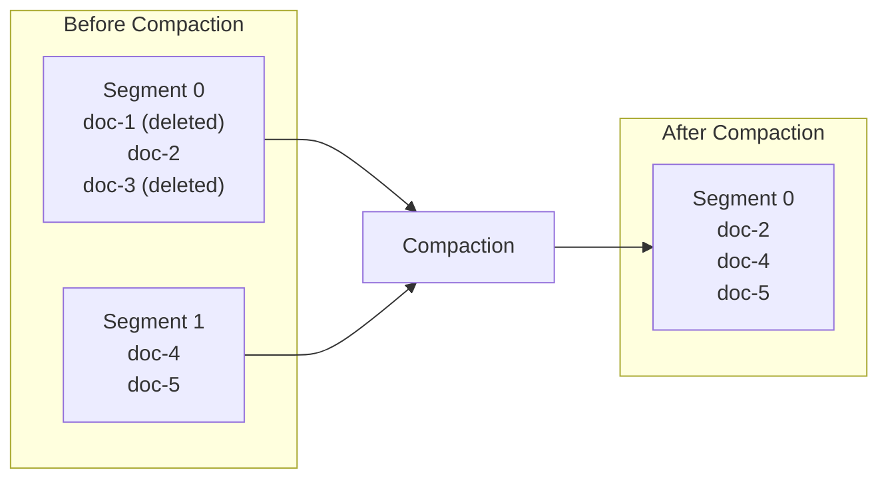

# Deletions & Compaction

Laurus uses a two-phase deletion strategy: fast **logical deletion** followed by periodic **physical compaction**.

## Deleting Documents

```rust
// Delete a document by its external ID
engine.delete_documents("doc-1").await?;
engine.commit().await?;
```

## Logical Deletion

When a document is deleted, it is **not** immediately removed from the index files. Instead:


1. The document's internal ID is added to a **deletion bitmap**
2. The bitmap is checked during every search, filtering out deleted documents from results
3. The original data remains in the segment files

### Why Logical Deletion?

| Benefit | Description |
| :--- | :--- |
| **Speed** | O(1) — flipping a bit is instant |
| **Immutable segments** | Segment files are never modified in place, simplifying concurrency |
| **Safe recovery** | If a crash occurs, the deletion bitmap can be reconstructed from the WAL |

## Upserts (Update = Delete + Insert)

When you index a document with an existing external ID, Laurus performs an automatic upsert:

1. The old document is logically deleted (its ID is added to the deletion bitmap)
2. A new document is inserted with a new internal ID
3. The external-to-internal ID mapping is updated

```rust
// First insert
engine.put_document("doc-1", doc_v1).await?;
engine.commit().await?;

// Update: old version is logically deleted, new version is inserted
engine.put_document("doc-1", doc_v2).await?;
engine.commit().await?;
```

## Physical Compaction

Over time, logically deleted documents accumulate and waste space. Compaction reclaims this space by rewriting segment files without the deleted entries.



### What Compaction Does

1. Reads all live (non-deleted) documents from existing segments
2. Rebuilds the inverted index and/or vector index without deleted entries
3. Writes new, clean segment files
4. Removes the old segment files
5. Resets the deletion bitmap

### Cost and Frequency

| Aspect | Detail |
| :--- | :--- |
| **CPU cost** | High — rebuilds index structures from scratch |
| **I/O cost** | High — reads all data, writes new segments |
| **Blocking** | Searches continue during compaction (reads see the old segments until the new ones are ready) |
| **Frequency** | Run when deleted documents exceed a threshold (e.g., 10-20% of total) |

### When to Compact

- **Low-write workloads**: Compact periodically (e.g., daily or weekly)
- **High-write workloads**: Compact when the deletion ratio exceeds a threshold
- **After bulk updates**: Compact after a large batch of upserts

## Deletion Bitmap

The deletion bitmap tracks which internal IDs have been deleted:

- **Storage**: HashSet of deleted document IDs (`AHashSet<u64>`)
- **Lookup**: O(1) — hash set lookup

The bitmap is persisted alongside the index segments and is rebuilt from the WAL during recovery.

## Next Steps

- How data is persisted: [Persistence & WAL](persistence.md)
- ID management and internal/external ID mapping: [ID Management](id_management.md)
