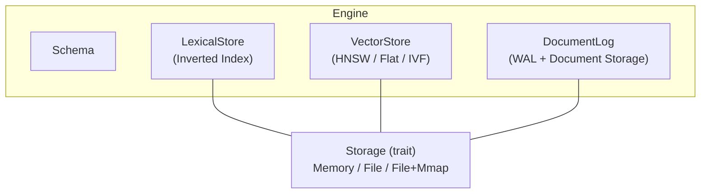
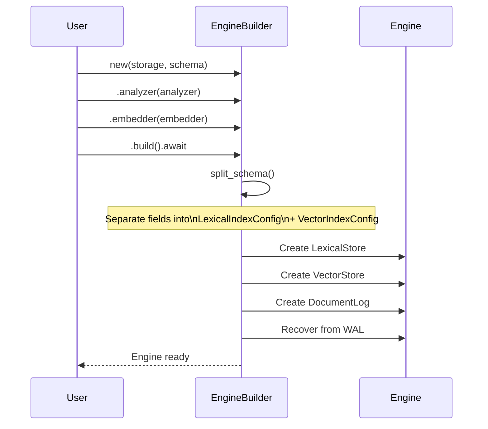
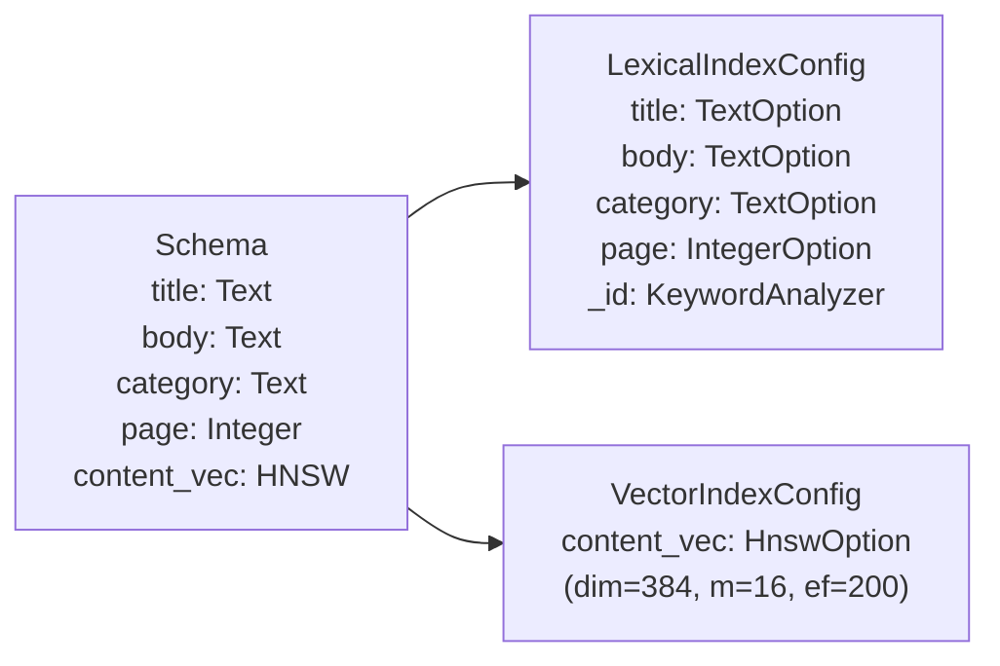
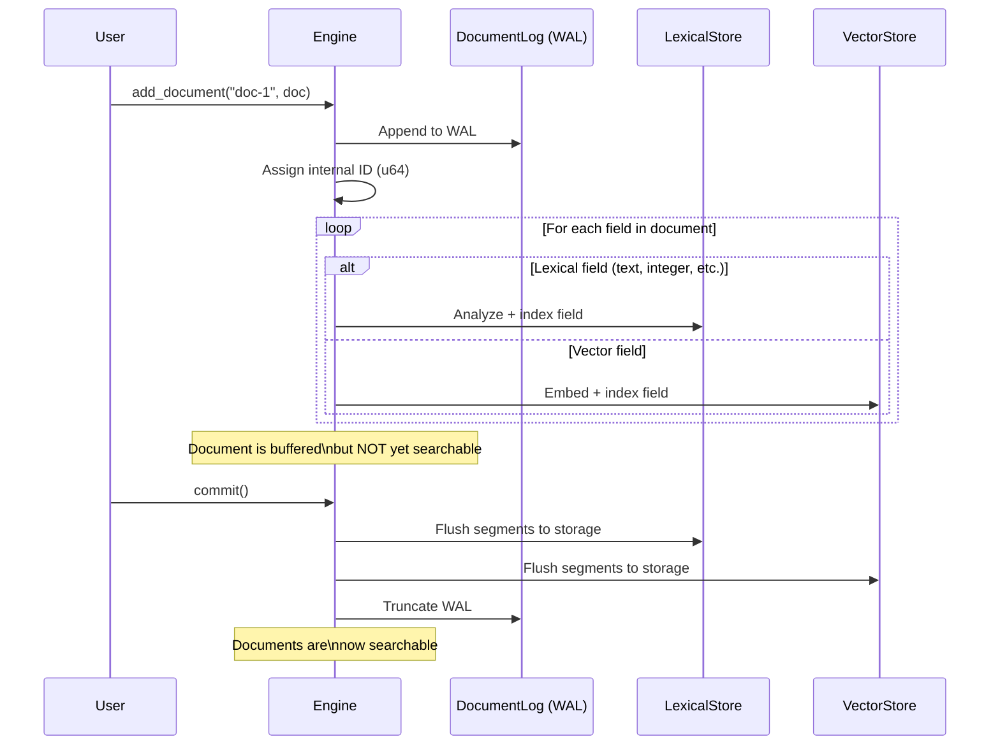
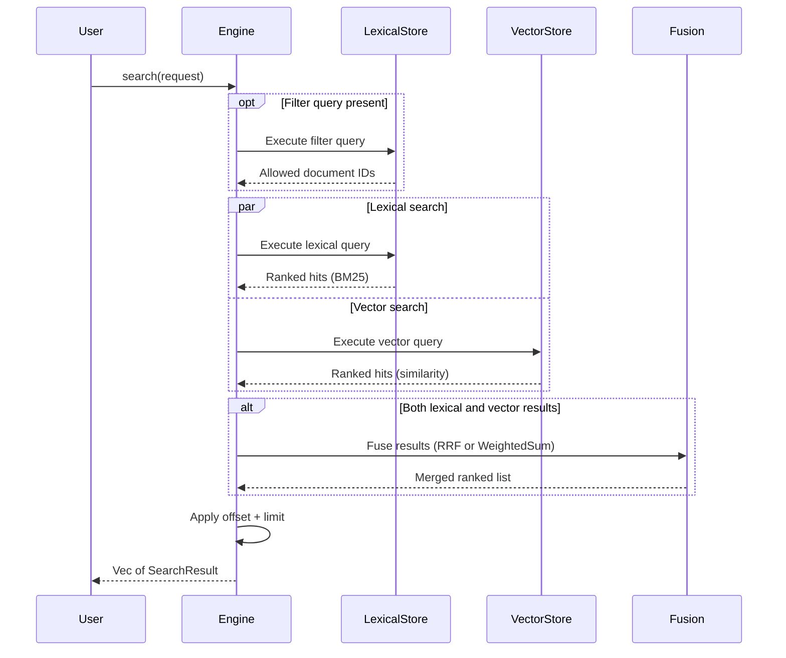
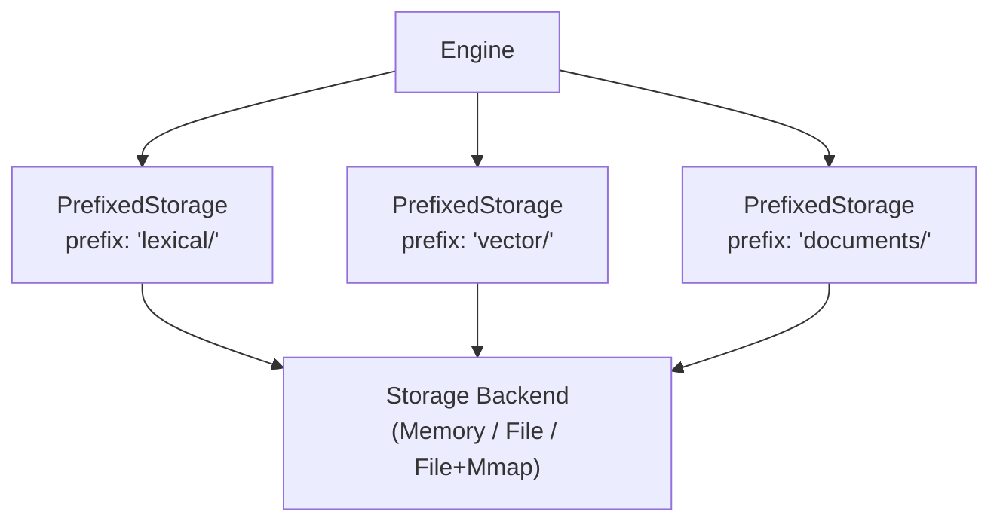
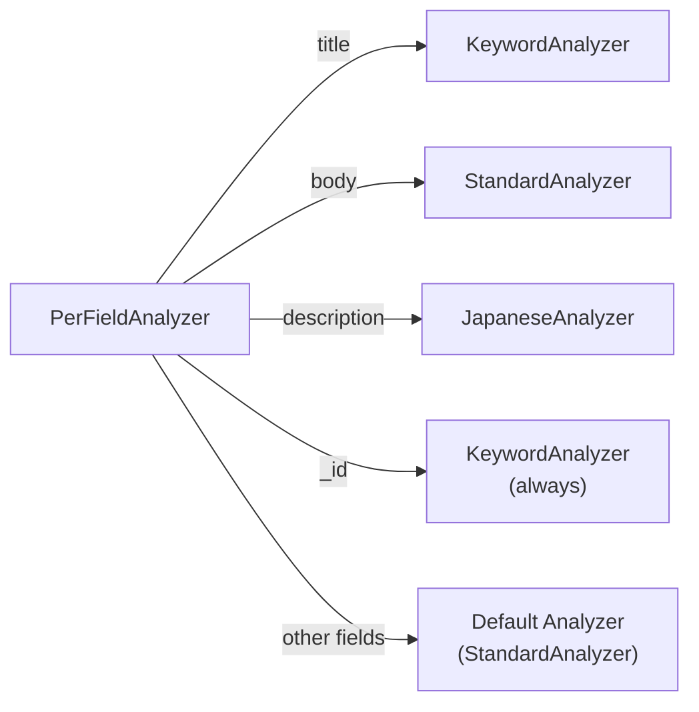

# Architecture

This page explains how Laurus is structured internally. Understanding the architecture will help you make better decisions about schema design, analyzer selection, and search strategies.

## High-Level Overview

Laurus is organized around a single `Engine` that coordinates four internal components:



| Component | Responsibility |
| :--- | :--- |
| **Schema** | Declares fields and their types; determines how each field is routed |
| **LexicalStore** | Inverted index for keyword search (BM25 scoring) |
| **VectorStore** | Vector index for similarity search (Flat, HNSW, or IVF) |
| **DocumentLog** | Write-ahead log (WAL) for durability + raw document storage |

All three stores share a single `Storage` backend, isolated by key prefixes (`lexical/`, `vector/`, `documents/`).

## Engine Lifecycle

### Building an Engine

The `EngineBuilder` assembles the engine from its parts:

```rust
let engine = Engine::builder(storage, schema)
    .analyzer(analyzer)      // optional: for text fields
    .embedder(embedder)      // optional: for vector fields
    .build()
    .await?;
```



During `build()`, the engine:

1. **Splits the schema** — lexical fields go to `LexicalIndexConfig`, vector fields go to `VectorIndexConfig`
2. **Creates prefixed storage** — each component gets an isolated namespace (`lexical/`, `vector/`, `documents/`)
3. **Initializes stores** — `LexicalStore` and `VectorStore` are constructed with their configs
4. **Recovers from WAL** — replays any uncommitted operations from a previous session

### Schema Splitting

The `Schema` contains both lexical and vector fields. At build time, `split_schema()` separates them:



Key details:

- The reserved `_id` field is always added to the lexical config with `KeywordAnalyzer` (exact match)
- A `PerFieldAnalyzer` wraps per-field analyzer settings; if you pass a simple `StandardAnalyzer`, it becomes the default for all text fields
- A `PerFieldEmbedder` works the same way for vector fields

## Indexing Data Flow

When you call `engine.add_document(id, doc)`:



Key points:

- **WAL-first**: every write is logged before modifying in-memory structures
- **Dual indexing**: each field is routed to either the lexical or vector store based on the schema
- **Commit required**: documents become searchable only after `commit()`

## Search Data Flow

When you call `engine.search(request)`:



The search pipeline has three stages:

1. **Filter** (optional) — execute a filter query on the lexical index to get a set of allowed document IDs
2. **Search** — run lexical and/or vector queries in parallel
3. **Fusion** — if both query types are present, merge results using RRF (default, k=60) or WeightedSum

## Storage Architecture

All components share a single `Storage` trait implementation, but use key prefixes to isolate their data:



| Backend | Description | Best For |
| :--- | :--- | :--- |
| `MemoryStorage` | All data in memory | Testing, small datasets, ephemeral use |
| `FileStorage` | Standard file I/O | General production use |
| `FileStorage` (mmap) | Memory-mapped files (`use_mmap = true`) | Large datasets, read-heavy workloads |

## Per-Field Dispatch

When a `PerFieldAnalyzer` is provided, the engine dispatches analysis to field-specific analyzers. The same pattern applies to `PerFieldEmbedder`.



This allows different fields to use different analysis strategies within the same engine.

## Summary

| Aspect | Detail |
| :--- | :--- |
| **Core struct** | `Engine` — coordinates all operations |
| **Builder** | `EngineBuilder` — assembles Engine from Storage + Schema + Analyzer + Embedder |
| **Schema split** | Lexical fields → `LexicalIndexConfig`, Vector fields → `VectorIndexConfig` |
| **Write path** | WAL → in-memory buffers → `commit()` → persistent storage |
| **Read path** | Query → parallel lexical/vector search → fusion → ranked results |
| **Storage isolation** | `PrefixedStorage` with `lexical/`, `vector/`, `documents/` prefixes |
| **Per-field dispatch** | `PerFieldAnalyzer` and `PerFieldEmbedder` route to field-specific implementations |

## Next Steps

- Understand field types and schema design: [Schema & Fields](concepts/schema_and_fields.md)
- Learn about text analysis: [Text Analysis](concepts/analysis.md)
- Learn about embeddings: [Embeddings](concepts/embedding.md)
