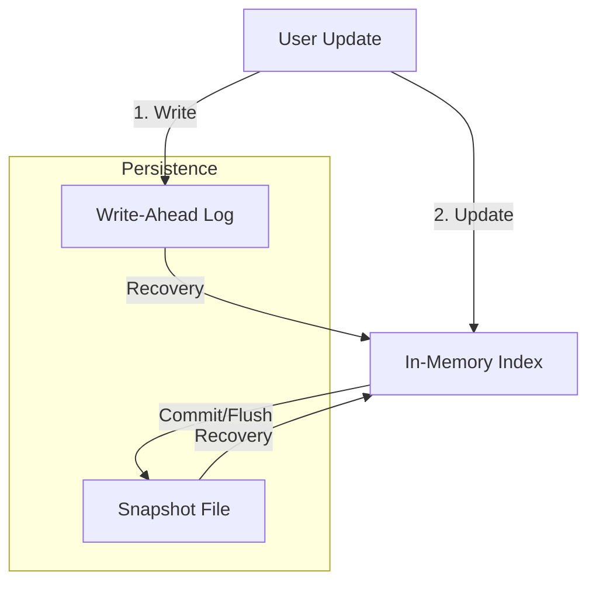

# Core Concepts

This section details the internal architecture and design philosophy of IRiS, based on its current Rust implementation.

## Unified Vector Engine Architecture

At the heart of IRiS is the `VectorEngine` (`src/vector/engine.rs`), which acts as the unified coordinator for all search operations. Unlike traditional systems that treat vector search and keyword search as separate silos, IRiS integrates them into a single cohesive system.

### Key Components

1. **VectorEngine**:
    * **Responsibility**: Manages the lifecycle of documents, handles persistence (WAL & Snapshots), and coordinates search queries.
    * **Unified Indexing**: When a document is indexed, `VectorEngine` splits it into:
      * **Vector Data**: Stored in field-specific indices (HNSW, Flat, IVF).
      * **Lexical Data**: Stored in a managed `LexicalEngine` instance (`metadata_index`).
    * **Implicit Schema**: By default, fields are registered dynamically upon insertion (`implicit_schema: true`), allowing for a schemaless-like experience while maintaining strict typing internally.

2. **LexicalEngine** (`src/lexical/engine.rs`):
    * **Role**: Serves as an internal component of `VectorEngine` to handle:
      * **Inverted Indices**: For `Term`, `Phrase`, and `Boolean` queries.
      * **ID Mapping**: Maps external string IDs (e.g., "product-123") to internal 64-bit integer IDs (`u64`).
      * **Metadata Storage**: Stores non-vector document fields (JSON-like metadata).
    * **Design**: Uses a "Near Real-Time" (NRT) architecture with a `writer_cache` for uncommitted changes and a `searcher_cache` for committed views.

3. **Storage Abstraction** (`src/storage.rs`):
    * All components interact with data through the `Storage` trait, enabling seamless switching between backends:
      * `MemoryStorage`: Pure in-memory usage (great for testing/embedded).
      * `FileStorage`: Standard disk-based persistence.
      * `MmapStorage`: Memory-mapped files for high-performance large datasets.

## Data Model

IRiS uses a flexible data model centered around the `DocumentVector` structure.

```rust
pub struct DocumentVector {
    /// Vector fields (e.g., "embedding", "image_vec")
    pub fields: HashMap<String, StoredVector>,
    /// Metadata fields (e.g., "title", "category", "_id")
    pub metadata: HashMap<String, String>,
}
```

* **External ID (`_id`)**: Every document has a unique string ID. Internally, this is mapped to a dense `u64` ID for performance.
* **Vector Fields**: Store high-dimensional vectors. Supported formats include:
  * **Flat**: Brute-force exact search.
  * **HNSW**: Hierarchical Navigable Small World graphs for approximate nearest neighbor search.
  * **IVF**: Inverted File Index for quantized search.
* **Payloads**: You can index raw text or images. The engine uses configured `Embedder`s (e.g., CLIP, BERT) to convert these payloads into vectors on the fly.

## Hybrid Search & Fusion

One of IRiS's core strengths is its ability to perform **Hybrid Search**—combining semantic similarity (Vector) with keyword relevance (Lexical).

### Search Flow

1. **Request**: The user sends a `VectorSearchRequest` containing both a query vector and a lexical query (e.g., "find red shoes" + `category:"sale"`).
2. **Parallel Execution**:
   * The **Vector Searcher** scans the HNSW index to find nearest neighbors.
   * The **Lexical Searcher** scans the Inverted Index to find matching terms.
3. **Fusion**: The results are merged using a configurable strategy (`FusionConfig`):
   * **RRF (Reciprocal Rank Fusion)**: Ranks documents based on their positional rank in each result set. Robust and parameter-free.
   * **Weighted Sum**: Linearly combines normalized scores (`alpha * vector_score + beta * lexical_score`).

## Persistence & durability

IRiS ensures data safety through a combination of **Write-Ahead Logging (WAL)** and **Snapshots**.

* **WAL (`src/vector/index/wal.rs`)**: Every write operation (Upsert/Delete) is appended to a log file immediately. This ensures that even if the process crashes, recent changes can be replayed on startup.
* **Snapshots**: Periodically, the in-memory state of the registry and documents is serialized to disk (`document_snapshot.bin`). This speeds up recovery by avoiding full WAL replay.
* **Commit**: Calling `commit()` forces a flush of all in-memory buffers to persistent storage and rotates the logs.


