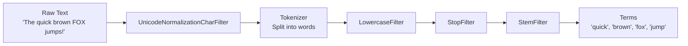
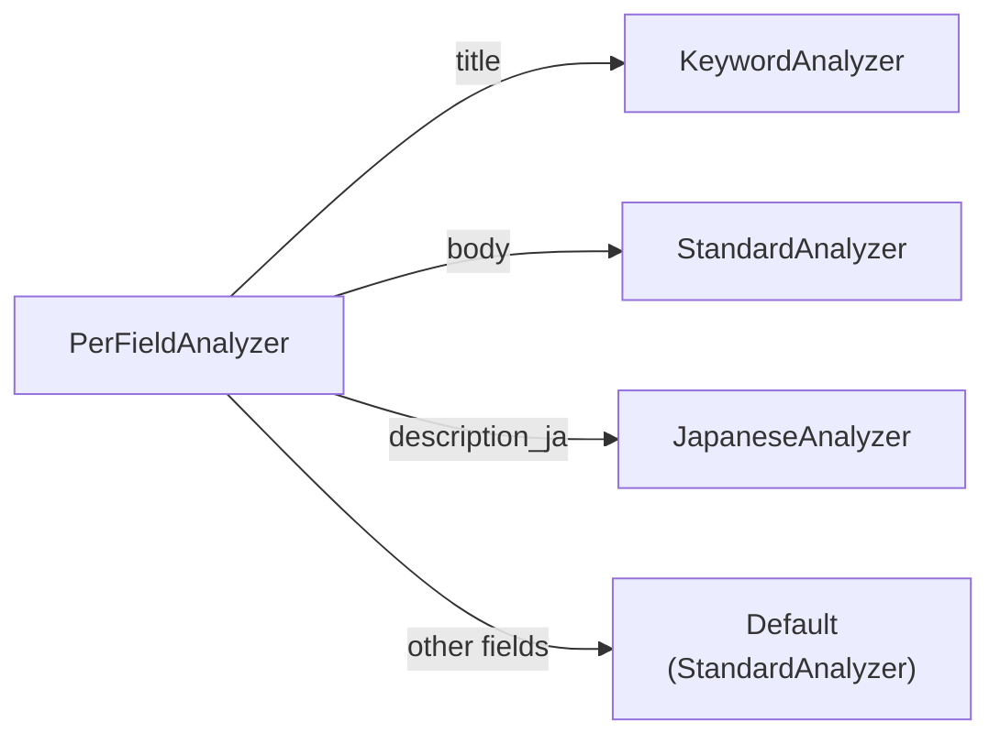

# Text Analysis

Text analysis is the process of converting raw text into searchable tokens. When a document is indexed, the analyzer breaks text fields into individual terms; when a query is executed, the same analyzer processes the query text to ensure consistency.

## The Analysis Pipeline



The analysis pipeline consists of:

1. **Char Filters** — normalize raw text at the character level before tokenization
2. **Tokenizer** — splits text into raw tokens (words, characters, n-grams)
3. **Token Filters** — transform, remove, or expand tokens (lowercase, stop words, stemming, synonyms)

## The Analyzer Trait

All analyzers implement the `Analyzer` trait:

```rust
pub trait Analyzer: Send + Sync + Debug {
    fn analyze(&self, text: &str) -> Result<TokenStream>;
    fn name(&self) -> &str;
    fn as_any(&self) -> &dyn Any;
}
```

`TokenStream` is a `Box<dyn Iterator<Item = Token> + Send>` — a lazy iterator over tokens.

A `Token` contains:

| Field | Type | Description |
| :--- | :--- | :--- |
| `text` | `String` | The token text |
| `position` | `usize` | Position in the original text |
| `start_offset` | `usize` | Start byte offset in original text |
| `end_offset` | `usize` | End byte offset in original text |
| `position_increment` | `usize` | Distance from previous token |
| `position_length` | `usize` | Span of the token (>1 for synonyms) |
| `boost` | `f32` | Token-level scoring weight |
| `stopped` | `bool` | Whether marked as a stop word |
| `metadata` | `Option<TokenMetadata>` | Additional token metadata |

## Built-in Analyzers

### StandardAnalyzer

The default analyzer. Suitable for most Western languages.

Pipeline: `RegexTokenizer` (Unicode word boundaries) → `LowercaseFilter` → `StopFilter` (128 common English stop words)

```rust
use iris::analysis::analyzer::standard::StandardAnalyzer;

let analyzer = StandardAnalyzer::default();
// "The Quick Brown Fox" → ["quick", "brown", "fox"]
// ("The" is removed by stop word filtering)
```

### JapaneseAnalyzer

Uses morphological analysis for Japanese text segmentation.

Pipeline: `UnicodeNormalizationCharFilter` (NFKC) → `JapaneseIterationMarkCharFilter` → `LinderaTokenizer` → `LowercaseFilter` → `StopFilter` (Japanese stop words)

```rust
use iris::analysis::analyzer::japanese::JapaneseAnalyzer;

let analyzer = JapaneseAnalyzer::new()?;
// "東京都に住んでいる" → ["東京", "都", "に", "住ん", "で", "いる"]
```

### KeywordAnalyzer

Treats the entire input as a single token. No tokenization or normalization.

```rust
use iris::analysis::analyzer::keyword::KeywordAnalyzer;

let analyzer = KeywordAnalyzer::new();
// "Hello World" → ["Hello World"]
```

Use this for fields that should match exactly (categories, tags, status codes).

### PipelineAnalyzer

Build a custom pipeline by combining any char filters, a tokenizer, and any sequence of token filters:

```rust
use iris::analysis::analyzer::pipeline::PipelineAnalyzer;
use iris::analysis::char_filter::unicode_normalize::{
    NormalizationForm, UnicodeNormalizationCharFilter,
};
use iris::analysis::tokenizer::regex::RegexTokenizer;
use iris::analysis::token_filter::lowercase::LowercaseFilter;
use iris::analysis::token_filter::stop::StopFilter;
use iris::analysis::token_filter::stem::StemFilter;

let analyzer = PipelineAnalyzer::new(Arc::new(RegexTokenizer::new()?))
    .add_char_filter(Arc::new(UnicodeNormalizationCharFilter::new(NormalizationForm::NFKC)))
    .add_filter(Arc::new(LowercaseFilter::new()))
    .add_filter(Arc::new(StopFilter::new()))
    .add_filter(Arc::new(StemFilter::new()));  // Porter stemmer
```

## PerFieldAnalyzer

`PerFieldAnalyzer` lets you assign different analyzers to different fields within the same engine:



```rust
use std::sync::Arc;
use iris::analysis::analyzer::standard::StandardAnalyzer;
use iris::analysis::analyzer::keyword::KeywordAnalyzer;
use iris::analysis::analyzer::per_field::PerFieldAnalyzer;

// Default analyzer for fields not explicitly configured
let mut per_field = PerFieldAnalyzer::new(
    Arc::new(StandardAnalyzer::default())
);

// Use KeywordAnalyzer for exact-match fields
per_field.add_analyzer("category", Arc::new(KeywordAnalyzer::new()));
per_field.add_analyzer("status", Arc::new(KeywordAnalyzer::new()));

let engine = Engine::builder(storage, schema)
    .analyzer(Arc::new(per_field))
    .build()
    .await?;
```

> **Note:** The `_id` field is always analyzed with `KeywordAnalyzer` regardless of configuration.

## Char Filters

Char filters operate on the raw input text **before** it reaches the tokenizer. They perform character-level normalization such as Unicode normalization, character mapping, and pattern-based replacement. This ensures that the tokenizer receives clean, normalized text.

All char filters implement the `CharFilter` trait:

```rust
pub trait CharFilter: Send + Sync {
    fn filter(&self, input: &str) -> (String, Vec<Transformation>);
    fn name(&self) -> &'static str;
}
```

The `Transformation` records describe how character positions shifted, allowing the engine to map token positions back to the original text.

| Char Filter | Description |
| :--- | :--- |
| `UnicodeNormalizationCharFilter` | Unicode normalization (NFC, NFD, NFKC, NFKD) |
| `MappingCharFilter` | Replaces character sequences based on a mapping dictionary |
| `PatternReplaceCharFilter` | Replaces characters matching a regex pattern |
| `JapaneseIterationMarkCharFilter` | Expands Japanese iteration marks (踊り字) to their base characters |

### UnicodeNormalizationCharFilter

Applies Unicode normalization to the input text. NFKC is recommended for search use cases because it normalizes both compatibility characters and composed forms.

```rust
use iris::analysis::char_filter::unicode_normalize::{
    NormalizationForm, UnicodeNormalizationCharFilter,
};

let filter = UnicodeNormalizationCharFilter::new(NormalizationForm::NFKC);
// "Ｓｏｎｙ" (fullwidth) → "Sony" (halfwidth)
// "㌂" → "アンペア"
```

| Form | Description |
| :--- | :--- |
| NFC | Canonical decomposition followed by canonical composition |
| NFD | Canonical decomposition |
| NFKC | Compatibility decomposition followed by canonical composition |
| NFKD | Compatibility decomposition |

### MappingCharFilter

Replaces character sequences using a dictionary. Matches are found using the Aho-Corasick algorithm (leftmost-longest match).

```rust
use std::collections::HashMap;
use iris::analysis::char_filter::mapping::MappingCharFilter;

let mut mapping = HashMap::new();
mapping.insert("ph".to_string(), "f".to_string());
mapping.insert("qu".to_string(), "k".to_string());

let filter = MappingCharFilter::new(mapping)?;
// "phone queue" → "fone keue"
```

### PatternReplaceCharFilter

Replaces all occurrences of a regex pattern with a fixed string.

```rust
use iris::analysis::char_filter::pattern_replace::PatternReplaceCharFilter;

// Remove hyphens
let filter = PatternReplaceCharFilter::new(r"-", "")?;
// "123-456-789" → "123456789"

// Normalize numbers
let filter = PatternReplaceCharFilter::new(r"\d+", "NUM")?;
// "Year 2024" → "Year NUM"
```

### JapaneseIterationMarkCharFilter

Expands Japanese iteration marks (踊り字) to their base characters. Supports kanji (`々`), hiragana (`ゝ`, `ゞ`), and katakana (`ヽ`, `ヾ`) iteration marks.

```rust
use iris::analysis::char_filter::japanese_iteration_mark::JapaneseIterationMarkCharFilter;

let filter = JapaneseIterationMarkCharFilter::new(
    true,  // normalize kanji iteration marks
    true,  // normalize kana iteration marks
);
// "佐々木" → "佐佐木"
// "いすゞ" → "いすず"
```

### Using Char Filters in a Pipeline

Add char filters to a `PipelineAnalyzer` with `add_char_filter()`. Multiple char filters are applied in the order they are added, all before the tokenizer runs.

```rust
use std::sync::Arc;
use iris::analysis::analyzer::pipeline::PipelineAnalyzer;
use iris::analysis::char_filter::unicode_normalize::{
    NormalizationForm, UnicodeNormalizationCharFilter,
};
use iris::analysis::char_filter::pattern_replace::PatternReplaceCharFilter;
use iris::analysis::tokenizer::regex::RegexTokenizer;
use iris::analysis::token_filter::lowercase::LowercaseFilter;

let analyzer = PipelineAnalyzer::new(Arc::new(RegexTokenizer::new()?))
    .add_char_filter(Arc::new(
        UnicodeNormalizationCharFilter::new(NormalizationForm::NFKC),
    ))
    .add_char_filter(Arc::new(
        PatternReplaceCharFilter::new(r"-", "")?,
    ))
    .add_filter(Arc::new(LowercaseFilter::new()));
// "Ｔｏｋｙｏ-2024" → NFKC → "Tokyo-2024" → remove hyphens → "Tokyo2024" → tokenize → lowercase → ["tokyo2024"]
```

## Tokenizers

| Tokenizer | Description |
| :--- | :--- |
| `RegexTokenizer` | Unicode word boundaries; splits on whitespace and punctuation |
| `UnicodeWordTokenizer` | Splits on Unicode word boundaries |
| `WhitespaceTokenizer` | Splits on whitespace only |
| `WholeTokenizer` | Returns the entire input as a single token |
| `LinderaTokenizer` | Japanese morphological analysis (Lindera/MeCab) |
| `NgramTokenizer` | Generates n-gram tokens of configurable size |

## Token Filters

| Filter | Description |
| :--- | :--- |
| `LowercaseFilter` | Converts tokens to lowercase |
| `StopFilter` | Removes common words ("the", "is", "a") |
| `StemFilter` | Reduces words to their root form ("running" → "run") |
| `SynonymGraphFilter` | Expands tokens with synonyms from a dictionary |
| `BoostFilter` | Adjusts token boost values |
| `LimitFilter` | Limits the number of tokens |
| `StripFilter` | Strips leading/trailing whitespace from tokens |
| `FlattenGraphFilter` | Flattens token graphs (for synonym expansion) |
| `RemoveEmptyFilter` | Removes empty tokens |

### Synonym Expansion

The `SynonymGraphFilter` expands terms using a synonym dictionary:

```rust
use iris::analysis::synonym::dictionary::SynonymDictionary;
use iris::analysis::token_filter::synonym_graph::SynonymGraphFilter;

let mut dict = SynonymDictionary::new(None)?;
dict.add_synonym_group(vec!["ml".into(), "machine learning".into()]);
dict.add_synonym_group(vec!["ai".into(), "artificial intelligence".into()]);

// keep_original=true means original token is preserved alongside synonyms
let filter = SynonymGraphFilter::new(dict, true)
    .with_boost(0.8);  // synonyms get 80% weight
```

The `boost` parameter controls how much weight synonyms receive relative to original tokens. A value of `0.8` means synonym matches contribute 80% as much to the score as exact matches.
