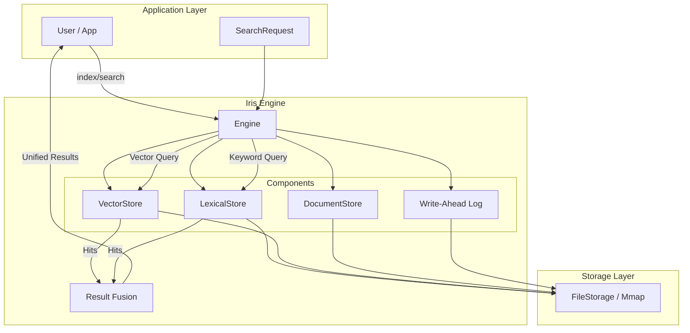

# Architecture

Iris is built on a unified modular architecture where the **Engine** serves as the core orchestrator.

## 1. Engine (Unified)

The primary engine associated with the library. It unifies vector similarity search with full-text search capabilities.

- **Orchestration**: Manages both VectorStore (HNSW/IVF/Flat index) and LexicalStore (Inverted Index).
- **Hybrid Search**: Performs unified queries combining vector similarity and keyword relevance.
- **ID Management**: Manages external ID to internal integer ID mapping.

## 2. LexicalStore (Component)

Operates as a component managed by the Engine, handling full-text search.

- **Inverted Index**: Standard posting lists for term lookups.
- **Analyzers**: Tokenization and normalization pipeline.
- **Query Parser**: Supports boolean, phrase, and structured queries.

## 3. VectorStore (Component)

Operates as a component managed by the Engine, handling vector similarity search.

- **Vector Index**: Supports HNSW, IVF, and Flat index types.
- **Embedder**: Automatic text/image to vector embedding.
- **Distance Metrics**: Cosine, Euclidean, and DotProduct similarity.



## Storage Layer

All components abstract their storage through a `Storage` trait, allowing seamless switching between:

- **Memory**: For testing and ephemeral data.
- **File**: For persistent on-disk storage.
- **Mmap**: For high-performance memory-mapped file access.

## Component Structure

Each store follows a simplified 4-member structure pattern:

```rust
pub struct LexicalStore {
    index: Box<dyn LexicalIndex>,
    writer_cache: Mutex<Option<Box<dyn LexicalIndexWriter>>>,
    searcher_cache: RwLock<Option<Box<dyn LexicalIndexSearcher>>>,
    doc_store: Arc<RwLock<UnifiedDocumentStore>>,
}

pub struct VectorStore {
    index: Box<dyn VectorIndex>,
    writer_cache: Mutex<Option<Box<dyn VectorIndexWriter>>>,
    searcher_cache: RwLock<Option<Box<dyn VectorIndexSearcher>>>,
    doc_store: Arc<RwLock<UnifiedDocumentStore>>,
}
```

This pattern provides:

- **Lazy Initialization**: Writers and searchers are created on-demand.
- **Cache Invalidation**: Searcher cache is invalidated after commit/optimize.
- **Shared Document Store**: Both stores share the same document storage.
