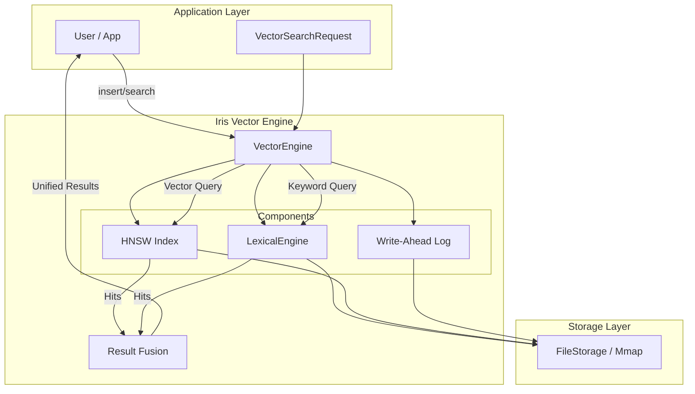

# Architecture

Iris is built on a unified modular architecture where the **Vector Engine** serves as the core orchestrator.

## 1. Vector Engine (Unified)

The primary engine associated with the library. It unifies vector similarity search with full-text search capabilities.

- **Orchestration**: Manages both HNSW (vector) and Inverted Indices (lexical).
- **Hybrid Search**: Performs unified queries combining vector similarity and keyword relevance.
- **ID Management**: Manages external ID to internal integer ID mapping.

## 2. Lexical Engine (Component)

Now operates as a component managed by the Vector Engine, rather than a standalone top-level engine in typical usage.

- **Inverted Index**: Standard posting lists for term lookups.
- **Analyzers**: Tokenization and normalization pipeline.
- **Query Parser**: Supports boolean, phrase, and structured queries.

## Storage Layer

All engines abstract their storage through a `Storage` trait, allowing seamless switching between:

- **Memory**: For testing and ephemeral data.
- **File**: For persistent on-disk storage.
- **Mmap**: For high-performance memory-mapped file access.
