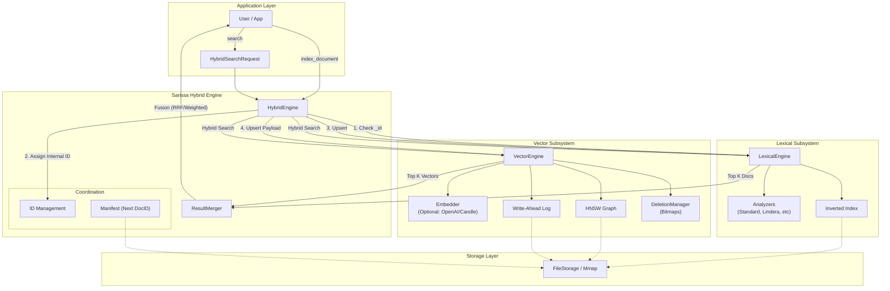

# Architecture

Sarissa is built on a modular architecture composed of three main engines.

## 1. Lexical Engine
Handles keyword-based full-text search.
- **Inverted Index**: Standard posting lists for term lookups.
- **Analyzers**: Tokenization and normalization pipeline.
- **Query Parser**: Supports boolean, phrase, and structured queries.

## 2. Vector Engine
Handles semantic search using dense vectors.
- **HNSW / IVF**: Pluggable vector indexing algorithms.
- **Embeddings**: Optional integration with models to convert text/images to vectors.

## 3. Hybrid Engine
The unifying layer that coordinates Lexical and Vector engines.
- **ID Management**: Synchronizes Document IDs across both sub-engines.
- **Result Merging**: Combines search results using algorithms like RRF (Reciprocal Rank Fusion) or Weighted Sum.
- **Manifest**: Persists global state like the next available Document ID.

