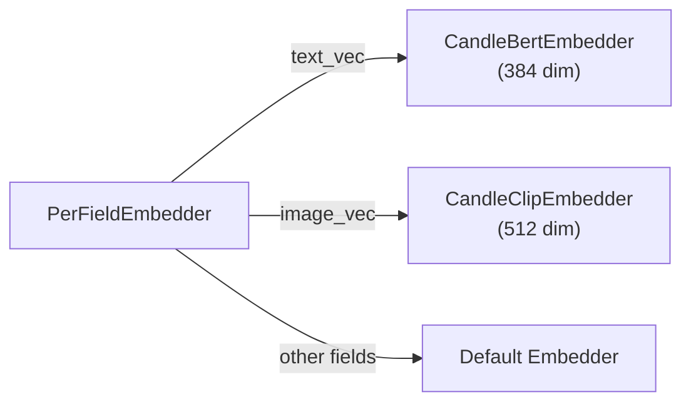

# Embeddings

Embeddings convert text (or images) into dense numeric vectors that capture semantic meaning. Two texts with similar meanings produce vectors that are close together in vector space, enabling similarity-based search.

## The Embedder Trait

All embedders implement the `Embedder` trait:

```rust
#[async_trait]
pub trait Embedder: Send + Sync + Debug {
    async fn embed(&self, input: &EmbedInput<'_>) -> Result<Vector>;
    async fn embed_batch(&self, inputs: &[EmbedInput<'_>]) -> Result<Vec<Vector>>;
    fn supported_input_types(&self) -> Vec<EmbedInputType>;
    fn name(&self) -> &str;
    fn as_any(&self) -> &dyn Any;
}
```

The `embed()` method returns a `Vector` (a struct wrapping `Vec<f32>`).

`EmbedInput` supports two modalities:

| Variant | Description |
| :--- | :--- |
| `EmbedInput::Text(&str)` | Text input |
| `EmbedInput::Bytes(&[u8], Option<&str>)` | Binary input with optional MIME type (for images) |

## Built-in Embedders

### CandleBertEmbedder

Runs a BERT model locally using Hugging Face Candle. No API key required.

**Feature flag:** `embeddings-candle`

```rust
use laurus::CandleBertEmbedder;

// Downloads model on first run (~80MB)
let embedder = CandleBertEmbedder::new(
    "sentence-transformers/all-MiniLM-L6-v2"  // model name
)?;
// Output: 384-dimensional vector
```

| Property | Value |
| :--- | :--- |
| Model | `sentence-transformers/all-MiniLM-L6-v2` |
| Dimensions | 384 |
| Runtime | Local (CPU) |
| First-run download | ~80 MB |

### OpenAIEmbedder

Calls the OpenAI Embeddings API. Requires an API key.

**Feature flag:** `embeddings-openai`

```rust
use laurus::OpenAIEmbedder;

let embedder = OpenAIEmbedder::new(
    api_key,
    "text-embedding-3-small".to_string()
).await?;
// Output: 1536-dimensional vector
```

| Property | Value |
| :--- | :--- |
| Model | `text-embedding-3-small` (or any OpenAI model) |
| Dimensions | 1536 (for text-embedding-3-small) |
| Runtime | Remote API call |
| Requires | `OPENAI_API_KEY` environment variable |

### CandleClipEmbedder

Runs a CLIP model locally for multimodal (text + image) embeddings.

**Feature flag:** `embeddings-multimodal`

```rust
use laurus::CandleClipEmbedder;

let embedder = CandleClipEmbedder::new(
    "openai/clip-vit-base-patch32"
)?;
// Text or images → 512-dimensional vector
```

| Property | Value |
| :--- | :--- |
| Model | `openai/clip-vit-base-patch32` |
| Dimensions | 512 |
| Input types | Text AND images |
| Use case | Text-to-image search, image-to-image search |

### PrecomputedEmbedder

Use pre-computed vectors directly without any embedding computation. Useful when vectors are generated externally.

```rust
use laurus::PrecomputedEmbedder;

let embedder = PrecomputedEmbedder::new();  // no parameters needed
```

When using `PrecomputedEmbedder`, you provide vectors directly in documents instead of text for embedding:

```rust
let doc = Document::builder()
    .add_vector("embedding", vec![0.1, 0.2, 0.3, ...])
    .build();
```

## PerFieldEmbedder

`PerFieldEmbedder` routes embedding requests to field-specific embedders:



```rust
use std::sync::Arc;
use laurus::PerFieldEmbedder;

let bert = Arc::new(CandleBertEmbedder::new("...")?);
let clip = Arc::new(CandleClipEmbedder::new("...")?);


let mut per_field = PerFieldEmbedder::new(bert.clone());
per_field.add_embedder("text_vec", bert.clone());
per_field.add_embedder("image_vec", clip.clone());

let engine = Engine::builder(storage, schema)
    .embedder(Arc::new(per_field))
    .build()
    .await?;
```

This is especially useful when:

- Different vector fields need different models (e.g., BERT for text, CLIP for images)
- Different fields have different vector dimensions
- You want to mix local and remote embedders

## How Embeddings Are Used

### At Index Time

When you add a text value to a vector field, the engine automatically embeds it:

```rust
let doc = Document::builder()
    .add_text("text_vec", "Rust is a systems programming language")
    .build();
engine.add_document("doc-1", doc).await?;
// The embedder converts the text to a vector before indexing
```

### At Search Time

When you search with text, the engine embeds the query text as well:

```rust
// Builder API
let request = VectorSearchRequestBuilder::new()
    .add_text("text_vec", "systems programming")
    .build();

// Query DSL
let request = vector_parser.parse(r#"text_vec:~"systems programming""#).await?;
```

Both approaches embed the query text using the same embedder that was used at index time, ensuring consistent vector spaces.

## Choosing an Embedder

| Scenario | Recommended Embedder |
| :--- | :--- |
| Quick prototyping, offline use | `CandleBertEmbedder` |
| Production with high accuracy | `OpenAIEmbedder` |
| Text + image search | `CandleClipEmbedder` |
| Pre-computed vectors from external pipeline | `PrecomputedEmbedder` |
| Multiple models per field | `PerFieldEmbedder` wrapping others |
