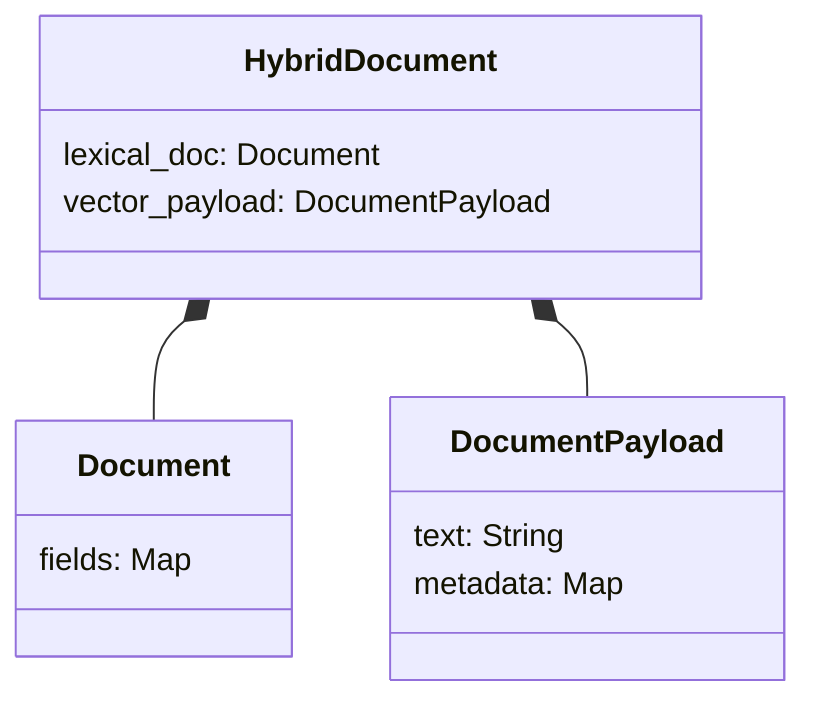
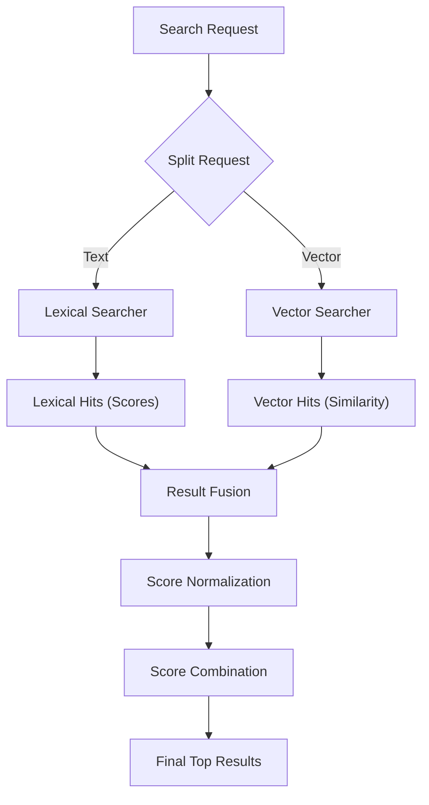
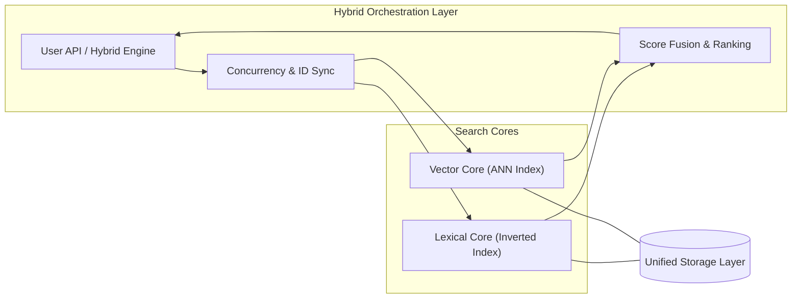

# Hybrid Search

Hybrid search combines the precision of Lexical Search (keyword matching) with the semantic understanding of Vector Search. By integrating these two paradigms, Sarissa provides highly relevant search results that handle both specific terms and conceptual similarities.

## Document Structure

In a hybrid system, a document contains both structured text for the inverted index and numerical vectors for similarity search.



- **Lexical Component**: A standard `Document` consisting of fields like title, body, and categories.
- **Vector Component**: A `DocumentPayload` which carries the raw text to be embedded into vectors (e.g., via BERT or OpenAI models) or pre-computed embeddings.

## Indexing Process

The `HybridEngine` coordinates the indexing into two specialized sub-engines.

1. **ID Synchronization**: The `HybridEngine` assigns a **Shard-Prefixed Stable ID (u64)** to each document. This ensures that a document maintains a consistent and globally unique identifier across lexical, vector, and multiple distributed nodes.
2. **Lexical Indexing**: The `lexical_doc` is passed to the `LexicalEngine`, analyzed, and stored in inverted indexes/BKD trees.
3. **Vector Indexing**: The `vector_payload` is processed by the `VectorEngine` (including embedding generation if configured) and stored in ANN structures like HNSW.

## Search Process

Hybrid search is executed in two parallel stages followed by a result fusion stage.



1. **Parallel Execution**: Both engines execute their respective searches independently.
2. **Candidate Collection**: Results are gathered from both sides. A document might appear in one or both results.
3. **Fusion (Merging)**: Scores from different domains (e.g., BM25 vs. Cosine Similarity) are brought into a common scale and combined.

## Core Concepts

### Score Normalization
Since lexical scores (BM25) are unbounded and vector similarities [0, 1] represent different distributions, normalization is crucial for a fair combination.

- **Min-Max**: Scales scores to a [0, 1] range based on the top/bottom scores in the current result set.
- **Z-Score**: Normalizes scores based on mean and standard deviation.
- **Rank**: Uses the rank position instead of the raw score (used in RRF).

### Fusion Strategies (Combination)

#### 1. Weighted Sum
The most common approach. Scores are normalized and then combined using a linear weight.
`FinalScore = (LexicalScore * alpha) + (VectorScore * beta)`
- **Pros**: Easy to tune; allows favoring one engine over another.

#### 2. RRF (Reciprocal Rank Fusion)
A robust method that doesn't rely on raw score scales. It calculates the final score based on the rank of the document in each result set.
`Score = Σ_i (1 / (k + rank_i))`
- **Pros**: Works well when score distributions are inconsistent; requires no normalization.

#### 3. Harmonic Mean
Calculates the harmonic mean of scores, penalizing documents that only rank well in one category.

## Engine Architecture

The hybrid search architecture is designed as an orchestrator that bridges the gap between keyword-based and semantic search paradigms.



### Hybrid Engine (`HybridEngine`)
The top-level API for the Sarissa library. It manages the lifecycle of both `LexicalEngine` and `VectorEngine`, handling manifest persistence and consistent Shard-Prefixed Stable ID allocation.

### Hybrid Index (`HybridIndex`)
A unified read-only interface that wraps both `LexicalIndexReader` and `VectorIndexReader`. It is used by the `ResultMerger` to fetch document content and aggregate statistics.

## Code Examples

### 1. Setting up HybridEngine
Initializing the engine with shared storage.

```rust
use std::sync::Arc;
use sarissa::hybrid::engine::HybridEngine;
use sarissa::lexical::engine::LexicalEngine;
use sarissa::vector::engine::VectorEngine;
use sarissa::storage::memory::MemoryStorage;

async fn setup_hybrid() -> sarissa::error::Result<HybridEngine> {
    let storage = Arc::new(MemoryStorage::new(Default::default()));
    
    let lexical = LexicalEngine::new(storage.clone(), Default::default())?;
    let vector = VectorEngine::new(storage.clone(), Default::default()).await?;
    
    HybridEngine::new(storage, lexical, vector)
}
```

### 2. Indexing a Hybrid Document

```rust
use sarissa::hybrid::core::document::HybridDocument;
use sarissa::lexical::core::document::Document as LexicalDoc;
use sarissa::lexical::core::field::TextOption;
use sarissa::vector::core::document::DocumentPayload;

async fn index_doc(engine: &mut HybridEngine) -> sarissa::error::Result<()> {
    let lexical_doc = LexicalDoc::builder()
        .add_text("title", "Sarissa Search", TextOption::default())
        .build();
    
    let vector_payload = DocumentPayload::new("Fast search engine in Rust");
    
    let hybrid_doc = HybridDocument::new(Some(lexical_doc), Some(vector_payload));
    
    engine.add_document(hybrid_doc).await?;
    Ok(())
}
```

### 3. Advanced Hybrid Search
Configuring weights and fusion strategies.

```rust
use sarissa::hybrid::search::searcher::{HybridSearchRequest, HybridSearchParams, ScoreCombination};

async fn search(engine: &HybridEngine) -> sarissa::error::Result<()> {
    let params = HybridSearchParams {
        keyword_weight: 0.7,
        vector_weight: 0.3,
        combination: ScoreCombination::WeightedSum,
        max_results: 10,
        ..Default::default()
    };

    let request = HybridSearchRequest::new()
        .with_text("vector search implementation")
        .with_params(params);

    let results = engine.search(request).await?;
    for res in results.results {
        println!("Doc ID: {}, Final Score: {}", res.doc_id, res.hybrid_score);
    }
    Ok(())
}
```

## Future Outlook

- **Semantic Filtering**: Using lexical fields to pre-filter vector search candidates for better performance.
- **Learnable Fusion**: Dynamically adjusting weights based on user feedback or click-through rates.
- **Cross-Encoder Reranking**: Integrating a second-stage reranker that evaluates search pairs at a deeper level.
