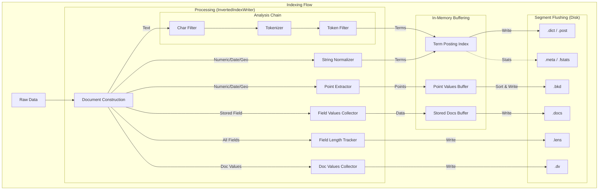
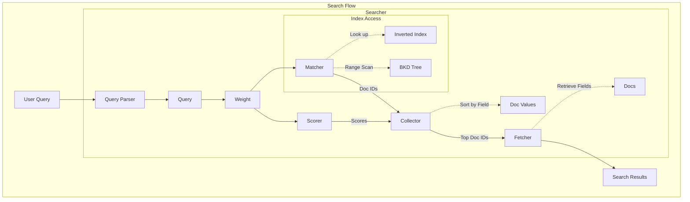

# Lexical Search

Lexical search matches documents based on exact or approximate keyword matches. It is the traditional "search engine" functionality found in Lucene or Elasticsearch.

> **Note**: In the unified Sarissa architecture, Lexical Search is typically handled by the `VectorEngine`, which orchestrates both lexical and vector components concurrently. `LexicalEngine` can still be used as a standalone engine for pure keyword search scenarios.

## Document Structure

In Sarissa, a **Document** is the fundamental unit of indexing. It follows a **schema-less** design, allowing fields to be added dynamically without defining a schema upfront.

Each `Document` consists of multiple `Fields` stored in a Map where the key is the field name. Each `Field` has a **Value** and **Options** defining how it should be indexed.


### Document

The fundamental unit of indexing in Sarissa.

- **Schema-less**: Fields can be added dynamically without a predefined schema.
- **Map Structure**: Fields are stored in a `HashMap` where the key is the field name (String).
- **Flexible**: A single document can contain a mix of different field types (Text, Integer, Blob, etc.).

### Field

A container representing a single data point within a document.

- **Value**: The actual data content (e.g., "Hello World", 123, true). Defined by `FieldValue`.
- **Option**: Configuration for how this data should be handled (e.g., indexed, stored). Defined by `FieldOption`.

### Field Values

- **Text**: UTF-8 string. Typically analyzed and indexed for full-text search.
- **Integer / Float**: Numeric values. Used for range queries (BKD Tree) and sorting.
- **Boolean**: True/False values.
- **DateTime**: UTC timestamps.
- **Geo**: Latitude/Longitude coordinates. Indexed in a 2D BKD tree for efficient spatial queries (distance and bounding box) and stored for precise calculations.
- **Blob**: Raw byte data with MIME type. Used for storing binary content (images, etc.) or vector source data. **Stored only**, never indexed by the lexical engine.

### Field Options

Configuration for the field defining how it should be indexed and stored.

- **TextOption**:
  - `indexed`: If true, the text is analyzed and added to the inverted index (searchable).
  - `stored`: If true, the original text is stored in the doc store (retrievable).
  - `term_vectors`: If true, stores term positions and offsets (needed for highlighting and "More Like This").
- **IntegerOption / FloatOption**:
  - `indexed`: If true, the value is added to the BKD tree (range searchable).
  - `stored`: If true, the original value is stored.
- **BooleanOption**:
  - `indexed`: If true, the value is indexed.
  - `stored`: If true, the original value is stored.
- **DateTimeOption**:
  - `indexed`: If true, the timestamp is added to the BKD tree (range searchable).
  - `stored`: If true, the original timestamp is stored.
- **GeoOption**:
  - `indexed`: If true, the coordinates are added to the 2D BKD tree (efficient spatial search).
  - `stored`: If true, the original coordinates are stored.
- **BlobOption**:
  - `stored`: If true, the binary data is stored. **Note**: Blobs cannot be indexed by the lexical engine.

## Indexing Process

The lexical indexing process translates documents into inverted indexes and BKD trees.



1. **Document Processing**:
   - **Analysis & Normalization**: Text is processed through the Analysis Chain (`Char Filter`, `Tokenizer`, `Token Filter`). Non-text fields are handled by the `String Normalizer`.
   - **Point Extraction**: Multidimensional values (Numeric, Date, and Geo) are extracted by the `Point Extractor` for spatial indexing (BKD Tree).
   - **Tracking & Collection**: `Field Length Tracker` and `Doc Values Collector` gather metadata and columnar data.
2. **In-Memory Buffering**:
   - Terms are added to the `Term Posting Index`.
   - Extracted points and stored fields are staged in the `Point Values Buffer` and `Stored Docs Buffer`.
3. **Segment Flushing**:
   - Buffered data is periodically sorted and serialized into immutable **Segment** files on disk.
4. **Merging**:
   - A background process automatically merges smaller segments into larger ones to optimize read performance and reclaim space from deleted documents.

### Analyzers

Text analysis is the process of converting raw text into tokens. An Analyzer is typically composed of a pipeline:

1. **Char Filters**: Transform the raw character stream (e.g., removing HTML tags).
2. **Tokenizer**: Splits the character stream into a token stream (e.g., splitting by whitespace).
3. **Token Filters**: Modify the token stream (e.g., lowercasing, stemming, removing stop words).

Sarissa provides several built-in analyzers:

- **StandardAnalyzer**: Good default for most European languages.
- **JapaneseAnalyzer**: Optimized for Japanese text using Lindera (morphological analysis).
- **KeywordAnalyzer**: Treats the entire input as a single token.
- **PipelineAnalyzer**: A flexible builder for creating custom analysis pipelines.

## Core Concepts

### Inverted Index

The inverted index is the fundamental structure for full-text search. While a traditional database maps documents to their terms, an inverted index maps **terms to the list of documents** containing them.

- **Term Dictionary**: A sorted repository of all unique terms across the index.
- **Postings Lists**: For each term, a list of document IDs (postings) where the term appears, along with frequency and position data for scoring.

### BKD Tree

For non-textual data like numbers, dates, and geographic coordinates, Sarissa uses a **BKD Tree**. It is a multi-dimensional tree structure optimized for block-based storage on disk.
Unlike an inverted index, a BKD tree is designed for **range search** and **spatial search**. It effectively partitions the data space into hierarchical blocks, allowing the search engine to skip large portions of irrelevant data.

### SIMD Optimization

Sarissa uses SIMD-accelerated batch scoring for high-throughput ranking. The BM25 scoring algorithm is optimized to process multiple documents simultaneously, leveraging modern CPU instructions to provide a several-fold increase in performance compared to scalar processing.

## Engine Architecture

### Lexical Engine (`LexicalEngine`)

The engine that manages indexing and searching for text data. It coordinates between `InvertedIndexWriter` and `InvertedIndexSearcher`.
In the unified architecture, this engine operates as a **sub-component** managed by the `VectorEngine`, handling the inverted index portions of hybrid documents. It handles manifest persistence and consistent ID mapping when run in standalone mode.

### Index Components

- **InvertedIndexWriter**: The primary interface for adding documents. It orchestrates analysis, point extraction, and buffering.
- **Segment Manager**: Controls the lifecycle and visibility of segments, maintaining the manifest and tracking deletions.
- **In-Memory Buffering**: High-performance mapping of terms and staged BKD/Stored data before merging into disk segments.

## Index Segment Files

A single segment is composed of several specialized files:

| Extension | Component | Description |
| :--- | :--- | :--- |
| `.dict` | Term Dictionary | Maps terms to their locations in the postings list. |
| `.post` | Postings Lists | Stores document IDs, frequencies, and positions for each term. |
| `.bkd` | BKD Tree | Provides multidimensional indexing for numeric and geospatial fields. |
| `.docs` | Document Store | Stores the original (stored) field values in a compressed format. |
| `.dv` | Doc Values | Columnar storage for fast sorting and aggregations. |
| `.meta` | Segment Metadata | Statistics, document count, and configuration. |
| `.lens` | Field Lengths | Token counts per field per document (used for scoring). |

## Search Process

The search process involves structure-aware traversal and weighted scoring.



1. **Query Parsing**: Translates a human-friendly string or DSL into a structured `Query` tree.
2. **Weight Creation**: Precomputes global statistics (like IDF) to prepare for execution across multiple segments.
3. **Matching & Scoring**:
   - **Matcher**: Navigates the Term Dictionary or BKD Tree to identify document IDs.
   - **Scorer**: Computes the relevance score (BM25) using precomputed weights and segment-local frequencies.
4. **Collection & Fetching**: Aggregates top results into a sorted list and retrieves original field data for the final response.

## Query Types

Sarissa supports a wide range of queries for different information needs.

- **Term Query**: Match a single analyzed term exactly.
- **Boolean Query**: Logical combinations (`MUST`, `SHOULD`, `MUST_NOT`).
- **Approximate Queries**: `Fuzzy`, `Prefix`, `Wildcard`, and `Regexp` queries.
- **Phrase Query**: Matches terms in a specific order with optional "slop".
- **Numeric Range Query**: High-performance range search using the BKD tree.
- **Geospatial Queries**: Distance-based or bounding-box search for geographic points.

## Scoring (BM25)

Sarissa uses **Okapi BM25** as its default scoring function. It improves results by prioritizing rare terms and normalizing for document length, ensuring that matches in shorter, focused documents are ranked appropriately.

## Code Examples

### 1. Configuring LexicalEngine

Setting up a schema-less engine with a default analyzer.

```rust
use std::sync::Arc;
use sarissa::lexical::engine::LexicalEngine;
use sarissa::lexical::engine::config::LexicalIndexConfig;
use sarissa::storage::memory::{MemoryStorage, MemoryStorageConfig};

fn setup_engine() -> sarissa::error::Result<LexicalEngine> {
    let storage = Arc::new(MemoryStorage::new(MemoryStorageConfig::default()));
    
    // Default configuration uses StandardAnalyzer
    let config = LexicalIndexConfig::default();
    let engine = LexicalEngine::new(storage, config)?;
    Ok(engine)
}
```

### 2. Adding Documents

Creating and indexing documents with various field types.

```rust
use sarissa::lexical::core::document::Document;
use sarissa::lexical::core::field::TextOption;

fn add_documents(engine: &LexicalEngine) -> sarissa::error::Result<()> {
    let doc = Document::builder()
        .add_text("title", "Sarissa Search", TextOption::default())
        .add_text("content", "Fast and semantic search engine in Rust", TextOption::default())
        .add_integer("price", 100)
        .build();

    engine.add_document(doc)?;
    engine.commit()?; // Flush and commit to make searchable
    Ok(())
}
```

### 3. Searching via DSL

Executing a simple search using the query string parser.

```rust
use sarissa::lexical::search::searcher::LexicalSearchRequest;

fn search(engine: &LexicalEngine) -> sarissa::error::Result<()> {
    // Search for matches in the default fields
    let request = LexicalSearchRequest::new("content:rust")
        .max_docs(10);

    let results = engine.search(request)?;
    for hit in results.hits {
        println!("Doc ID: {}, Score: {}", hit.doc_id, hit.score);
    }
    Ok(())
}
```

### 4. Custom Analyzer Setup

Configuring a Japanese analyzer for specific fields.

```rust
use sarissa::analysis::analyzer::japanese::JapaneseAnalyzer;
use sarissa::lexical::engine::config::LexicalIndexConfig;

fn setup_japanese_engine() -> sarissa::error::Result<LexicalEngine> {
    let storage = Arc::new(MemoryStorage::new(MemoryStorageConfig::default()));
    
    // Configure default analyzer to Japanese
    let analyzer = Arc::new(JapaneseAnalyzer::default());
    let config = LexicalIndexConfig::builder()
        .analyzer(analyzer)
        .build();

    LexicalEngine::new(storage, config)
}
```

## Future Outlook

- **Advanced Scoring Functions**: Support for BM25F and custom script-based scoring.
- **Improved NRT (Near-Real-Time)**: Faster segment flushing and background merging optimizations.
- **Multilingual Support**: Integration with more language-specific tokenizers and dictionaries.
- **Tiered Storage**: Support for moving older segments to slower/cheaper storage automatically.
