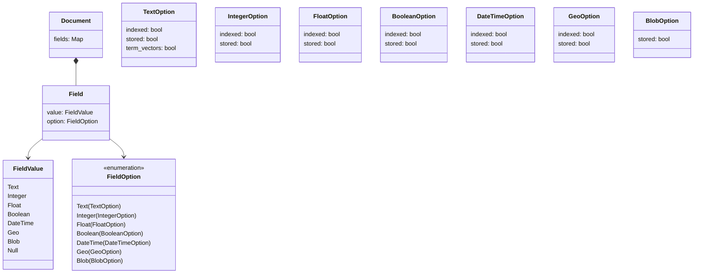
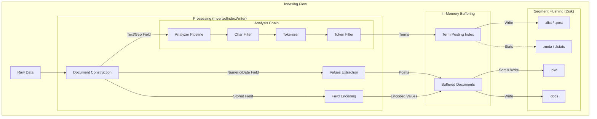
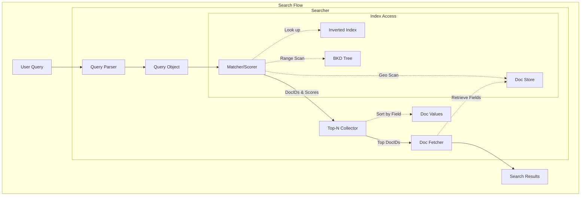

# Lexical Search

Lexical search matches documents based on exact or approximate keyword matches. It is the traditional "search engine" functionality found in Lucene or Elasticsearch.

## Document Structure
In Sarissa, a **Document** is the fundamental unit of indexing. It follows a **schema-less** design, allowing fields to be added dynamically without defining a schema upfront.

Each `Document` consists of multiple `Fields` stored in a Map where the key is the field name. Each `Field` has a **Value** and **Options** defining how it should be indexed.



### Document
The fundamental unit of indexing in Sarissa.
- **Schema-less**: Fields can be added dynamically without a predefined schema.
- **Map Structure**: Fields are stored in a `HashMap` where the key is the field name (String).
- **Flexible**: A single document can contain a mix of different field types (Text, Integer, Blob, etc.).

### Field
A container representing a single data point within a document.
- **Value**: The actual data content (e.g., "Hello World", 123, true). Defined by `FieldValue`.
- **Option**: Configuration for how this data should be handled (e.g., indexed, stored). Defined by `FieldOption`.

### Field Values
- **Text**: UTF-8 string. Typically analyzed and indexed for full-text search.
- **Integer / Float**: Numeric values. Used for range queries (BKD Tree) and sorting.
- **Boolean**: True/False values.
- **DateTime**: UTC timestamps.
- **Geo**: Latitude/Longitude coordinates. Currently stored for scan-based queries or indexed as "lat,lon" text string.
- **Blob**: Raw byte data with MIME type. Used for storing binary content (images, etc.) or vector source data. **Stored only**, never indexed by the lexical engine.

### Field Options
Configuration for the field defining how it should be indexed and stored.

- **TextOption**:
    - `indexed`: If true, the text is analyzed and added to the inverted index (searchable).
    - `stored`: If true, the original text is stored in the doc store (retrievable).
    - `term_vectors`: If true, stores term positions and offsets (needed for highlighting and "More Like This").
- **IntegerOption / FloatOption**:
    - `indexed`: If true, the value is added to the BKD tree (range searchable).
    - `stored`: If true, the original value is stored.
- **BooleanOption**:
    - `indexed`: If true, the value is indexed.
    - `stored`: If true, the original value is stored.
- **DateTimeOption**:
    - `indexed`: If true, the timestamp is added to the BKD tree (range searchable).
    - `stored`: If true, the original timestamp is stored.
- **GeoOption**:
    - `indexed`: If true, the coordinates are indexed as text "lat,lon" (exact match).
    - `stored`: If true, the original coordinates are stored (required for distance queries).
- **BlobOption**:
    - `stored`: If true, the binary data is stored. **Note**: Blobs cannot be indexed by the lexical engine.

## Indexing Process
The indexing process converts raw documents into a searchable index.



1. **Analysis**:
   - **Char Filters**: Pre-process the text (e.g., removing HTML tags).
   - **Tokenizer**: Split text into tokens (e.g., words).
   - **Token Filters**: Normalize tokens (lowercase, stemming, stop-word removal).
2. **Indexing**:
   - **Inverted Index**: Tokens are added to the Term Dictionary and Postings Lists for full-text search.
   - **BKD Tree**: Numeric and DateTime values are added to the BKD Tree for efficient range filtering.
   - **Doc Store**: All fields marked as `stored` are serialized and saved for retrieval.
3. **Segment Creation**:
   - Documents are buffered in memory and periodically flushed to disk as a new **Segment**.
   - Segments are immutable once written, ensuring thread safety and simplifying concurrency.
4. **Merging**:
   - A background process automatically merges smaller segments into larger ones to optimize read performance and reclaim space from deleted documents.

### Analyzers
Text analysis is the process of converting raw text into tokens. An Analyzer is typically composed of a pipeline:

1. **Char Filters**: Transform the raw character stream (e.g., removing HTML tags).
2. **Tokenizer**: Splits the character stream into a token stream (e.g., splitting by whitespace).
3. **Token Filters**: Modify the token stream (e.g., lowercasing, stemming, removing stop words).

Sarissa provides several built-in analyzers with pre-configured pipelines:

- **StandardAnalyzer**: Good default for most European languages (alias for a generic English setup).
    - Tokenizer: `RegexTokenizer` (Splits on Unicode word boundaries)
    - Token Filters: `LowercaseFilter`, `StopFilter` (English stop words)
- **KeywordAnalyzer**: Treats the entire input as a single token.
    - Tokenizer: `WholeTokenizer`
    - No filters.
- **SimpleAnalyzer**: Basic tokenization without filtering.
    - Tokenizer: Configurable (defaults to `RegexTokenizer` in some contexts)
    - No filters.
- **No-op Analyzer**: Performs no analysis, yielding an empty token stream.
    - Useful for stored-only fields or when a field should not be searchable.
- **PipelineAnalyzer**: A flexible builder for creating custom analysis pipelines.
    - Allows combining any **Char Filter**, **Tokenizer**, and **Token Filter** chain.
    - Example: `PipelineAnalyzer::new(tokenizer).add_char_filter(...).add_filter(...)`
- **LanguageAnalyzer**: Analyzers specialized for specific languages.
    - **EnglishAnalyzer**: Specialized for English (similar to StandardAnalyzer but explicit).
        - Tokenizer: `RegexTokenizer` (Splits on Unicode word boundaries)
        - Token Filters: `LowercaseFilter`, `StopFilter` (English stop words)
    - **JapaneseAnalyzer**: Optimized for Japanese text.
        - Char Filters: `UnicodeNormalizationCharFilter` (NFKC), `JapaneseIterationMarkCharFilter` (Normalizes iteration marks like 々)
        - Tokenizer: `LinderaTokenizer` (Morphological analysis using UniDic)
        - Token Filters: `LowercaseFilter`, `StopFilter` (Japanese stop words)
- **PerFieldAnalyzer**: Wraps multiple analyzers to apply them based on field names (Lucene-compatible).
    - Useful when different fields require different analysis strategies (e.g., standard for "body", keyword for "tags").
    - Example:
      ```rust
      let mut analyzer = PerFieldAnalyzer::new(default_analyzer);
      analyzer.add_analyzer("tags", keyword_analyzer);
      ```

## Index Components
The indexing architecture is responsible for transforming raw documents into efficient, searchable structures. It consists of several logical components, each managing a specific part of the lifecycle.

### Index Writer (`InvertedIndexWriter`)
The primary interface for adding documents to the index.
- **Buffering**: Manages an in-memory buffer of documents. When the buffer exceeds a certain size (number of documents or memory usage), it triggers a **flush**.
- **Orchestration**: Directs the flow from document analysis to in-memory indexing.

### Analyzer Pipeline
Processes text fields to create searchable terms.
- **Process**: Each field is passed through `Char Filters` (pre-processing), a `Tokenizer` (splitting into tokens), and `Token Filters` (normalization like lowercasing or stemming).
- **Output**: Produces a stream of analyzed terms with positions and offsets.

### In-Memory Posting Index (`TermPostingIndex`)
A high-performance buffer for inverted index data.
- **Structure**: Uses an efficient hash-based structure to map terms to their occurrences (postings) within the current buffer.
- **Temporary State**: This data is volatile and only exists in memory until the segment is flushed to disk.

### Segment Flusher
Responsible for transforming in-memory buffers into immutable on-disk files.
- **Serialization**: It writes the final data structures:
    - **.dict**: Term Dictionary (Sorted list of terms).
    - **.post**: Postings Lists (Document IDs and frequencies).
    - **.bkd**: BKD Tree (Spatial/Numeric index).
    - **.dv**: Doc Values (Columnar storage for sorting/scoring).

### Doc Store Writer
Manages the persistent storage of original document content.
- **Persistence**: Writes serialized document fields to the **.docs** file.
- **Random Access**: Ensures that documents can be quickly retrieved by their internal ID during the fetch phase of a search.

### Segment Manager
Manages the lifecycle and visibility of segments.
- **Manifest**: Maintains the `segments.manifest` file, which tracks which segments are active and their generation numbers.
- **Deletion Tracking**: Manages document deletions by keeping track of which IDs in each segment are no longer live.

### Index Segment Files
A single segment is composed of several specialized files:
- **Term Dictionary (.dict)**: Maps terms to their locations in the postings list.
- **Postings Lists (.post)**: Stores document IDs, frequencies, and positions for each term.
- **BKD Tree (.bkd)**: Provides multidimensional indexing for numeric and date fields.
- **Doc Store (.docs)**: Stores the original (stored) field values.
- **Doc Values (.dv)**: Stores field values in a columnar format for sorting and scoring.
- **Segment Metadata (.meta)**: JSON file containing segment statistics and ID ranges.
- **Field Statistics (.fstats)**: Stores per-field information like document frequency and average length.
- **Field Lengths (.lens)**: Stores the length of each field for every document (used in BM25 scoring).
**Core component of the Text Inverted Index.**
A sorted list of all unique terms (tokens) extracted from the documents. It acts as the primary entry point for text search.
- **Function**: Maps a term (e.g., "rust") to its location in the Postings List.
- **Features**: Supports fast distinct term lookup, prefix search, and range scans.
- **Format**:
    - **Magic**: `STDC` (Sorted) or `HTDC` (Hash)
    - **Entries**:
        - `Term`: String
        - `Pointer`: `PostingOffset` (u64), `PostingLength` (u64)
        - `Stats`: `DocFrequency` (u64), `TotalFrequency` (u64)

### Postings Lists (`.post`)
**Core component of the Text Inverted Index.**
Stores the relationships between terms and documents.
- **Function**: For a given term, provides the list of Document IDs containing it.
- **Features**: Highly compressed using delta encoding and varints. Includes frequency and position data for scoring and phrase queries.
- **Format**:
    - **Header**: `Term` (String), `TotalFreq` (Varint), `DocFreq` (Varint), `PostingCount` (Varint).
    - **Postings List**: Sequence of:
        - `DocIDDelta`: VarInt (difference from previous DocID)
        - `Frequency`: VarInt (term freq in doc)
        - `Weight`: Float32 (contribution to score)
        - `HasPositions`: Byte (0 or 1)
        - `Positions`: (Optional) `Count` (VarInt) + `PositionDeltas` (VarInts)

### BKD Tree (`.bkd`)
**Component for Numeric and Geospatial Search.**
A persistent tree structure for multi-dimensional data.
- **Function**: Efficiently handles range queries (e.g., `price > 100`, `date in 2023`).

- **Features**: Block-based storage optimized for disk I/O.
- **Format**:
    - **Magic**: `BKDT`
    - **Index Section**: Internal nodes for tree traversal.
    - **Leaf Blocks**: Contiguous blocks of `(Value, DocID)` pairs.

### Document Store (`.docs`)
**Component for Data Retrieval.**
Stores the original content of fields marked as `stored`.
- **Function**: Retrieves the full document content (JSON) after the search has identified the matching DocIDs.
- **Format**:
    - **Magic**: `DOCS` + Version + DocCount
    - **Data**: Sequential list of documents. Each document contains `DocID`, `FieldCount`, and then for each field: `Name`, `TypeTag`, and `Value`.

### Auxiliary Components

#### Doc Values (`.dv`)
Columnar storage for sorting and aggregations.
- **Function**: Fast access to specific field values across many documents.

#### Field Statistics (`.fstats`)
Global statistics for each field (min/max length, doc count).
- **Usage**: Query planning and optimization.

#### Field Lengths (`.lens`)
Stores the number of tokens per field per document.
- **Usage**: Essential for BM25 scoring (length normalization).

#### Segment Metadata (`.meta`) & Manifest (`segments.manifest`)
Registry and metadata files.
- **Format**: JSON (`SegmentInfo`).
- **Fields**: `segment_id`, `doc_count`, `doc_offset`, `generation`, `has_deletions`.
- **Usage**: Managing segment lifecycle, versioning, and status.

## Search Process
The search process in Sarissa involves several stages to efficiently retrieve and rank documents.



1. **Query Parsing**: The input query string (if using a parser) is converted into a structured `Query` object (e.g., `BooleanQuery` combining `TermQuery`s).
2. **Matching**:
   - The `Query` creates a `Weight` object which calculates normalization factors.
   - For each segment, the `Weight` creates a `Matcher` (equivalent to Lucene's `Scorer` or `Iterator`).
   - The `Matcher` iterates over the `Postings Lists` or `BKD Trees` to find matching document IDs.
   - BitSets are used to efficiently filter out deleted documents.
3. **Scoring**:
   - For ranked queries, a scoring function (BM25) calculates a relevance score for each matching document.
   - Top-N results are collected using a Min-Heap queue to keep only the highest-scoring documents.
4. **Fetching**:
   - Once the top document IDs are identified, their original content is retrieved from the `Doc Store`.

### Query Rewriting
Sarissa implements a **Multi-Term Query** framework (similar to Lucene) for queries like `FuzzyQuery`, `PrefixQuery`, `WildcardQuery`, and `RegexpQuery`.

Instead of matching these complex patterns directly against every document, they undergo a **rewrite** process:
1. **Term Enumeration**: The query identifies all unique terms in the `Term Dictionary` that match the pattern (e.g., `hel*` matches `hello`, `help`, `held`).
2. **Expansion**: These terms are expanded into a large `BooleanQuery`.
3. **Scoring Strategy**:
   - **TopTermsScoring**: (Default) Only the top N terms by score are included to maintain performance.
   - **ConstantScore**: All matching terms contribute equally to the document score.

## Search Components
The search architecture is composed of several modular components that work together to execute queries and rank results.

### Searcher (`InvertedIndexSearcher`)
The primary entry point for search operations.
- **Coordination**: It coordinates the search across multiple immutable segments.
- **Parallelism**: Supports parallel execution of sub-queries (e.g., within a `BooleanQuery`) to improve performance.
- **API**: Provides high-level methods for searching with string queries or structured `Query` objects.

### Query Parser
Translates human-readable query strings into structured objects.
- **Grammar**: Uses a recursive descent parser to handle operators like `+`, `-`, `OR`, `*`, and field-specific searches (e.g., `title:rust`).
- **Flexible**: Can be configured with default fields and analyzers.

### Query
Represents the structural logic of a search request.
- **Trait-based**: Each query type (Term, Prefix, Fuzzy, etc.) implements the `Query` trait.
- **Factory Role**: Responsible for creating its own `Matcher` and `Scorer` for a given index segment.

### Matcher
A low-level component that iterates through documents.
- **Efficiency**: Supports efficient skipping (`skip_to`) to allow fast intersection (AND) and union (OR) operations.
- **Abstraction**: Hides the details of whether it's reading from an inverted index (.post), a BKD tree (.bkd), or performing a linear scan.

### Scorer
Calculates the relevance score for a document.
- **BM25**: Default implementation using the Okapi BM25 algorithm.
- **Batched Scoring**: Supports SIMD-optimized batch scoring for better throughput.

### Collector
Aggregates and sorts matching documents.
- **TopDocsCollector**: Collects the top N documents by score.
- **TopFieldCollector**: Collects documents sorted by a specific field value (e.g., price, date).
- **CountCollector**: Returns only the total number of hits without retrieving document IDs.

### Index Reader
The data access layer.
- **Segmented Access**: Provides a unified view over multiple immutable segments.
- **Resource Management**: Handles the loading and caching of index components like the Term Dictionary and BKD Tree.

## Scoring (BM25)
Sarissa uses the **Okapi BM25** algorithm as its default similarity function. It is a probabilistic retrieval framework that improves upon TF-IDF by adding saturation and length normalization.

**Formula Components**:
- **TF (Term Frequency)**: How often the term appears in the document. Contribution saturates (diminishing returns) to prevent keyword spamming.
- **IDF (Inverse Document Frequency)**: How rare the term is across the entire index. Rare terms carry more weight.
- **Field Length Norm**: Shorter fields (e.g., "Title") are considered more relevant than long fields (e.g., "Body") for the same match.

## Query Types
Sarissa supports a diverse set of queries for different use cases.

### Core Queries
- **TermQuery**: Exact match for a single token.
  - *Example*: Field "status" matches "active".
- **BooleanQuery**: Combines queries with `MUST` (+), `SHOULD` (OR), `MUST_NOT` (-).
  - *Minimum Should Match*: Supports specifying a minimum number of `SHOULD` clauses that must match for the document to be considered a hit.
  - *Example*: `+rust -c++` (Must contain "rust", must not contain "c++").


### Approximate Queries
- **FuzzyQuery**: Matches terms within a specific Levenshtein edit distance (default 2).
  - *Example*: "helo" matches "hello".
- **WildcardQuery**: Supported standard wildcards `*` (any) and `?` (single char).
  - *Example*: `te*t` matches "test", "text".
- **PrefixQuery**: Matches terms starting with a specific prefix.
  - *Example*: `data*` matches "database", "datum".
- **RegexpQuery**: Full regular expression support.
  - *Example*: `[0-9]{3}-[0-9]{4}`.

### Range Queries
- **NumericRangeQuery**: Efficient BKD-tree based range search for integers and floats. Supports inclusive/exclusive bounds.
  - *Example*: `price` in `[100, 500]`, `age` > 18.
- **DateTimeRangeQuery**: Specialized range query for timestamps.
  - *Example*: `created_at` in `[2023-01-01, 2023-12-31]`.

### Positional Queries
- **PhraseQuery**: Matches an exact sequence of terms. "Slop" allows for some distance/permutation.
  - *Example*: "distributed search engine" (slop 0), "search distributed" (slop 2).
- **SpanQuery**: Advanced control over term positions.
  - `SpanTerm`: Basic unit.
  - `SpanNear`: Matches spans within a certain distance.
  - `SpanOr`: Union of spans.
  - `SpanNot`: Exclude matches if another span overlaps.

### Geospatial (Requires `geo` feature)
- **GeoDistanceQuery**: Matches points within a radius from a center point.
- **GeoBoundingBoxQuery**: Matches points within a rectangular area.

### Complex Queries
- **MultiFieldQuery**: Executes a search across several fields simultaneously.
  - *Strategies*: Matches can be combined using `BestFields` (highest score wins) or `MostFields` (scores are summed).
  - *Example*: Search "query string" across "title^2" and "content".
- **AdvancedQuery**: A high-level wrapper for complex query orchestration.
  - *Features*: Supports query-level boosts, minimum score thresholds, and tiered filtering (Must, MustNot, Post-Filtering).
  - *Optimization*: Automatically optimizes query structure and handles execution timeouts.
