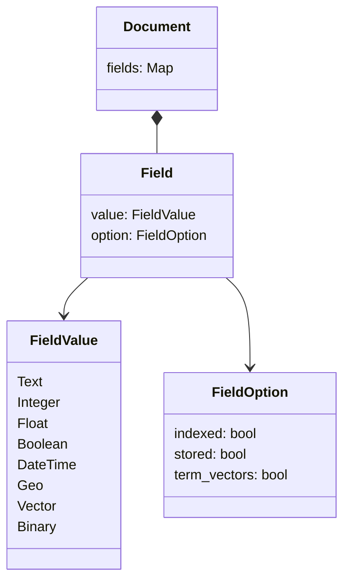
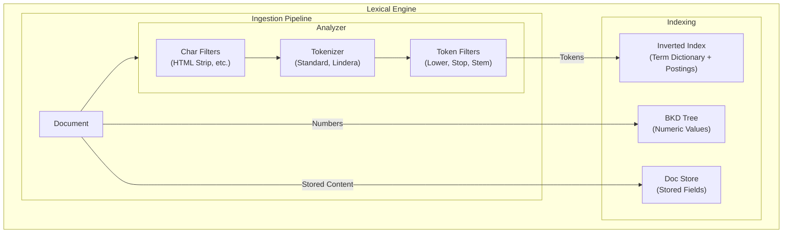

# Lexical Search

Lexical search matches documents based on exact or approximate keyword matches. It is the traditional "search engine" functionality found in Lucene or Elasticsearch.

## Document Structure
In Sarissa, a **Document** is the fundamental unit of indexing. It follows a **schema-less** design, allowing fields to be added dynamically without defining a schema upfront.

Each `Document` consists of multiple `Fields` stored in a Map where the key is the field name. Each `Field` has a **Value** and **Options** defining how it should be indexed.



### Field Values
- **Text**: UTF-8 string. Typically analyzed and indexed for full-text search.
- **Integer / Float**: Numeric values. Used for range queries (BKD Tree) and sorting.
- **Boolean**: True/False values.
- **DateTime**: UTC timestamps.
- **Geo**: Latitude/Longitude coordinates.
- **Binary**: Raw byte data (e.g., images, serialized blobs). **Stored only**, never indexed.
- **Vector**: Source text string for embedding. **Stored only** (for re-ranking/display). The actual vector embedding is managed by the Vector Engine.

### Field Options
Configuration for the field (e.g., `indexed: true`, `stored: true`). Defined per-field-type (e.g., `TextOption`, `VectorOption`).

## Key Components



### Analyzers
Text analysis is the process of converting raw text into tokens. An Analyzer is typically composed of a pipeline:

1. **Char Filters**: Transform the raw character stream (e.g., removing HTML tags).
2. **Tokenizer**: Splits the character stream into a token stream (e.g., splitting by whitespace).
3. **Token Filters**: Modify the token stream (e.g., lowercasing, stemming, removing stop words).

Sarissa provides several built-in analyzers with pre-configured pipelines:

- **StandardAnalyzer**: Good default for most European languages (alias for a generic English setup).
    - Tokenizer: `RegexTokenizer` (Splits on Unicode word boundaries)
    - Token Filters: `LowercaseFilter`, `StopFilter` (English stop words)
- **KeywordAnalyzer**: Treats the entire input as a single token.
    - Tokenizer: `WholeTokenizer`
    - No filters.
- **SimpleAnalyzer**: Basic tokenization without filtering.
    - Tokenizer: Configurable (defaults to `RegexTokenizer` in some contexts)
    - No filters.
- **PipelineAnalyzer**: A flexible builder for creating custom analysis pipelines.
    - Allows combining any **Char Filter**, **Tokenizer**, and **Token Filter** chain.
    - Example: `PipelineAnalyzer::new(tokenizer).add_char_filter(...).add_filter(...)`
- **LanguageAnalyzer**: Analyzers specialized for specific languages.
    - **EnglishAnalyzer**: Specialized for English (similar to StandardAnalyzer but explicit).
        - Tokenizer: `RegexTokenizer` (Splits on Unicode word boundaries)
        - Token Filters: `LowercaseFilter`, `StopFilter` (English stop words)
    - **JapaneseAnalyzer**: Optimized for Japanese text.
        - Char Filters: `UnicodeNormalizationCharFilter` (NFKC), `JapaneseIterationMarkCharFilter` (Normalizes iteration marks like 々)
        - Tokenizer: `LinderaTokenizer` (Morphological analysis using UniDic)
        - Token Filters: `LowercaseFilter`, `StopFilter` (Japanese stop words)
- **PerFieldAnalyzer**: Wraps multiple analyzers to apply them based on field names (Lucene-compatible).
    - Useful when different fields require different analysis strategies (e.g., standard for "body", keyword for "tags").
    - Example:
      ```rust
      let mut analyzer = PerFieldAnalyzer::new(default_analyzer);
      analyzer.add_analyzer("tags", keyword_analyzer);
      ```

## Data Structures
Sarissa uses specialized data structures for different data types to ensure optimal performance.

### Inverted Index
Used for **Text** fields. It maps terms (tokens) to the list of documents containing them (Posting Lists). This allows for O(1) or O(log N) lookup complexity for term matches.

### BKD Tree
Used for **Numeric** fields (Interger, Float). It is a spatial data structure (Block K-dimensional Tree) that efficiently handles range queries (e.g., `price > 100` OR `year:[2020 TO 2024]`) by organizing multi-dimensional points into blocks.

### Doc Store
Used to store the original field content (if configured as `stored`). This allows retrieving the actual document data during search results fetching, not just the document ID. It is typically a key-value store optimized for retrieving full documents by ID.

### Query Types
Sarissa supports a wide range of query types to handle various search requirements.

- **TermQuery**: The most basic query. Matches documents containing an exact term.
- **PhraseQuery**: Matches documents containing a specific sequence of terms. Slop can be configured to allow for intervening terms.
- **BooleanQuery**: Combines multiple queries using boolean logic (`MUST` (AND), `SHOULD` (OR), `MUST_NOT` (NOT)).
- **FuzzyQuery**: Matches terms similar to the query term based on Levenshtein edit distance. Useful for handling typos.
- **RangeQuery**: Matches documents with values falling within a specified range. Supports both numeric (BKD Tree) and string ranges.
- **WildcardQuery**: Matches terms using wildcard operators (`*` for zero or more chars, `?` for single char).
- **PrefixQuery**: Matches terms starting with a specific prefix.
- **RegexpQuery**: Matches terms based on a regular expression pattern.
- **SpanQuery**: Advanced positional queries (Near, Or, Not, Term, First) that allow for precise control over term proximity and positioning.
- **GeoQuery**: Performs geospatial searches such as bounding box and distance searches (requires `geo` feature).
