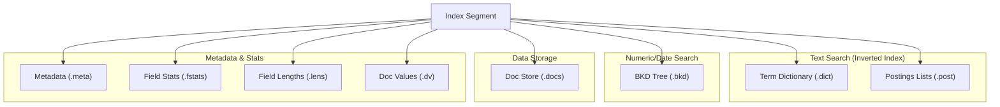

# Lexical Search

Lexical search matches documents based on exact or approximate keyword matches. It is the traditional "search engine" functionality found in Lucene or Elasticsearch.

## Document Structure
In Sarissa, a **Document** is the fundamental unit of indexing. It follows a **schema-less** design, allowing fields to be added dynamically without defining a schema upfront.

Each `Document` consists of multiple `Fields` stored in a Map where the key is the field name. Each `Field` has a **Value** and **Options** defining how it should be indexed.


### Document
The fundamental unit of indexing in Sarissa.
- **Schema-less**: Fields can be added dynamically without a predefined schema.
- **Map Structure**: Fields are stored in a `HashMap` where the key is the field name (String).
- **Flexible**: A single document can contain a mix of different field types (Text, Integer, Blob, etc.).

### Field
A container representing a single data point within a document.
- **Value**: The actual data content (e.g., "Hello World", 123, true). Defined by `FieldValue`.
- **Option**: Configuration for how this data should be handled (e.g., indexed, stored). Defined by `FieldOption`.

### Field Values
- **Text**: UTF-8 string. Typically analyzed and indexed for full-text search.
- **Integer / Float**: Numeric values. Used for range queries (BKD Tree) and sorting.
- **Boolean**: True/False values.
- **DateTime**: UTC timestamps.
- **Geo**: Latitude/Longitude coordinates. Currently stored for scan-based queries or indexed as "lat,lon" text string.
- **Blob**: Raw byte data with MIME type. Used for storing binary content (images, etc.) or vector source data. **Stored only**, never indexed by the lexical engine.

### Field Options
Configuration for the field defining how it should be indexed and stored.

- **TextOption**:
    - `indexed`: If true, the text is analyzed and added to the inverted index (searchable).
    - `stored`: If true, the original text is stored in the doc store (retrievable).
    - `term_vectors`: If true, stores term positions and offsets (needed for highlighting and "More Like This").
- **IntegerOption / FloatOption**:
    - `indexed`: If true, the value is added to the BKD tree (range searchable).
    - `stored`: If true, the original value is stored.
- **BooleanOption**:
    - `indexed`: If true, the value is indexed.
    - `stored`: If true, the original value is stored.
- **DateTimeOption**:
    - `indexed`: If true, the timestamp is added to the BKD tree (range searchable).
    - `stored`: If true, the original timestamp is stored.
- **GeoOption**:
    - `indexed`: If true, the coordinates are indexed as text "lat,lon" (exact match).
    - `stored`: If true, the original coordinates are stored (required for distance queries).
- **BlobOption**:
    - `stored`: If true, the binary data is stored. **Note**: Blobs cannot be indexed by the lexical engine.

## Indexing Process
The indexing process converts raw documents into a searchable index.


1. **Analysis**:
   - **Char Filters**: Pre-process the text (e.g., removing HTML tags).
   - **Tokenizer**: Split text into tokens (e.g., words).
   - **Token Filters**: Normalize tokens (lowercase, stemming, stop-word removal).
2. **Indexing**:
   - **Inverted Index**: Tokens are added to the Term Dictionary and Postings Lists for full-text search.
   - **BKD Tree**: Numeric and DateTime values are added to the BKD Tree for efficient range filtering.
   - **Doc Store**: All fields marked as `stored` are serialized and saved for retrieval.
3. **Segment Creation**:
   - Documents are buffered in memory and periodically flushed to disk as a new **Segment**.
   - Segments are immutable once written, ensuring thread safety and simplifying concurrency.
4. **Merging**:
   - A background process automatically merges smaller segments into larger ones to optimize read performance and reclaim space from deleted documents.

## Search Process
The search process in Sarissa involves several stages to efficiently retrieve and rank documents.


1. **Query Parsing**: The input query string (if using a parser) is converted into a structured `Query` object (e.g., `BooleanQuery` combining `TermQuery`s).
2. **Matching**:
   - The `Query` creates a `Weight` object which calculates normalization factors.
   - For each segment, the `Weight` creates a `Matcher` (equivalent to Lucene's `Scorer` or `Iterator`).
   - The `Matcher` iterates over the `Postings Lists` or `BKD Trees` to find matching document IDs.
   - BitSets are used to efficiently filter out deleted documents.
3. **Scoring**:
   - For ranked queries, a scoring function (BM25) calculates a relevance score for each matching document.
   - Top-N results are collected using a Min-Heap queue to keep only the highest-scoring documents.
4. **Fetching**:
   - Once the top document IDs are identified, their original content is retrieved from the `Doc Store`.

### Scoring (BM25)
Sarissa uses the **Okapi BM25** algorithm as its default similarity function. It is a probabilistic retrieval framework that improves upon TF-IDF by adding saturation and length normalization.

**Formula Components**:
- **TF (Term Frequency)**: How often the term appears in the document. Contribution saturates (diminishing returns) to prevent keyword spamming.
- **IDF (Inverse Document Frequency)**: How rare the term is across the entire index. Rare terms carry more weight.
- **Field Length Norm**: Shorter fields (e.g., "Title") are considered more relevant than long fields (e.g., "Body") for the same match.

## Query Types
Sarissa supports a diverse set of queries for different use cases.

### Core Queries
- **TermQuery**: Exact match for a single token.
  - *Example*: Field "status" matches "active".
- **BooleanQuery**: Combines queries with `MUST` (+), `SHOULD` (OR), `MUST_NOT` (-).
  - *Example*: `+rust -c++` (Must contain "rust", must not contain "c++").


### Approximate Queries
- **FuzzyQuery**: Matches terms within a specific Levenshtein edit distance (default 2).
  - *Example*: "helo" matches "hello".
- **WildcardQuery**: Supported standard wildcards `*` (any) and `?` (single char).
  - *Example*: `te*t` matches "test", "text".
- **PrefixQuery**: Matches terms starting with a specific prefix.
  - *Example*: `data*` matches "database", "datum".
- **RegexpQuery**: Full regular expression support.
  - *Example*: `[0-9]{3}-[0-9]{4}`.

### Range Queries
- **NumericRangeQuery**: Efficient BKD-tree based range search for integers and floats. Supports inclusive/exclusive bounds.
  - *Example*: `price` in `[100, 500]`, `age` > 18.
- **DateTimeRangeQuery**: Specialized range query for timestamps.
  - *Example*: `created_at` in `[2023-01-01, 2023-12-31]`.

### Positional Queries
- **PhraseQuery**: Matches an exact sequence of terms. "Slop" allows for some distance/permutation.
  - *Example*: "distributed search engine" (slop 0), "search distributed" (slop 2).
- **SpanQuery**: Advanced control over term positions.
  - `SpanTerm`: Basic unit.
  - `SpanNear`: Matches spans within a certain distance.
  - `SpanOr`: Union of spans.
  - `SpanNot`: Exclude matches if another span overlaps.

### Geospatial (Requires `geo` feature)
- **GeoDistanceQuery**: Matches points within a radius from a center point.
- **GeoBoundingBoxQuery**: Matches points within a rectangular area.

### Analyzers
Text analysis is the process of converting raw text into tokens. An Analyzer is typically composed of a pipeline:

1. **Char Filters**: Transform the raw character stream (e.g., removing HTML tags).
2. **Tokenizer**: Splits the character stream into a token stream (e.g., splitting by whitespace).
3. **Token Filters**: Modify the token stream (e.g., lowercasing, stemming, removing stop words).

Sarissa provides several built-in analyzers with pre-configured pipelines:

- **StandardAnalyzer**: Good default for most European languages (alias for a generic English setup).
    - Tokenizer: `RegexTokenizer` (Splits on Unicode word boundaries)
    - Token Filters: `LowercaseFilter`, `StopFilter` (English stop words)
- **KeywordAnalyzer**: Treats the entire input as a single token.
    - Tokenizer: `WholeTokenizer`
    - No filters.
- **SimpleAnalyzer**: Basic tokenization without filtering.
    - Tokenizer: Configurable (defaults to `RegexTokenizer` in some contexts)
    - No filters.
- **PipelineAnalyzer**: A flexible builder for creating custom analysis pipelines.
    - Allows combining any **Char Filter**, **Tokenizer**, and **Token Filter** chain.
    - Example: `PipelineAnalyzer::new(tokenizer).add_char_filter(...).add_filter(...)`
- **LanguageAnalyzer**: Analyzers specialized for specific languages.
    - **EnglishAnalyzer**: Specialized for English (similar to StandardAnalyzer but explicit).
        - Tokenizer: `RegexTokenizer` (Splits on Unicode word boundaries)
        - Token Filters: `LowercaseFilter`, `StopFilter` (English stop words)
    - **JapaneseAnalyzer**: Optimized for Japanese text.
        - Char Filters: `UnicodeNormalizationCharFilter` (NFKC), `JapaneseIterationMarkCharFilter` (Normalizes iteration marks like 々)
        - Tokenizer: `LinderaTokenizer` (Morphological analysis using UniDic)
        - Token Filters: `LowercaseFilter`, `StopFilter` (Japanese stop words)
- **PerFieldAnalyzer**: Wraps multiple analyzers to apply them based on field names (Lucene-compatible).
    - Useful when different fields require different analysis strategies (e.g., standard for "body", keyword for "tags").
    - Example:
      ```rust
      let mut analyzer = PerFieldAnalyzer::new(default_analyzer);
      analyzer.add_analyzer("tags", keyword_analyzer);
      ```

## Index Components & File Formats
A Sarissa Index is a collection of **Segments**. Each segment is a self-contained index composed of several specialized files that work together to support different types of search and retrieval.

The main components of a segment are:



### Term Dictionary (`.dict`)
**Core component of the Text Inverted Index.**
A sorted list of all unique terms (tokens) extracted from the documents. It acts as the primary entry point for text search.
- **Function**: Maps a term (e.g., "rust") to its location in the Postings List.
- **Features**: Supports fast distinct term lookup, prefix search, and range scans.
- **Format**:
    - **Magic**: `STDC` (Sorted) or `HTDC` (Hash)
    - **Entries**:
        - `Term`: String
        - `Pointer`: `PostingOffset` (u64), `PostingLength` (u64)
        - `Stats`: `DocFrequency` (u64), `TotalFrequency` (u64)

### Postings Lists (`.post`)
**Core component of the Text Inverted Index.**
Stores the relationships between terms and documents.
- **Function**: For a given term, provides the list of Document IDs containing it.
- **Features**: Highly compressed using delta encoding and varints. Includes frequency and position data for scoring and phrase queries.
- **Format**:
    - **Header**: `Term` (String), `TotalFreq` (Varint), `DocFreq` (Varint), `PostingCount` (Varint).
    - **Postings List**: Sequence of:
        - `DocIDDelta`: VarInt (difference from previous DocID)
        - `Frequency`: VarInt (term freq in doc)
        - `Weight`: Float32 (contribution to score)
        - `HasPositions`: Byte (0 or 1)
        - `Positions`: (Optional) `Count` (VarInt) + `PositionDeltas` (VarInts)

### BKD Tree (`.bkd`)
**Component for Numeric and Geospatial Search.**
A persistent tree structure for multi-dimensional data.
- **Function**: Efficiently handles range queries (e.g., `price > 100`, `date in 2023`).

- **Features**: Block-based storage optimized for disk I/O.
- **Format**:
    - **Magic**: `BKDT`
    - **Index Section**: Internal nodes for tree traversal.
    - **Leaf Blocks**: Contiguous blocks of `(Value, DocID)` pairs.

### Document Store (`.docs`)
**Component for Data Retrieval.**
Stores the original content of fields marked as `stored`.
- **Function**: Retrieves the full document content (JSON) after the search has identified the matching DocIDs.
- **Format**:
    - **Magic**: `DOCS` + Version + DocCount
    - **Data**: Sequential list of documents. Each document contains `DocID`, `FieldCount`, and then for each field: `Name`, `TypeTag`, and `Value`.

### Auxiliary Components

#### Doc Values (`.dv`)
Columnar storage for sorting and aggregations.
- **Function**: Fast access to specific field values across many documents.

#### Field Statistics (`.fstats`)
Global statistics for each field (min/max length, doc count).
- **Usage**: Query planning and optimization.

#### Field Lengths (`.lens`)
Stores the number of tokens per field per document.
- **Usage**: Essential for BM25 scoring (length normalization).

#### Segment Metadata (`.meta`) & Manifest (`segments.manifest`)
Registry and metadata files.
- **Format**: JSON (`SegmentInfo`).
- **Fields**: `segment_id`, `doc_count`, `doc_offset`, `generation`, `has_deletions`.
- **Usage**: Managing segment lifecycle, versioning, and status.
