# Lexical Search

Lexical search matches documents based on exact or approximate keyword matches. It is the traditional "search engine" functionality found in Lucene or Elasticsearch.

## Document Structure
In Sarissa, a **Document** is the fundamental unit of indexing. It follows a **schema-less** design, allowing fields to be added dynamically without defining a schema upfront.

Each `Document` consists of multiple `Fields` stored in a Map where the key is the field name. Each `Field` has a **Value** and **Options** defining how it should be indexed.


### Document
The fundamental unit of indexing in Sarissa.
- **Schema-less**: Fields can be added dynamically without a predefined schema.
- **Map Structure**: Fields are stored in a `HashMap` where the key is the field name (String).
- **Flexible**: A single document can contain a mix of different field types (Text, Integer, Blob, etc.).

### Field
A container representing a single data point within a document.
- **Value**: The actual data content (e.g., "Hello World", 123, true). Defined by `FieldValue`.
- **Option**: Configuration for how this data should be handled (e.g., indexed, stored). Defined by `FieldOption`.

### Field Values
- **Text**: UTF-8 string. Typically analyzed and indexed for full-text search.
- **Integer / Float**: Numeric values. Used for range queries (BKD Tree) and sorting.
- **Boolean**: True/False values.
- **DateTime**: UTC timestamps.
- **Geo**: Latitude/Longitude coordinates.
- **Blob**: Raw byte data with MIME type. Used for storing binary content (images, etc.) or vector source data. **Stored only**, never indexed by the lexical engine.

### Field Options
Configuration for the field defining how it should be indexed and stored.

- **TextOption**:
    - `indexed`: If true, the text is analyzed and added to the inverted index (searchable).
    - `stored`: If true, the original text is stored in the doc store (retrievable).
    - `term_vectors`: If true, stores term positions and offsets (needed for highlighting and "More Like This").
- **IntegerOption / FloatOption**:
    - `indexed`: If true, the value is added to the BKD tree (range searchable).
    - `stored`: If true, the original value is stored.
- **BooleanOption**:
    - `indexed`: If true, the value is indexed.
    - `stored`: If true, the original value is stored.
- **DateTimeOption**:
    - `indexed`: If true, the timestamp is added to the BKD tree (range searchable).
    - `stored`: If true, the original timestamp is stored.
- **GeoOption**:
    - `indexed`: If true, the coordinates are indexed for geospatial search.
    - `stored`: If true, the original coordinates are stored.
- **BlobOption**:
    - `stored`: If true, the binary data is stored. **Note**: Blobs cannot be indexed by the lexical engine.

## Key Components

```mermaid
graph TD
    subgraph "Lexical Engine"
        subgraph "Ingestion Pipeline"
            Doc[Document]
            
            subgraph "Analyzer"
                CF["Char Filters<br>(HTML Strip, etc.)"]
                Tok["Tokenizer<br>(Standard, Lindera)"]
                TF["Token Filters<br>(Lower, Stop, Stem)"]
                
                CF --> Tok --> TF
            end
        end
        
        subgraph "Indexing"
            II["Inverted Index<br>(Term Dictionary + Postings)"]
            BKD["BKD Tree<br>(Numeric Values)"]
            Store["Doc Store<br>(Stored Fields)"]
        end

        Doc --> Analyzer
        TF -->|"Tokens"| II
        Doc -->|"Numbers"| BKD
        Doc -->|"Stored Content"| Store
    end
```



### Analyzers
Text analysis is the process of converting raw text into tokens. An Analyzer is typically composed of a pipeline:

1. **Char Filters**: Transform the raw character stream (e.g., removing HTML tags).
2. **Tokenizer**: Splits the character stream into a token stream (e.g., splitting by whitespace).
3. **Token Filters**: Modify the token stream (e.g., lowercasing, stemming, removing stop words).

Sarissa provides several built-in analyzers with pre-configured pipelines:

- **StandardAnalyzer**: Good default for most European languages (alias for a generic English setup).
    - Tokenizer: `RegexTokenizer` (Splits on Unicode word boundaries)
    - Token Filters: `LowercaseFilter`, `StopFilter` (English stop words)
- **KeywordAnalyzer**: Treats the entire input as a single token.
    - Tokenizer: `WholeTokenizer`
    - No filters.
- **SimpleAnalyzer**: Basic tokenization without filtering.
    - Tokenizer: Configurable (defaults to `RegexTokenizer` in some contexts)
    - No filters.
- **PipelineAnalyzer**: A flexible builder for creating custom analysis pipelines.
    - Allows combining any **Char Filter**, **Tokenizer**, and **Token Filter** chain.
    - Example: `PipelineAnalyzer::new(tokenizer).add_char_filter(...).add_filter(...)`
- **LanguageAnalyzer**: Analyzers specialized for specific languages.
    - **EnglishAnalyzer**: Specialized for English (similar to StandardAnalyzer but explicit).
        - Tokenizer: `RegexTokenizer` (Splits on Unicode word boundaries)
        - Token Filters: `LowercaseFilter`, `StopFilter` (English stop words)
    - **JapaneseAnalyzer**: Optimized for Japanese text.
        - Char Filters: `UnicodeNormalizationCharFilter` (NFKC), `JapaneseIterationMarkCharFilter` (Normalizes iteration marks like 々)
        - Tokenizer: `LinderaTokenizer` (Morphological analysis using UniDic)
        - Token Filters: `LowercaseFilter`, `StopFilter` (Japanese stop words)
- **PerFieldAnalyzer**: Wraps multiple analyzers to apply them based on field names (Lucene-compatible).
    - Useful when different fields require different analysis strategies (e.g., standard for "body", keyword for "tags").
    - Example:
      ```rust
      let mut analyzer = PerFieldAnalyzer::new(default_analyzer);
      analyzer.add_analyzer("tags", keyword_analyzer);
      ```

## Data Structures
Sarissa uses specialized data structures for different data types to ensure optimal performance.

### Inverted Index
Used for **Text** fields. It maps terms (tokens) to the list of documents containing them (Posting Lists). This allows for O(1) or O(log N) lookup complexity for term matches.


- **Term Dictionary**: A sorted list of all unique terms (tokens) extracted from the documents. It allows for fast prefix-based lookups and range scans.
- **Postings Lists**: For each term, a list of document IDs containing that term is stored. It often includes additional metadata like:
    - **Frequency**: How many times the term appears in the document (for scoring).
    - **Positions**: The positions of the term in the document (for phrase queries and highlighting).

## File Structure
Sarissa's Inverted Index is **segment-based**, similar to Lucene.
- **Immutable Segments**: New documents are written to a new segment. Once written, a segment is immutable (never modified).
- **Merge Process**: In the background, small segments are merged into larger ones to keep the number of files manageable and improve search performance.

### Segment Files
Each segment consists of multiple files sharing the same prefix (e.g., `segment_000001`):

- `segments.manifest`: The master registry listing all active segments.
- `*.dict`: **Term Dictionary**. Stores terms and pointers to the postings file.
- `*.post`: **Postings Lists**. Stores document IDs, frequencies, and positions.
- `*.docs`: **Doc Store**. Stores the original fields of the documents.
- `*.dv`: **Doc Values**. Columnar storage for sorting and aggregations.
- `*.lens`: **Field Lengths**. Used for scoring (BM25 normalization).
- `*.fstats`: **Field Statistics**. Min/Max/Avg lengths for query planning.
- `*.meta`: **Metadata**. Segment info like document count and generation.

### File Formats
Details of the specific binary formats used in Sarissa.

#### Term Dictionary (`.dict`)
- **Magic**: `STDC` (Sorted) or `HTDC` (Hash)
- **Version**: 1 (u32)
- **Content**: List of terms sorted lexicographically.
    - `Term`: String
    - `PostingOffset`: u64 (Pointer to `.post` file)
    - `PostingLength`: u64
    - `DocFreq`: u64
    - `TotalFreq`: u64

#### Postings Lists (`.post`)
- **Content**: Encoded posting lists for each term.
    - `Term`: String
    - `Term Metadata`: TotalFreq, DocFreq, PostingCount (Varint)
    - **Postings**: Delta-encoded list of document IDs.
        - `DocIDDelta`: Varint
        - `Frequency`: Varint
        - `Weight`: f32
        - `Positions`: (Optional) PosCount + Delta-encoded positions

#### Doc Store (`.docs`)
- **Content**: Row-oriented storage for retrieving full documents.
    - `DocCount`: Varint
    - **Documents**:
        - `DocID`: u64
        - `FieldCount`: Varint
        - **Fields**: Name + TypeTag + Value (Serialized)

#### Doc Values (`.dv`)
- **Magic**: `DVFF`
- **Version**: 1.0
- **Content**: Column-oriented storage for sorting/aggregations.
    - `NumFields`: u32
    - **Fields**:
        - `Name`: String
        - `NumValues`: u64
        - `Data`: Rkyv-serialized vector of values

#### Segment Metadata (`.meta`)
- **Format**: JSON
- **Content**: Basic segment information.
    - `segment_id`, `doc_count`, `doc_offset`, `generation`, `has_deletions`

#### Manifest (`segments.manifest`)
- **Magic**: `SEGS`
- **Content**: Registry of all active segments and their management info (size, creation time, merge tier).

### BKD Tree
> [!NOTE]
> Currently, the BKD Tree implementation is **in-memory only** and does not have a persistent file format. It is rebuilt from document values when needed or falls back to scan-based range queries.

Used for **Numeric** fields (Integer, Float) and **Geo** fields. It efficiently handles range queries (e.g., `price > 100`) and spatial queries.

### Structure
Conceptually, the BKD Tree recursively subdivides the space into smaller blocks. For 1D numeric data, this behaves like a balanced binary search tree or a sorted array.


### Explanation
- **Internal Nodes**: Pivot points that split the data into two halves (used for binary search).
- **Leaf Blocks**: Continuous chunks of sorted data containing `(Value, DocID)` pairs.
- **Range Search**: Uses binary search to efficiently locate the start and end blocks for the requested range, then scans the matching values.

### Doc Store
Used to store the original field content (if configured as `stored`). This allows retrieving the actual document data during search results fetching, not just the document ID. It is typically a key-value store optimized for retrieving full documents by ID.

### Query Types
Sarissa supports a wide range of query types to handle various search requirements.

- **TermQuery**: The most basic query. Matches documents containing an exact term.
- **PhraseQuery**: Matches documents containing a specific sequence of terms. Slop can be configured to allow for intervening terms.
- **BooleanQuery**: Combines multiple queries using boolean logic (`MUST` (AND), `SHOULD` (OR), `MUST_NOT` (NOT)).
- **FuzzyQuery**: Matches terms similar to the query term based on Levenshtein edit distance. Useful for handling typos.
- **RangeQuery**: Matches documents with values falling within a specified range. Supports both numeric (BKD Tree) and string ranges.
- **WildcardQuery**: Matches terms using wildcard operators (`*` for zero or more chars, `?` for single char).
- **PrefixQuery**: Matches terms starting with a specific prefix.
- **RegexpQuery**: Matches terms based on a regular expression pattern.
- **SpanQuery**: Advanced positional queries (Near, Or, Not, Term, First) that allow for precise control over term proximity and positioning.
- **GeoQuery**: Performs geospatial searches such as bounding box and distance searches (requires `geo` feature).
