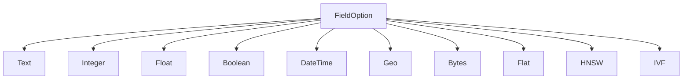

# Schema & Fields

The `Schema` defines the structure of your documents — what fields exist and how each field is indexed. It is the single source of truth for the Engine.

## Schema

A `Schema` is a collection of named fields. Each field is either a **lexical field** (for keyword search) or a **vector field** (for similarity search).

```rust
use laurus::Schema;
use laurus::lexical::TextOption;
use laurus::lexical::core::field::IntegerOption;
use laurus::vector::HnswOption;

let schema = Schema::builder()
    .add_text_field("title", TextOption::default())
    .add_text_field("body", TextOption::default())
    .add_integer_field("year", IntegerOption::default())
    .add_hnsw_field("embedding", HnswOption::default())
    .add_default_field("body")
    .build();
```

### Default Fields

`add_default_field()` specifies which field(s) are searched when a query does not explicitly name a field. This is used by the [Query DSL](../advanced/query_dsl.md) parser.

## Field Types



### Lexical Fields

Lexical fields are indexed using an inverted index and support keyword-based queries.

| Type | Rust Type | SchemaBuilder Method | Description |
| :--- | :--- | :--- | :--- |
| **Text** | `TextOption` | `add_text_field()` | Full-text searchable; tokenized by the analyzer |
| **Integer** | `IntegerOption` | `add_integer_field()` | 64-bit signed integer; supports range queries |
| **Float** | `FloatOption` | `add_float_field()` | 64-bit floating point; supports range queries |
| **Boolean** | `BooleanOption` | `add_boolean_field()` | `true` / `false` |
| **DateTime** | `DateTimeOption` | `add_datetime_field()` | UTC timestamp; supports range queries |
| **Geo** | `GeoOption` | `add_geo_field()` | Latitude/longitude pair; supports radius and bounding box queries |
| **Bytes** | `BytesOption` | `add_bytes_field()` | Raw binary data |

#### Text Field Options

`TextOption` controls how text is indexed:

```rust
use laurus::lexical::TextOption;

// Default: indexed + stored
let opt = TextOption::default();

// Customize: indexed + stored + term vectors
let opt = TextOption::default()
    .set_indexed(true)
    .set_stored(true)
    .set_term_vectors(true);
```

| Option | Default | Description |
| :--- | :--- | :--- |
| `indexed` | `true` | Whether the field is searchable |
| `stored` | `true` | Whether the original value is stored for retrieval |
| `term_vectors` | `false` | Whether term positions are stored (needed for phrase queries) |

### Vector Fields

Vector fields are indexed using vector indexes for approximate nearest neighbor (ANN) search.

| Type | Rust Type | SchemaBuilder Method | Description |
| :--- | :--- | :--- | :--- |
| **Flat** | `FlatOption` | `add_flat_field()` | Brute-force linear scan; exact results |
| **HNSW** | `HnswOption` | `add_hnsw_field()` | Hierarchical Navigable Small World graph; fast approximate |
| **IVF** | `IvfOption` | `add_ivf_field()` | Inverted File Index; cluster-based approximate |

#### HNSW Field Options (most common)

```rust
use laurus::vector::HnswOption;
use laurus::vector::core::distance::DistanceMetric;

let opt = HnswOption {
    dimension: 384,                          // vector dimensions
    distance: DistanceMetric::Cosine,        // distance metric
    m: 16,                                   // max connections per layer
    ef_construction: 200,                    // construction search width
    base_weight: 1.0,                        // default scoring weight
    quantizer: None,                         // optional quantization
};
```

See [Vector Indexing](../indexing/vector_indexing.md) for detailed parameter guidance.

## Document

A `Document` is a collection of named field values. Use `DocumentBuilder` to construct documents:

```rust
use laurus::Document;

let doc = Document::builder()
    .add_text("title", "Introduction to Rust")
    .add_text("body", "Rust is a systems programming language.")
    .add_integer("year", 2024)
    .add_float("rating", 4.8)
    .add_boolean("published", true)
    .build();
```

### DocumentBuilder Methods

| Method | Value Type | Description |
| :--- | :--- | :--- |
| `add_text(name, value)` | `String` | Add a text field |
| `add_integer(name, value)` | `i64` | Add an integer field |
| `add_float(name, value)` | `f64` | Add a float field |
| `add_boolean(name, value)` | `bool` | Add a boolean field |
| `add_datetime(name, value)` | `DateTime<Utc>` | Add a datetime field |
| `add_vector(name, value)` | `Vec<f32>` | Add a pre-computed vector field |
| `add_geo(name, lat, lon)` | `(f64, f64)` | Add a geographic point |
| `add_bytes(name, data)` | `Vec<u8>` | Add binary data |
| `add_field(name, value)` | `DataValue` | Add any value type |

## DataValue

`DataValue` is the unified value enum that represents any field value in Laurus:

```rust
pub enum DataValue {
    Null,
    Bool(bool),
    Int64(i64),
    Float64(f64),
    Text(String),
    Bytes(Vec<u8>, Option<String>),  // (data, optional MIME type)
    Vector(Vec<f32>),
    DateTime(DateTime<Utc>),
    Geo(f64, f64),          // (latitude, longitude)
}
```

`DataValue` implements `From<T>` for common types, so you can use `.into()` conversions:

```rust
use laurus::DataValue;

let v: DataValue = "hello".into();       // Text
let v: DataValue = 42i64.into();         // Int64
let v: DataValue = 3.14f64.into();       // Float64
let v: DataValue = true.into();          // Bool
let v: DataValue = vec![0.1f32, 0.2].into(); // Vector
```

## Reserved Fields

The `_id` field is reserved by Laurus for internal use. It stores the external document ID and is always indexed with `KeywordAnalyzer` (exact match). You do not need to add it to your schema — it is managed automatically.

## Schema Design Tips

1. **Separate lexical and vector fields** — a field is either lexical or vector, never both. For hybrid search, create separate fields (e.g., `body` for text, `body_vec` for vector).

2. **Use `KeywordAnalyzer` for exact-match fields** — category, status, and tag fields should use `KeywordAnalyzer` via `PerFieldAnalyzer` to avoid tokenization.

3. **Choose the right vector index** — use HNSW for most cases, Flat for small datasets, IVF for very large datasets. See [Vector Indexing](../indexing/vector_indexing.md).

4. **Set default fields** — if you use the Query DSL, set default fields so users can write `hello` instead of `body:hello`.
