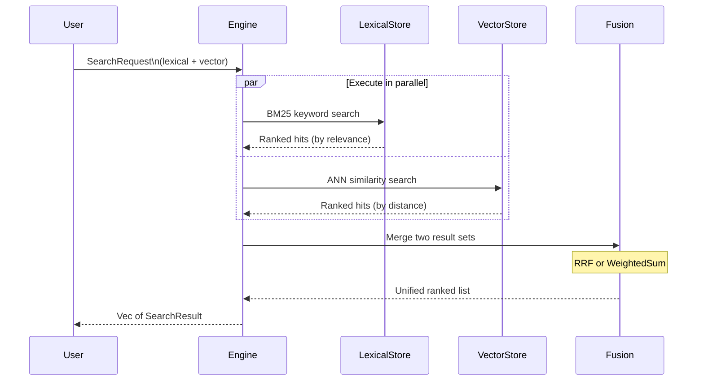

# Hybrid Search

Hybrid search combines **lexical search** (keyword matching) with **vector search** (semantic similarity) to deliver results that are both precise and semantically relevant. This is Laurus's most powerful search mode.

## Why Hybrid Search?

| Search Type | Strengths | Weaknesses |
| :--- | :--- | :--- |
| **Lexical only** | Exact keyword matching, handles rare terms well | Misses synonyms and paraphrases |
| **Vector only** | Understands meaning, handles synonyms | May miss exact keywords, less precise |
| **Hybrid** | Best of both worlds | Slightly more complex to configure |

## How It Works



## Basic Usage

### Builder API

```rust
use laurus::{SearchRequestBuilder, FusionAlgorithm};
use laurus::lexical::TermQuery;
use laurus::lexical::search::searcher::LexicalSearchQuery;
use laurus::vector::search::searcher::VectorSearchQuery;
use laurus::vector::store::request::QueryPayload;
use laurus::data::DataValue;

let request = SearchRequestBuilder::new()
    // Lexical component
    .lexical_query(
        LexicalSearchQuery::Obj(
            Box::new(TermQuery::new("body", "rust"))
        )
    )
    // Vector component
    .vector_query(
        VectorSearchQuery::Payloads(vec![
            QueryPayload {
                field: "text_vec".to_string(),
                payload: DataValue::Text("systems programming".to_string()),
                weight: 1.0,
            },
        ])
    )
    // Fusion algorithm
    .fusion_algorithm(FusionAlgorithm::RRF { k: 60.0 })
    .limit(10)
    .build();

let results = engine.search(request).await?;
```

### Query DSL

Mix lexical and vector clauses in a single query string:

```rust
use laurus::UnifiedQueryParser;
use laurus::lexical::QueryParser;
use laurus::vector::VectorQueryParser;

let unified = UnifiedQueryParser::new(
    QueryParser::new(analyzer).with_default_field("body"),
    VectorQueryParser::new(embedder),
);

// Lexical + vector in one query
let request = unified.parse(r#"body:rust text_vec:"systems programming""#).await?;
let results = engine.search(request).await?;
```

The parser uses the schema to identify vector clauses by field type. Fields defined as vector fields (e.g., HNSW) are parsed as vector queries; everything else is parsed as lexical.

## Fusion Algorithms

When both lexical and vector results exist, they must be merged into a single ranked list. Laurus supports two fusion algorithms:

### RRF (Reciprocal Rank Fusion)

The default algorithm. Combines results based on their rank positions rather than raw scores.

```text
score(doc) = sum( 1 / (k + rank_i) )
```

Where `rank_i` is the position of the document in each result list, and `k` is a smoothing parameter (default 60).

```rust
use laurus::FusionAlgorithm;

let fusion = FusionAlgorithm::RRF { k: 60.0 };
```

**Advantages:**

- Robust to different score distributions between lexical and vector results
- No need to tune weights
- Works well out of the box

### WeightedSum

Linearly combines normalized lexical and vector scores:

```text
score(doc) = lexical_weight * lexical_score + vector_weight * vector_score
```

```rust
use laurus::FusionAlgorithm;

let fusion = FusionAlgorithm::WeightedSum {
    lexical_weight: 0.3,
    vector_weight: 0.7,
};
```

**When to use:**

- When you want explicit control over the balance between lexical and vector relevance
- When you know one signal is more important than the other

## SearchRequest Fields

| Field | Type | Default | Description |
| :--- | :--- | :--- | :--- |
| `query` | `SearchQuery` | `Dsl("")` | Search query (Dsl, Lexical, Vector, or Hybrid) |
| `limit` | `usize` | 10 | Maximum number of results to return |
| `offset` | `usize` | 0 | Number of results to skip (for pagination) |
| `fusion_algorithm` | `Option<FusionAlgorithm>` | `None` (uses `RRF { k: 60.0 }` when both results exist) | How to merge lexical and vector results |
| `filter_query` | `Option<Box<dyn Query>>` | None | Pre-filter using a lexical query (restricts both lexical and vector results) |
| `lexical_options` | `LexicalSearchOptions` | Default | Parameters controlling lexical search behavior (field boosts, min score, timeout, etc.) |
| `vector_options` | `VectorSearchOptions` | Default | Parameters controlling vector search behavior (score mode, min score) |

## SearchResult

Each result contains:

| Field | Type | Description |
| :--- | :--- | :--- |
| `id` | `String` | External document ID |
| `score` | `f32` | Fused relevance score |
| `document` | `Option<Document>` | Full document content (if loaded) |

## Filtered Hybrid Search

Apply a filter to restrict both lexical and vector results:

```rust
let request = SearchRequestBuilder::new()
    .lexical_query(
        LexicalSearchQuery::Obj(Box::new(TermQuery::new("body", "rust")))
    )
    .vector_query(
        VectorSearchQuery::Payloads(vec![
            QueryPayload {
                field: "text_vec".to_string(),
                payload: DataValue::Text("systems programming".to_string()),
                weight: 1.0,
            },
        ])
    )
    // Only search within "tutorial" category
    .filter_query(Box::new(TermQuery::new("category", "tutorial")))
    .fusion_algorithm(FusionAlgorithm::RRF { k: 60.0 })
    .limit(10)
    .build();
```

### How Filtering Works

1. The filter query runs on the lexical index to produce a set of allowed document IDs
2. For lexical search: the filter is combined with the user query as a boolean AND
3. For vector search: the allowed IDs are passed to restrict the ANN search

## Pagination

Use `offset` and `limit` for pagination:

```rust
// Page 1: results 0-9
let page1 = SearchRequestBuilder::new()
    .lexical_query(/* ... */)
    .vector_query(/* ... */)
    .offset(0)
    .limit(10)
    .build();

// Page 2: results 10-19
let page2 = SearchRequestBuilder::new()
    .lexical_query(/* ... */)
    .vector_query(/* ... */)
    .offset(10)
    .limit(10)
    .build();
```

## Complete Example

```rust
use std::sync::Arc;
use laurus::{
    Document, Engine, Schema, SearchRequestBuilder,
    FusionAlgorithm, PerFieldEmbedder,
};
use laurus::lexical::{TextOption, TermQuery};
use laurus::lexical::core::field::IntegerOption;
use laurus::lexical::search::searcher::LexicalSearchQuery;
use laurus::vector::HnswOption;
use laurus::vector::search::searcher::VectorSearchQuery;
use laurus::vector::store::request::QueryPayload;
use laurus::data::DataValue;
use laurus::storage::memory::MemoryStorage;

#[tokio::main]
async fn main() -> laurus::Result<()> {
    let storage = Arc::new(MemoryStorage::new(Default::default()));

    // Schema with both lexical and vector fields
    let schema = Schema::builder()
        .add_text_field("title", TextOption::default())
        .add_text_field("body", TextOption::default())
        .add_text_field("category", TextOption::default())
        .add_integer_field("year", IntegerOption::default())
        .add_hnsw_field("body_vec", HnswOption {
            dimension: 384,
            ..Default::default()
        })
        .build();

    // Configure analyzer and embedder (see Text Analysis and Embeddings docs)
    // let analyzer = Arc::new(StandardAnalyzer::new()?);
    // let embedder = Arc::new(CandleBertEmbedder::new("sentence-transformers/all-MiniLM-L6-v2")?);
    let engine = Engine::builder(storage, schema)
        // .analyzer(analyzer)
        // .embedder(embedder)
        .build()
        .await?;

    // Index documents with both text and vector fields
    engine.add_document("doc-1", Document::builder()
        .add_text("title", "Rust Programming Guide")
        .add_text("body", "Rust is a systems programming language.")
        .add_text("category", "programming")
        .add_integer("year", 2024)
        .add_text("body_vec", "Rust is a systems programming language.")
        .build()
    ).await?;
    engine.commit().await?;

    // Hybrid search: keyword "rust" + semantic "systems language"
    let results = engine.search(
        SearchRequestBuilder::new()
            .lexical_query(
                LexicalSearchQuery::Obj(Box::new(TermQuery::new("body", "rust")))
            )
            .vector_query(
                VectorSearchQuery::Payloads(vec![
                    QueryPayload {
                        field: "body_vec".to_string(),
                        payload: DataValue::Text("systems language".to_string()),
                        weight: 1.0,
                    },
                ])
            )
            .fusion_algorithm(FusionAlgorithm::RRF { k: 60.0 })
            .limit(10)
            .build()
    ).await?;

    for r in &results {
        println!("{}: score={:.4}", r.id, r.score);
    }

    Ok(())
}
```

## Next Steps

- Full query syntax reference: [Query DSL](../query_dsl.md)
- Understand ID resolution: [ID Management](../../laurus/id_management.md)
- Data durability: [Persistence & WAL](../../laurus/persistence.md)
