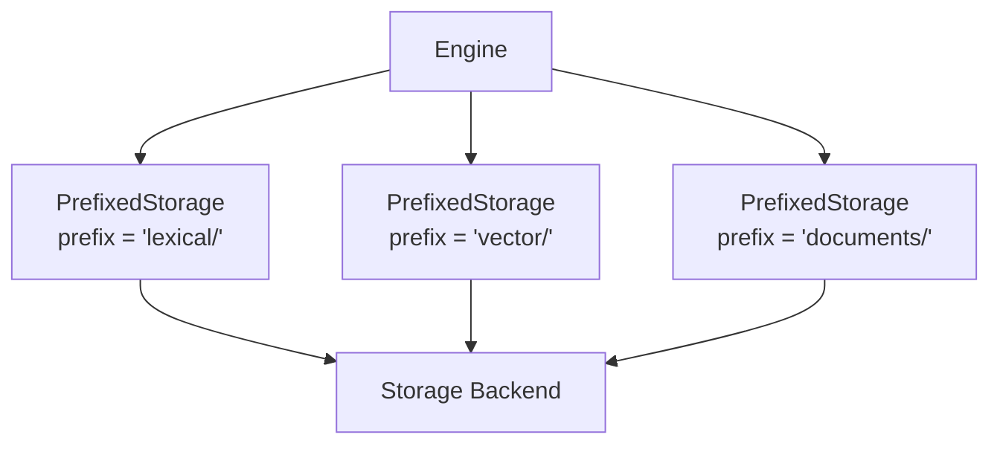

# Storage

Iris uses a pluggable storage layer that abstracts how and where index data is persisted. All components — lexical index, vector index, and document log — share a single storage backend.

## The Storage Trait

All backends implement the `Storage` trait:

```rust
pub trait Storage: Send + Sync + Debug {
    fn loading_mode(&self) -> LoadingMode;
    fn open_input(&self, name: &str) -> Result<Box<dyn StorageInput>>;
    fn create_output(&self, name: &str) -> Result<Box<dyn StorageOutput>>;
    fn file_exists(&self, name: &str) -> bool;
    fn delete_file(&self, name: &str) -> Result<()>;
    fn list_files(&self) -> Result<Vec<String>>;
    fn file_size(&self, name: &str) -> Result<u64>;
    // ... additional methods
}
```

This interface is file-oriented: all data (index segments, metadata, WAL entries, documents) is stored as named files accessed through streaming `StorageInput` / `StorageOutput` handles.

## Storage Backends

### MemoryStorage

All data lives in memory. Fast and simple, but not durable.

```rust
use std::sync::Arc;
use iris::Storage;
use iris::storage::memory::MemoryStorage;

let storage: Arc<dyn Storage> = Arc::new(
    MemoryStorage::new(Default::default())
);
```

| Property | Value |
| :--- | :--- |
| Durability | None (data lost on process exit) |
| Speed | Fastest |
| Use case | Testing, prototyping, ephemeral data |

### FileStorage

Standard file-system based persistence. Each key maps to a file on disk.

```rust
use std::sync::Arc;
use iris::Storage;
use iris::storage::file::{FileStorage, FileStorageConfig};

let config = FileStorageConfig {
    base_path: "/tmp/iris-data".into(),
};
let storage: Arc<dyn Storage> = Arc::new(FileStorage::new(config)?);
```

| Property | Value |
| :--- | :--- |
| Durability | Full (persisted to disk) |
| Speed | Moderate (disk I/O) |
| Use case | General production use |

### FileStorage with Memory Mapping

`FileStorage` supports memory-mapped file access via the `use_mmap` configuration flag. When enabled, the OS manages paging between memory and disk.

```rust
use std::sync::Arc;
use iris::Storage;
use iris::storage::file::{FileStorage, FileStorageConfig};

let mut config = FileStorageConfig::new("/tmp/iris-data");
config.use_mmap = true;  // enable memory-mapped I/O
let storage: Arc<dyn Storage> = Arc::new(FileStorage::new(config)?);
```

| Property | Value |
| :--- | :--- |
| Durability | Full (persisted to disk) |
| Speed | Fast (OS-managed memory mapping) |
| Use case | Large datasets, read-heavy workloads |

## StorageFactory

You can also create storage via configuration:

```rust
use iris::storage::{StorageConfig, StorageFactory};
use iris::storage::memory::MemoryStorageConfig;

let storage = StorageFactory::create(
    StorageConfig::Memory(MemoryStorageConfig::default())
)?;
```

## PrefixedStorage

The engine uses `PrefixedStorage` to isolate components within a single storage backend:



When the lexical store writes a key `segments/seg-001.dict`, it is actually stored as `lexical/segments/seg-001.dict` in the underlying backend. This ensures no key collisions between components.

You do not need to create `PrefixedStorage` yourself — the `EngineBuilder` handles this automatically.

## Choosing a Backend

| Factor | MemoryStorage | FileStorage | FileStorage (mmap) |
| :--- | :--- | :--- | :--- |
| **Durability** | None | Full | Full |
| **Read speed** | Fastest | Moderate | Fast |
| **Write speed** | Fastest | Moderate | Moderate |
| **Memory usage** | Proportional to data size | Low | OS-managed |
| **Max data size** | Limited by RAM | Limited by disk | Limited by disk + address space |
| **Best for** | Tests, small datasets | General use | Large read-heavy datasets |

### Recommendations

- **Development / Testing**: Use `MemoryStorage` for fast iteration without file cleanup
- **Production (general)**: Use `FileStorage` for reliable persistence
- **Production (large scale)**: Use `FileStorage` with `use_mmap = true` when you have large indexes and want to leverage OS page cache

## Next Steps

- Learn how the lexical index works: [Lexical Indexing](../indexing/lexical_indexing.md)
- Learn how the vector index works: [Vector Indexing](../indexing/vector_indexing.md)
