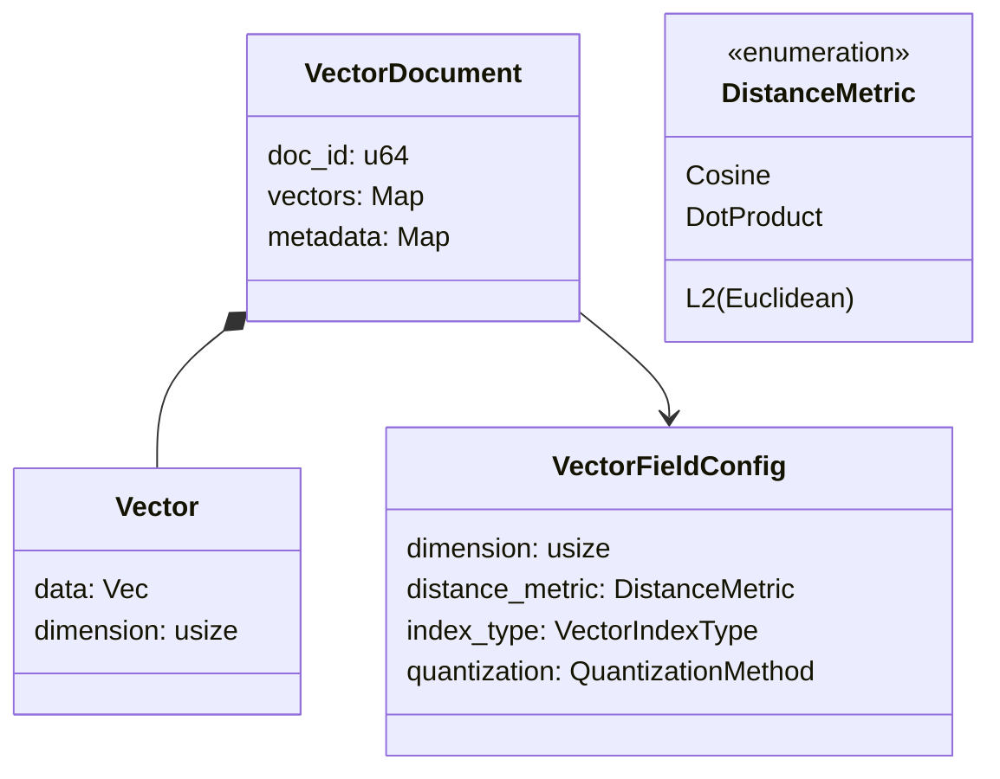
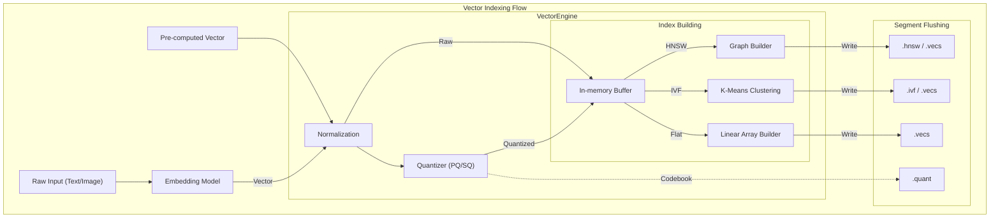
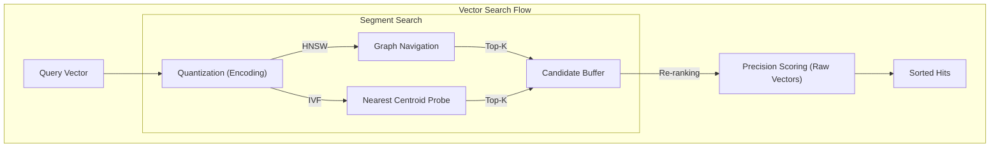

# Vector Search

Vector search (finding "nearest neighbors") enables semantic retrieval where matches are based on meaning rather than exact keywords. It is the core technology behind modern AI-powered search, recommendations, and RAG (Retrieval-Augmented Generation) systems.

## Vector Document Structure
While lexical search operates on text documents, vector search operates on high-dimensional numerical representations of data. In Sarissa, vectors can be part of a standard `Document` or managed as standalone entities.



### Vector
A mathematical representation of an object (text, image, audio) in a multi-dimensional space.
- **Dimension**: The number of elements in the vector (e.g., 384, 768, 1536).
- **Normalization**: Vectors can be normalized (e.g., to unit length) to optimize distance calculations.

### Vector Field Configuration
Defines how vectors in a specific field are indexed and queried.
- **Distance Metric**: The formula used to calculate "similarity" between vectors.
- **Index Type**: The algorithm used for storage and retrieval (HNSW, IVF, Flat).
- **Quantization**: Compression techniques to reduce memory usage.

## Indexing Process
The vector indexing process transforms raw data or pre-computed vectors into efficient, searchable structures.



1.  **Vector Acquisition**: Vectors are either provided directly or generated from text/images using an `Embedder`.
2.  **Processing**:
    *   **Normalization**: Adjusting vectors to a consistent scale (e.g., unit norm for Cosine similarity).
    *   **Quantization**: Optional compression (e.g., Product Quantization) to reduce the memory footprint.
3.  **Index Construction**:
    *   **HNSW**: Builds a hierarchical graph structure for sub-linear search time.
    *   **IVF**: Clusters vectors into partitions to restrict the search space.
4.  **Segment Flushing**: Serializes the in-memory structures into immutable files on disk.

## Core Concepts

### ANN (Approximate Nearest Neighbor)
In large-scale vector search, calculating exact distances to every vector is too slow. ANN algorithms provide a high-speed search with a small, controllable loss in accuracy (Recall).

### HNSW (Hierarchical Navigable Small World)
Sarissa's primary ANN algorithm. It constructs a multi-layered graph where the top layers are sparse (long-distance "express" links) and bottom layers are dense (short-distance local links).
- **Efficiency**: Search time is logarithmic $O(\log N)$.
- **Parameters**: `m` (links per node) and `ef_construction` control the trade-off between index quality and build speed.

### IVF (Inverted File Index)
Clusters vectors into $K$ Voronoi cells. During search, only the nearest `n_probe` cells are scanned.
- **Centroids**: Calculated during a `Training` phase using K-Means.
- **Use Case**: Efficient for extremely large datasets where HNSW memory overhead becomes prohibitive.

## Distance Metrics

Sarissa leverages Rust's SIMD (Single Instruction Multiple Data) instructions to maximize performance for distance calculations. This ensures efficient processing of high-dimensional vectors.

| Metric | Description | Rust Implementation Class | Features |
| :--- | :--- | :--- | :--- |
| **Cosine** | Measures the angle between vectors. | `DistanceMetric::Cosine` | Ideal for semantic text similarity. |
| **Euclidean (L2)** | Measures straight-line distance. | `DistanceMetric::Euclidean` | Suitable for image retrieval and physical proximity. |
| **DotProduct** | Calculates the dot product. | `DistanceMetric::DotProduct` | Extremely fast for pre-normalized vectors. |
| **Manhattan** | L1 distance. | `DistanceMetric::Manhattan` | Sum of absolute differences of coordinates. |

### SIMD Optimization
Sarissa's distance calculation logic (`src/vector/core/distance.rs`) automatically selects the optimal SIMD instruction set based on the target architecture. This provides significant performance gains compared to standard loop-based processing.

## Quantization

Sarissa supports multiple quantization methods to reduce memory usage and improve search speed.

- **Scalar 8-bit (SQ8)**: Maps 32-bit floating-point values to 8-bit integers. Reduces memory by 4x while maintaining high precision.
- **Product Quantization (PQ)**: Decomposes vectors into sub-vectors and performs clustering in each sub-space, achieving compression ratios from 16x to 64x.

## Implementation Details for Index Types

### Flat Index (Exact Search)
Stores all vectors directly in an array and calculates distances between the query and every vector during search.
- **Implementation**: `FlatIndexWriter`, `FlatVectorIndexReader`
- **Characteristics**: 100% precision (Exact Search), but search speed decreases linearly with data volume.
- **Use Cases**: Small datasets or as a baseline for ANN precision.

### HNSW (Hierarchical Navigable Small World)
The default ANN algorithm in Sarissa.
- **Implementation**: `HnswIndexWriter`, `HnswIndexReader`
- **Details**: Constructs a multi-layered graph. Supports parallel building using `rayon` for fast construction from large datasets.
- **Parameters**:
    - `m`: Number of neighbors per node. Increasing this improves precision but increases memory and build time.
    - `ef_construction`: Search scope during index building.

### IVF (Inverted File Index)
An index based on vector clustering.
- **Implementation**: `IvfIndexWriter`, `IvfIndexReader`
- **Details**: Calculates centroids using the K-means algorithm during a `Training` phase and assigns each vector to its nearest cluster.
- **Use Cases**: Memory-constrained environments with large datasets. Works best when combined with PQ quantization.

## Engine Architecture

### 1. VectorEngine
The high-level orchestrator that manages multiple vector fields, handles persistence (WAL, snapshots), and coordinates aggregated searches.

### 2. VectorField (`VectorField` Trait)
Abstracts individual fields:
- `InMemoryVectorField`: A small, in-memory field.
- `SegmentedVectorField`: Manages large-scale indexes like HNSW as immutable segments.

### 3. VectorEngineSearcher
Processes search requests and integrates results from each field based on the specified score mode.
- **WeightedSum**: Addition of scores considering per-field weights.
- **MaxSim**: Uses the highest score as the representative value.

## Index Segment Files
A vector segment consists of several specialized files:

| Extension | Component | Description |
| :--- | :--- | :--- |
| `.hnsw` | HNSW Graph | Adjacency lists for hierarchical navigation. |
| `.vecs` | Raw Vectors | Stored raw floating-point vectors (f32). |
| `.quant` | Codebook | Trained centroids and parameters for quantization. |
| `.idx` | Quantized IDs | Compressed vector representations. |
| `.meta` | Metadata | Segment statistics, dimension, and configuration. |

## Search Process
Finding the nearest neighbors involves navigating the index structure to minimize distance calculations.



1.  **Preparation**: The query vector is normalized and/or quantized to match the index format.
2.  **Navigation**:
    *   In **HNSW**, the search starts at the top layer and descends toward the target vector through graph neighbors.
    *   In **IVF**, the nearest cluster centroids are identified, and search is restricted to those cells.
3.  **Refinement**: (Optional) If quantization was used, raw vectors may be accessed to re-rank the top candidates for higher precision.

## Query Types

### K-NN Search (K-Nearest Neighbors)
The basic vector search query.
- **Parameters**: `K` (the number of neighbors to return).
- **Recall vs. Speed**: Adjusted via search parameters like `ef_search` for HNSW.

### Filtered Vector Search
Combines vector search with boolean filters. Sarissa supports pre-filtering using registry filters to restrict the search space to documents matching specific metadata criteria.

### Hybrid Search
Leverages both Lexical and Vector engines simultaneously. Results are combined using algorithms like **Reciprocal Rank Fusion (RRF)** to produce a single, high-quality ranked list.

## Code Examples

### 1. Configuring VectorEngine
Example of creating an engine with an embedder and field configurations.

```rust
use std::sync::Arc;
use sarissa::vector::engine::VectorEngine;
use sarissa::vector::engine::config::{VectorIndexConfig, VectorFieldConfig, VectorIndexKind};
use sarissa::vector::core::distance::DistanceMetric;
use sarissa::embedding::precomputed::PrecomputedEmbedder;
use sarissa::storage::memory::{MemoryStorage, MemoryStorageConfig};

fn setup_engine() -> sarissa::error::Result<VectorEngine> {
    let storage = Arc::new(MemoryStorage::new(MemoryStorageConfig::default()));
    
    // Create configuration
    let config = VectorIndexConfig::builder()
        .add_field("title_embedding", 384)? // 384-dimensional field
        .add_field("body_embedding", 384)?
        .default_distance(DistanceMetric::Cosine)
        .build()?;

    let engine = VectorEngine::new(storage, config)?;
    Ok(engine)
}
```

### 2. Adding Documents
Example of indexing a document with vector data.

```rust
use sarissa::vector::core::document::{DocumentVector, StoredVector};

fn add_document(engine: &VectorEngine) -> sarissa::error::Result<()> {
    let mut doc = DocumentVector::new();
    
    // Create vector data
    let vector_data = Arc::from(vec![0.1; 384]);
    doc.set_field("title_embedding", StoredVector::new(vector_data));
    
    // Add metadata (available for filtering)
    doc.metadata.insert("category".to_string(), "technology".to_string());

    // Add document with specific ID
    engine.upsert_vectors(1, doc)?;
    engine.commit()?; // Persist data
    
    Ok(())
}
```

### 3. Executing Vector Search
Example of performing a search using `VectorSearchRequest`.

```rust
use sarissa::vector::engine::request::{VectorSearchRequest, QueryVector};
use sarissa::vector::core::document::StoredVector;

fn search(engine: &VectorEngine) -> sarissa::error::Result<()> {
    // Prepare query vector
    let query_data = Arc::from(vec![0.1; 384]);
    let query_vector = QueryVector {
        vector: StoredVector::new(query_data),
        weight: 1.0,
        fields: None,
    };

    let request = VectorSearchRequest {
        query_vectors: vec![query_vector],
        limit: 10,
        min_score: 0.7,
        ..Default::default()
    };

    let results = engine.search(request)?;
    for hit in results.hits {
        println!("Doc ID: {}, Score: {}", hit.doc_id, hit.score);
    }
    
    Ok(())
}
```

### 4. Filtered Search
Example of a search restricted to a specific category.

```rust
use sarissa::vector::engine::filter::{VectorFilter, FilterCondition};

fn filtered_search(engine: &VectorEngine) -> sarissa::error::Result<()> {
    let mut filter = VectorFilter::new();
    filter.add_condition("category", FilterCondition::Equals("technology".to_string()));

    let request = VectorSearchRequest {
        query_vectors: vec![/* query vector */],
        filter: Some(filter),
        limit: 5,
        ..Default::default()
    };

    let results = engine.search(request)?;
    Ok(())
}
```

## Future Outlook

- **Full Implementation of Product Quantization (PQ)**: Optimizing PQ clustering, currently a placeholder.
- **GPU Acceleration**: Offloading distance calculations to GPUs, in addition to model inference.
- **Disk-ANN Support**: Mechanisms to efficiently search large indexes stored on SSDs when they exceed memory capacity.
