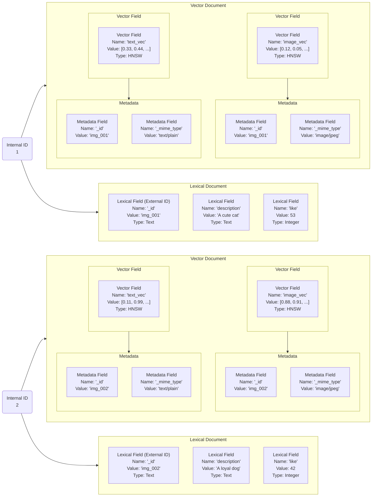

# Unified Vector Search

Vector search (finding "nearest neighbors") enables semantic retrieval where matches are based on meaning rather than exact keywords. Iris provides a **Unified Vector Engine** that combines this semantic search with traditional lexical (keyword) search capabilities.

## Document Structure

With the unified engine, a document can contain both vector fields (for semantic search) and lexical fields (for keyword search/filtering).



### Vector

A mathematical representation of an object (text, image, audio) in a multi-dimensional space.

- **Dimension**: The number of elements in the vector (e.g., 384, 768, 1536).
- **Normalization**: Vectors can be normalized (e.g., to unit length) to optimize distance calculations.

### Vector Field Configuration

Defines how vectors in a specific field are indexed and queried.

- **Distance Metric**: The formula used to calculate "similarity" between vectors.
- **Index Type**: The algorithm used for storage and retrieval (HNSW, IVF, Flat).
- **Quantization**: Compression techniques to reduce memory usage.

## Indexing Process

The vector indexing process transforms raw data or pre-computed vectors into efficient, searchable structures.


1. **Vector Acquisition**: Vectors are either provided directly or generated from text/images using an `Embedder`.
2. **Processing**:
   - **Normalization**: Adjusting vectors to a consistent scale (e.g., unit norm for Cosine similarity).
   - **Quantization**: Optional compression (e.g., Product Quantization) to reduce the memory footprint.
3. **Index Construction**:
   - **HNSW**: Builds a hierarchical graph structure for sub-linear search time.
   - **IVF**: Clusters vectors into partitions to restrict the search space.
4. **Segment Flushing**: Serializes the in-memory structures into immutable files on disk.

## Core Concepts

### Approximate Nearest Neighbor (ANN)

In large-scale vector search, calculating exact distances to every vector is too slow. ANN algorithms provide a high-speed search with a small, controllable loss in accuracy (Recall).

### Index Types

#### Flat Index (Exact Search)

Stores all vectors directly in an array and calculates distances between the query and every vector during search.

- **Implementation**: `FlatIndexWriter`, `FlatVectorIndexReader`
- **Characteristics**: 100% precision (Exact Search), but search speed decreases linearly with data volume.
- **Use Cases**: Small datasets or as a baseline for ANN precision.

#### HNSW (Hierarchical Navigable Small World)

Iris's primary ANN algorithm. It constructs a multi-layered graph where the top layers are sparse (long-distance "express" links) and bottom layers are dense (short-distance local links).

- **Efficiency**: Search time is logarithmic $O(\log N)$.
- **Implementation**: `HnswIndexWriter`, `HnswIndexReader`
- **Parameters**: `m` (links per node) and `ef_construction` control the trade-off between index quality and build speed.

#### IVF (Inverted File Index)

Clusters vectors into $K$ Voronoi cells. During search, only the nearest `n_probe` cells are scanned.

- **Centroids**: Calculated during a `Training` phase using K-Means.
- **Implementation**: `IvfIndexWriter`, `IvfIndexReader`
- **Use Case**: Efficient for extremely large datasets where HNSW memory overhead becomes prohibitive. Works best when combined with PQ quantization.

### Distance Metrics

Iris leverages Rust's SIMD (Single Instruction Multiple Data) instructions to maximize performance for distance calculations.

| Metric | Description | Rust Implementation Class | Features |
| :--- | :--- | :--- | :--- |
| **Cosine** | Measures the angle between vectors. | `DistanceMetric::Cosine` | Ideal for semantic text similarity. |
| **Euclidean** | Measures straight-line distance. | `DistanceMetric::Euclidean` | Suitable for image retrieval and physical proximity. |
| **DotProduct** | Calculates the dot product. | `DistanceMetric::DotProduct` | Extremely fast for pre-normalized vectors. |

### Quantization

To reduce memory usage and improve search speed, Iris supports several quantization methods:

- **Scalar 8-bit (SQ8)**: Maps 32-bit floating-points to 8-bit integers (4x compression).
- **Product Quantization (PQ)**: Decomposes vectors into sub-vectors and performs clustering (16x-64x compression).

## Engine Architecture

### Vector Engine (`VectorEngine`)

The high-level orchestrator that manages multiple vector fields, handles persistence via WAL (Write-Ahead Log), and coordinates aggregated searches across fields.

### Index Components

- **VectorField**: Abstracts individual field implementations (e.g., `InMemoryVectorField`, `SegmentedVectorField`).
- **Index Writers/Readers**: Specific implementations for each algorithm (e.g., `HnswIndexWriter`, `FlatVectorIndexReader`, `IvfIndexReader`).
- **VectorEngineSearcher**: Integrates results from multiple fields based on specified score modes (WeightedSum, MaxSim).

## Index Segment Files

A vector segment consists of several specialized files:

| Extension | Component | Description |
| :--- | :--- | :--- |
| `.hnsw` | HNSW Graph | Adjacency lists for hierarchical navigation. |
| `.vecs` | Raw Vectors | Stored raw floating-point vectors (f32). |
| `.quant` | Codebook | Trained centroids and parameters for quantization. |
| `.idx` | Quantized IDs | Compressed vector representations. |
| `.meta` | Metadata | Segment statistics, dimension, and configuration. |

## Search Process

Finding the nearest neighbors involves navigating the index structure to minimize distance calculations.


1. **Preparation**: The query vector is normalized and/or quantized to match the index format.
2. **Navigation**:
    - In **HNSW**, the search starts at the top layer and descends toward the target vector through graph neighbors.
    - In **IVF**, the nearest cluster centroids are identified, and search is restricted to those cells.
3. **Refinement**: (Optional) If quantization was used, raw vectors may be accessed to re-rank the top candidates for higher precision.

## Query Types

### K-NN Search (K-Nearest Neighbors)

The basic vector search query.

- **Parameters**: `K` (the number of neighbors to return).
- **Recall vs. Speed**: Adjusted via search parameters like `ef_search` for HNSW.

### Filtered Vector Search

Combines vector search with boolean filters. Iris supports pre-filtering using metadata filters (backed by LexicalEngine) to restrict the search space to documents matching specific metadata criteria.

### Hybrid Search

Leverages both Lexical and Vector engines simultaneously. Results are combined using algorithms like **Reciprocal Rank Fusion (RRF)** to produce a single, high-quality ranked list.

#### Fusion Strategies

Results from the vector and lexical searches are combined using fusion strategies.

1. **Weighted Sum**: Scores are normalized and combined using linear weights.
   `FinalScore = (LexicalScore * alpha) + (VectorScore * beta)`

2. **RRF (Reciprocal Rank Fusion)**: Calculates scores based on rank position, robust to different score distributions.
   `Score = Σ_i (1 / (k + rank_i))`

## Search Process for Hybrid Queries


## Code Examples

### 1. Configuring VectorEngine

Example of creating an engine with an embedder and field configurations.

```rust
use std::sync::Arc;
use iris::vector::engine::VectorEngine;
use iris::vector::engine::config::{VectorIndexConfig, VectorFieldConfig, VectorIndexKind};
use iris::vector::core::distance::DistanceMetric;
use iris::embedding::precomputed::PrecomputedEmbedder;
use iris::storage::memory::{MemoryStorage, MemoryStorageConfig};

fn setup_engine() -> iris::error::Result<VectorEngine> {
    let storage = Arc::new(MemoryStorage::new(MemoryStorageConfig::default()));
    
    // Create configuration
    let config = VectorIndexConfig::builder()
        .add_field("title_embedding", 384)? // 384-dimensional field
        .add_field("body_embedding", 384)?
        .default_distance(DistanceMetric::Cosine)
        .build()?;

    let engine = VectorEngine::new(storage, config)?;
    Ok(engine)
}
```

### 2. Adding Documents

Example of indexing a document with vector data.

```rust
use iris::vector::core::document::{DocumentVector, StoredVector};

fn add_document(engine: &VectorEngine) -> iris::error::Result<()> {
    let mut doc = DocumentVector::new();
    
    // Create vector data
    let vector_data = Arc::from(vec![0.1; 384]);
    doc.set_field("title_embedding", StoredVector::new(vector_data));
    
    // Add metadata for filtering and hybrid search
    doc.set_metadata("category", "technology");
    doc.set_metadata("description", "Fast semantic search in Rust");

    // Add document with specific ID
    // Note: index_vectors triggers metadata indexing in the underlying LexicalEngine
    engine.index_vectors("doc_001", doc)?;
    engine.commit()?; // Persist data
    
    Ok(())
}
```

### 3. Executing Vector Search

Example of performing a search using `VectorSearchRequest`.

```rust
use iris::vector::engine::request::{VectorSearchRequest, QueryVector};
use iris::vector::core::document::StoredVector;

fn search(engine: &VectorEngine) -> iris::error::Result<()> {
    // Prepare query vector
    let query_data = Arc::from(vec![0.1; 384]);
    let query_vector = QueryVector {
        vector: StoredVector::new(query_data),
        weight: 1.0,
        fields: None,
    };

    let request = VectorSearchRequest {
        query_vectors: vec![query_vector],
        limit: 10,
        min_score: 0.7,
        ..Default::default()
    };

    let results = engine.search(request)?;
    for hit in results.hits {
        println!("Doc ID: {}, Score: {}", hit.doc_id, hit.score);
    }
    
    Ok(())
}
```

### 4. Filtered Search

Example of a search restricted to a specific category.

```rust
use iris::vector::engine::filter::{VectorFilter, FilterCondition};

fn filtered_search(engine: &VectorEngine) -> iris::error::Result<()> {
    let mut filter = VectorFilter::default();
    filter.document.equals.insert("category".to_string(), "technology".into());

    let request = VectorSearchRequest {
        query_vectors: vec![/* query vector */],
        filter: Some(filter),
        limit: 5,
        ..Default::default()
    };

    let results = engine.search(request)?;
    Ok(())
}
```

### 5. Hybrid Search

Example of combining vector and keyword search.

```rust
use iris::vector::engine::request::{
    VectorSearchRequest, LexicalQuery, MatchQueryOptions, FusionConfig, VectorScoreMode
};

fn hybrid_search(engine: &VectorEngine, query_vector: Vec<f32>) -> iris::error::Result<()> {
    // Prepare query vector
    let q_vec = QueryVector {
        vector: StoredVector::new(Arc::from(query_vector.as_slice())),
        weight: 1.0,
        fields: None,
    };

    // Define Hybrid Query
    let request = VectorSearchRequest {
        query_vectors: vec![q_vec],
        limit: 10,
        // Add Lexical Query (Keyword Search)
        lexical_query: Some(LexicalQuery::Match(MatchQueryOptions {
            field: "description".to_string(),
            query: "fast rust search".to_string(),
            operator: Default::default(),
            boost: 1.0,
        })),
        // Configure Fusion Strategy
        fusion_config: Some(FusionConfig::WeightedSum {
            vector_weight: 0.5,
            lexical_weight: 0.5,
        }),
        score_mode: VectorScoreMode::WeightedSum,
        ..Default::default()
    };

    let results = engine.search(request)?;
    
    for res in results.hits {
        println!("Doc ID: {}, Score: {}", res.doc_id, res.score);
    }
    Ok(())
}
```

## Future Outlook

- **Full Implementation of Product Quantization (PQ)**: Optimizing PQ clustering, currently a placeholder.
- **GPU Acceleration**: Offloading distance calculations to GPUs, in addition to model inference.
- **Disk-ANN Support**: Mechanisms to efficiently search large indexes stored on SSDs when they exceed memory capacity.
