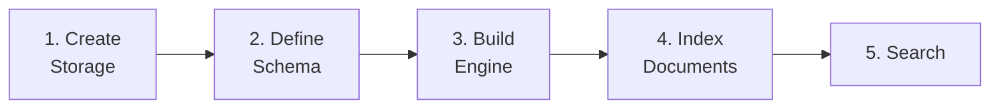

# Getting Started

Welcome to Laurus! This section will help you install the library and run your first search.

## What You Will Build

By the end of this guide, you will have a working search engine that can:

- Index text documents
- Perform keyword (lexical) search
- Perform semantic (vector) search
- Combine both with hybrid search

## Prerequisites

- **Rust** 1.85 or later (edition 2024)
- **Cargo** (included with Rust)
- **Tokio** runtime (Laurus uses async APIs)

## Steps

1. **[Installation](getting_started/installation.md)** — Add Laurus to your project and choose feature flags
2. **[Quick Start](getting_started/quickstart.md)** — Build a complete search engine in 5 steps

## Workflow Overview

Building a search application with Laurus follows a consistent pattern:

| Step | What Happens |
| :--- | :--- |
| **Create Storage** | Choose where data lives — in memory, on disk, or memory-mapped |
| **Define Schema** | Declare fields and their types (text, integer, vector, etc.) |
| **Build Engine** | Attach an analyzer (for text) and an embedder (for vectors) |
| **Index Documents** | Add documents; the engine routes fields to the correct index |
| **Search** | Run lexical, vector, or hybrid queries and get ranked results |
