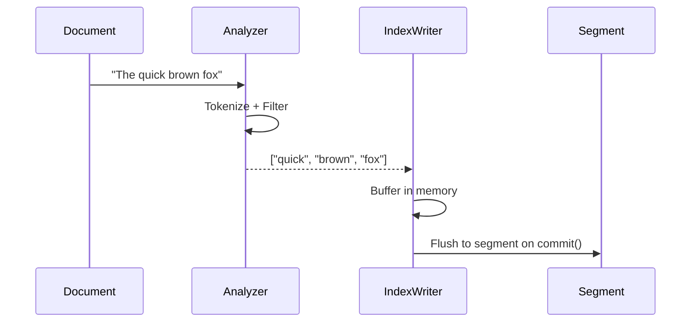
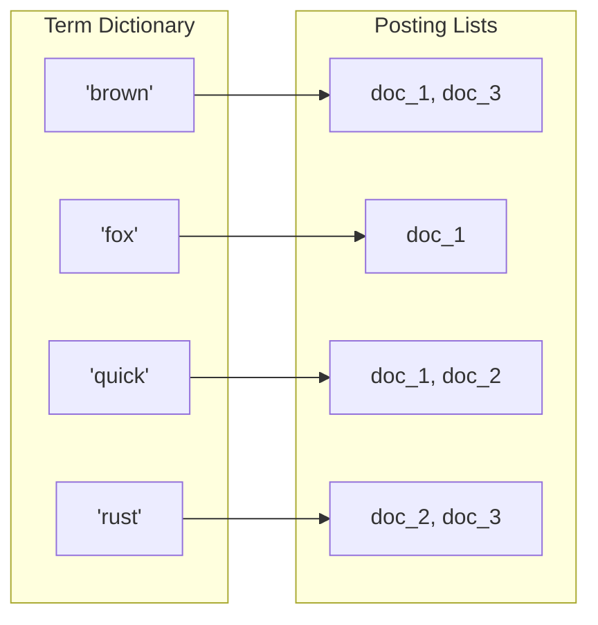
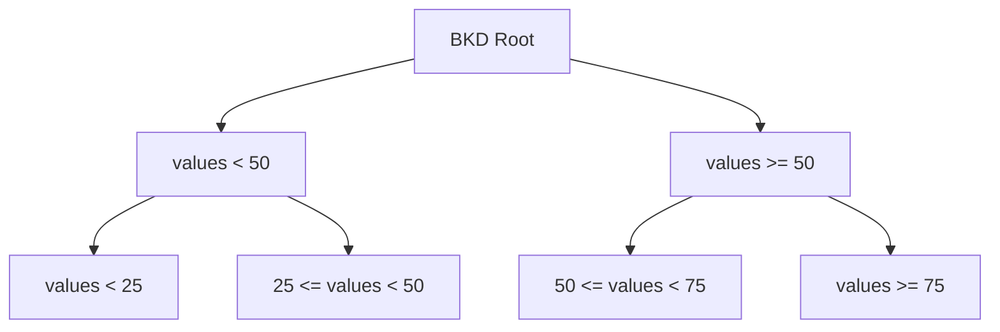
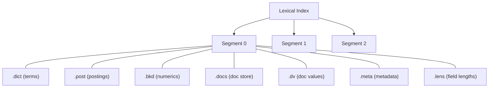

# Lexical Indexing

Lexical indexing powers keyword-based search. When a document's text field is indexed, Iris builds an **inverted index** — a data structure that maps terms to the documents containing them.

## How Lexical Indexing Works



### Step by Step

1. **Analyze**: The text passes through the configured analyzer (tokenizer + filters), producing a stream of normalized terms
2. **Buffer**: Terms are stored in an in-memory write buffer, organized by field
3. **Commit**: On `commit()`, the buffer is flushed to a new segment on storage

## The Inverted Index

An inverted index is essentially a map from terms to document lists:



| Component | Description |
| :--- | :--- |
| **Term Dictionary** | Sorted list of all unique terms in the index; supports fast prefix lookup |
| **Posting Lists** | For each term, a list of document IDs and metadata (term frequency, positions) |
| **Doc Values** | Column-oriented storage for sort/filter operations on numeric and date fields |

### Posting List Contents

Each entry in a posting list contains:

| Field | Description |
| :--- | :--- |
| Document ID | Internal `u64` identifier |
| Term Frequency | How many times the term appears in this document |
| Positions (optional) | Where in the document the term appears (needed for phrase queries) |
| Field Length | Total number of terms in the field (used for BM25 normalization) |

## Numeric and Date Fields

Integer, float, and datetime fields are indexed using a **BKD tree** — a space-partitioning data structure optimized for range queries:



BKD trees allow efficient evaluation of range queries like `price:[10 TO 100]` or `date:[2024-01-01 TO 2024-12-31]`.

## Geo Fields

Geographic fields store latitude/longitude pairs. They are indexed using a spatial data structure that supports:

- **Radius queries**: find all points within N kilometers of a center point
- **Bounding box queries**: find all points within a rectangular area

## Segments

The lexical index is organized into **segments**. Each segment is an immutable, self-contained mini-index:



| File Extension | Contents |
| :--- | :--- |
| `.dict` | Term dictionary (sorted terms + metadata offsets) |
| `.post` | Posting lists (document IDs, term frequencies, positions) |
| `.bkd` | BKD tree data for numeric and date fields |
| `.docs` | Stored field values (the original document content) |
| `.dv` | Doc values for sorting and filtering |
| `.meta` | Segment metadata (doc count, term count, etc.) |
| `.lens` | Field length norms (for BM25 scoring) |

### Segment Lifecycle

1. **Create**: A new segment is created each time `commit()` is called
2. **Search**: All segments are searched in parallel and results are merged
3. **Merge**: Periodically, multiple small segments are merged into larger ones to improve query performance
4. **Delete**: When a document is deleted, its ID is added to a deletion bitmap rather than physically removed (see [Deletions & Compaction](../advanced/deletions.md))

## BM25 Scoring

Iris uses the BM25 algorithm to score lexical search results. BM25 considers:

- **Term Frequency (TF)**: how often the term appears in the document (more = better, with diminishing returns)
- **Inverse Document Frequency (IDF)**: how rare the term is across all documents (rarer = more important)
- **Field Length Normalization**: shorter fields are boosted relative to longer ones

The formula:

```
score(q, d) = IDF(q) * (TF(q, d) * (k1 + 1)) / (TF(q, d) + k1 * (1 - b + b * |d| / avgdl))
```

Where `k1 = 1.2` and `b = 0.75` are the default tuning parameters.

## SIMD Optimization

Posting list intersection and scoring operations leverage SIMD (Single Instruction, Multiple Data) instructions when available, providing significant speedups for large indexes.

## Code Example

```rust
use std::sync::Arc;
use iris::{Document, Engine, Schema};
use iris::lexical::TextOption;
use iris::lexical::core::field::IntegerOption;
use iris::storage::memory::MemoryStorage;

#[tokio::main]
async fn main() -> iris::Result<()> {
    let storage = Arc::new(MemoryStorage::new(Default::default()));
    let schema = Schema::builder()
        .add_text_field("title", TextOption::default())
        .add_text_field("body", TextOption::default())
        .add_integer_field("year", IntegerOption::default())
        .build();

    let engine = Engine::builder(storage, schema).build().await?;

    // Index documents
    engine.add_document("doc-1", Document::builder()
        .add_text("title", "Rust Programming")
        .add_text("body", "Rust is a systems programming language.")
        .add_integer("year", 2024)
        .build()
    ).await?;

    // Commit to flush segments to storage
    engine.commit().await?;

    Ok(())
}
```

## Next Steps

- Learn how vector indexes work: [Vector Indexing](vector_indexing.md)
- Run queries against the lexical index: [Lexical Search](../search/lexical_search.md)
