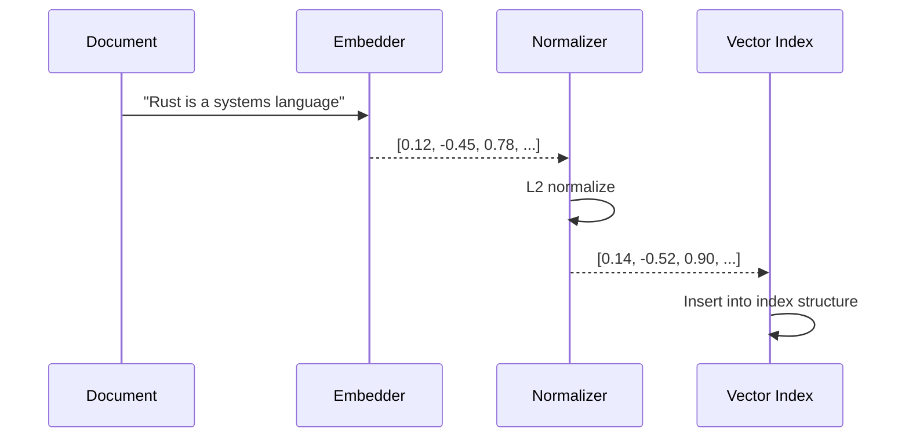
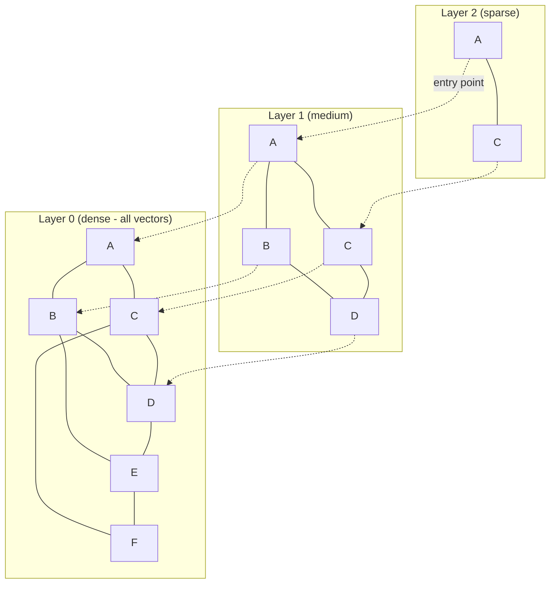
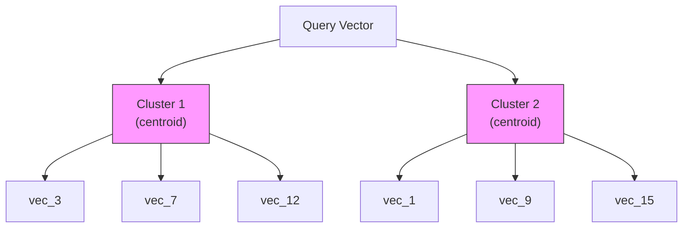

# Vector Indexing

Vector indexing powers similarity-based search. When a document's vector field is indexed, Iris stores the embedding vector in a specialized index structure that enables fast approximate nearest neighbor (ANN) retrieval.

## How Vector Indexing Works



### Step by Step

1. **Embed**: The text (or image) is converted to a vector by the configured embedder
2. **Normalize**: The vector is L2-normalized (for cosine similarity)
3. **Index**: The vector is inserted into the configured index structure (Flat, HNSW, or IVF)
4. **Commit**: On `commit()`, the index is flushed to persistent storage

## Index Types

Iris supports three vector index types, each with different performance characteristics:

### Comparison

| Property | Flat | HNSW | IVF |
| :--- | :--- | :--- | :--- |
| **Accuracy** | 100% (exact) | ~95-99% (approximate) | ~90-98% (approximate) |
| **Search speed** | O(n) linear scan | O(log n) graph walk | O(n/k) cluster scan |
| **Memory usage** | Low | Higher (graph edges) | Moderate (centroids) |
| **Index build time** | Fast | Moderate | Slower (clustering) |
| **Best for** | < 10K vectors | 10K - 10M vectors | > 1M vectors |

### Flat Index

The simplest index. Compares the query vector against every stored vector (brute-force).

```rust
use iris::vector::FlatOption;
use iris::vector::core::distance::DistanceMetric;

let opt = FlatOption {
    dimension: 384,
    distance: DistanceMetric::Cosine,
    ..Default::default()
};
```

- **Pros**: 100% recall (exact results), simple, low memory
- **Cons**: Slow for large datasets (linear scan)
- **Use when**: You have fewer than ~10,000 vectors, or you need exact results

### HNSW Index

**Hierarchical Navigable Small World** graph. The default and most commonly used index type.



The HNSW algorithm searches from the top (sparse) layer down to the bottom (dense) layer, narrowing the search space at each level.

```rust
use iris::vector::HnswOption;
use iris::vector::core::distance::DistanceMetric;

let opt = HnswOption {
    dimension: 384,
    distance: DistanceMetric::Cosine,
    m: 16,                  // max connections per node per layer
    ef_construction: 200,   // search width during index building
    ..Default::default()
};
```

#### HNSW Parameters

| Parameter | Default | Description | Impact |
| :--- | :--- | :--- | :--- |
| `m` | 16 | Max bi-directional connections per layer | Higher = better recall, more memory |
| `ef_construction` | 200 | Search width during index building | Higher = better recall, slower build |
| `dimension` | 128 | Vector dimensions | Must match embedder output |
| `distance` | Cosine | Distance metric | See Distance Metrics below |

**Tuning tips:**

- Increase `m` (e.g., 32 or 64) for higher recall at the cost of memory
- Increase `ef_construction` (e.g., 400) for better index quality at the cost of build time
- At search time, the `ef_search` parameter (set in the search request) controls the search width

### IVF Index

**Inverted File Index**. Partitions vectors into clusters, then only searches relevant clusters.



```rust
use iris::vector::IvfOption;
use iris::vector::core::distance::DistanceMetric;

let opt = IvfOption {
    dimension: 384,
    distance: DistanceMetric::Cosine,
    n_clusters: 100,   // number of clusters
    n_probe: 10,       // clusters to search at query time
    ..Default::default()
};
```

#### IVF Parameters

| Parameter | Default | Description | Impact |
| :--- | :--- | :--- | :--- |
| `n_clusters` | 100 | Number of Voronoi cells | More clusters = faster search, lower recall |
| `n_probe` | 1 | Clusters to search at query time | Higher = better recall, slower search |
| `dimension` | (required) | Vector dimensions | Must match embedder output |
| `distance` | Cosine | Distance metric | See Distance Metrics below |

**Tuning tips:**

- Set `n_clusters` to roughly `sqrt(n)` where `n` is the number of vectors
- Set `n_probe` to 5-20% of `n_clusters` for a good recall/speed trade-off
- IVF requires a training phase — initial indexing may be slower

## Distance Metrics

| Metric | Description | Range | Best For |
| :--- | :--- | :--- | :--- |
| `Cosine` | 1 - cosine similarity | [0, 2] | Text embeddings (most common) |
| `Euclidean` | L2 distance | [0, +inf) | Spatial data |
| `Manhattan` | L1 distance | [0, +inf) | Feature vectors |
| `DotProduct` | Negative inner product | (-inf, +inf) | Pre-normalized vectors |
| `Angular` | Angular distance | [0, pi] | Directional similarity |

```rust
use iris::vector::core::distance::DistanceMetric;

let metric = DistanceMetric::Cosine;      // Default for text
let metric = DistanceMetric::Euclidean;    // For spatial data
let metric = DistanceMetric::Manhattan;    // L1 distance
let metric = DistanceMetric::DotProduct;   // For pre-normalized vectors
let metric = DistanceMetric::Angular;      // Angular distance
```

> **Note:** For cosine similarity, vectors are automatically L2-normalized before indexing. Lower distance = more similar.

## Quantization

Quantization reduces memory usage by compressing vectors at the cost of some accuracy:

| Method | Enum Variant | Description | Memory Reduction |
| :--- | :--- | :--- | :--- |
| **Scalar 8-bit** | `Scalar8Bit` | Scalar quantization to 8-bit integers | ~4x |
| **Product Quantization** | `ProductQuantization { subvector_count }` | Splits vectors into sub-vectors and quantizes each | ~16-64x |

```rust
use iris::vector::HnswOption;
use iris::vector::core::quantization::QuantizationMethod;

let opt = HnswOption {
    dimension: 384,
    quantizer: Some(QuantizationMethod::Scalar8Bit),
    ..Default::default()
};
```

## Segment Files

Each vector index type stores its data in a single segment file:

| Index Type | File Extension | Contents |
| :--- | :--- | :--- |
| HNSW | `.hnsw` | Graph structure, vectors, and metadata |
| Flat | `.flat` | Raw vectors and metadata |
| IVF | `.ivf` | Cluster centroids, assigned vectors, and metadata |

## Code Example

```rust
use std::sync::Arc;
use iris::{Document, Engine, Schema};
use iris::lexical::TextOption;
use iris::vector::HnswOption;
use iris::vector::core::distance::DistanceMetric;
use iris::storage::memory::MemoryStorage;

#[tokio::main]
async fn main() -> iris::Result<()> {
    let storage = Arc::new(MemoryStorage::new(Default::default()));
    let schema = Schema::builder()
        .add_text_field("title", TextOption::default())
        .add_hnsw_field("embedding", HnswOption {
            dimension: 384,
            distance: DistanceMetric::Cosine,
            m: 16,
            ef_construction: 200,
            ..Default::default()
        })
        .build();

    // With an embedder, text in vector fields is automatically embedded
    let engine = Engine::builder(storage, schema)
        .embedder(my_embedder)
        .build()
        .await?;

    // Add text to the vector field — it will be embedded automatically
    engine.add_document("doc-1", Document::builder()
        .add_text("title", "Rust Programming")
        .add_text("embedding", "Rust is a systems programming language.")
        .build()
    ).await?;

    engine.commit().await?;

    Ok(())
}
```

## Next Steps

- Search the vector index: [Vector Search](../search/vector_search.md)
- Combine with lexical search: [Hybrid Search](../search/hybrid_search.md)
