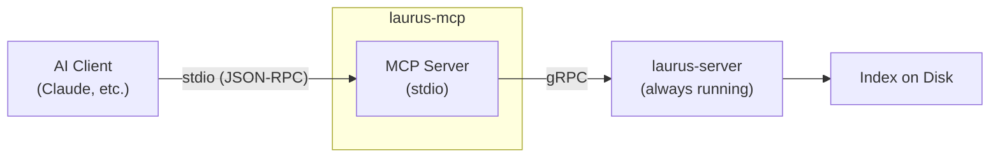

# MCP Server Overview

The `laurus-mcp` crate provides a [Model Context Protocol (MCP)](https://modelcontextprotocol.io/) server for the Laurus search engine. It acts as a gRPC client to a running `laurus-server` instance, enabling AI assistants such as Claude to index documents and perform searches through the standard MCP stdio transport.

## Features

- **MCP stdio transport** — Runs as a subprocess; communicates with the AI client via stdin/stdout
- **gRPC client** — Proxies all tool calls to a running `laurus-server` instance
- **All laurus search modes** — Lexical (BM25), vector (HNSW/Flat/IVF), and hybrid search
- **Dynamic connection** — Connect to any laurus-server endpoint via the `connect` tool
- **Document lifecycle** — Add, update, delete, and retrieve documents through MCP tools

## Architecture



The MCP server runs as a child process launched by the AI client. It proxies all
tool calls to a `laurus-server` instance via gRPC. The `laurus-server` must be
started separately before (or after) the MCP server.

## Quick Start

```bash
# Step 1: Start the laurus-server
laurus serve --grpc-port 50051

# Step 2: Configure Claude Code and start the MCP server
claude mcp add laurus laurus mcp --endpoint http://localhost:50051
```

Or with a manual configuration:

```json
{
  "mcpServers": {
    "laurus": {
      "command": "laurus",
      "args": ["mcp", "--endpoint", "http://localhost:50051"]
    }
  }
}
```

## Sections

- [Getting Started](laurus-mcp/getting_started.md) — Installation, configuration, and first steps
- [Tools Reference](laurus-mcp/tools.md) — Full reference for all MCP tools
