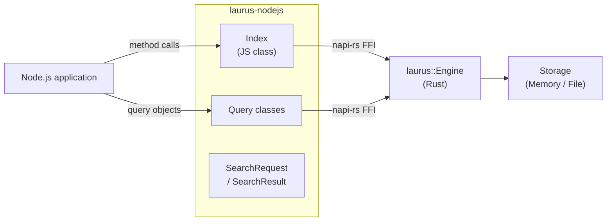

# Node.js Binding Overview

The `laurus-nodejs` package provides Node.js/TypeScript bindings
for the Laurus search engine. It is built as a native addon using
[napi-rs](https://napi.rs), giving Node.js programs direct access
to Laurus's lexical, vector, and hybrid search capabilities with
near-native performance.

## Features

- **Lexical Search** -- Full-text search powered by an inverted
  index with BM25 scoring
- **Vector Search** -- Approximate nearest neighbor (ANN) search
  using Flat, HNSW, or IVF indexes
- **Hybrid Search** -- Combine lexical and vector results with
  fusion algorithms (RRF, WeightedSum)
- **Rich Query DSL** -- Term, Phrase, Fuzzy, Wildcard,
  NumericRange, Geo, Boolean, Span queries
- **Text Analysis** -- Tokenizers, filters, stemmers,
  and synonym expansion
- **Flexible Storage** -- In-memory (ephemeral) or file-based
  (persistent) indexes
- **TypeScript Types** -- Auto-generated `.d.ts` type definitions
- **Async API** -- All I/O operations return Promises

## Architecture



The JavaScript classes are thin wrappers around the Rust engine.
Each call crosses the napi-rs FFI boundary once; the Rust engine
then executes the operation entirely in native code.

All I/O methods (`search`, `commit`, `putDocument`, etc.) are
**async** and return Promises. They run on napi-rs's built-in
tokio runtime and return results to the Node.js event loop
without blocking it. Schema construction, query creation, and
`stats()` are synchronous since they involve no I/O.

> **Note:** The Python binding (`laurus-python`) exposes the
> same Rust engine methods as **synchronous** functions because
> Python's GIL (Global Interpreter Lock) makes an async API
> cumbersome. Node.js has no such constraint, so the async Rust
> engine is exposed directly as Promises.

## Quick Start

```javascript
import { Index, Schema } from "laurus-nodejs";

// Create an in-memory index
const schema = new Schema();
schema.addTextField("name");
schema.addTextField("description");
schema.setDefaultFields(["name", "description"]);

const index = await Index.create(null, schema);

// Index documents
await index.putDocument("express", {
  name: "Express",
  description: "Fast minimalist web framework for Node.js.",
});
await index.putDocument("fastify", {
  name: "Fastify",
  description: "Fast and low overhead web framework.",
});
await index.commit();

// Search
const results = await index.search("framework", 5);
for (const r of results) {
  console.log(`[${r.id}] score=${r.score.toFixed(4)}  ${r.document.name}`);
}
```

## Sections

- [Installation](laurus-nodejs/installation.md) --
  How to install the package
- [Quick Start](laurus-nodejs/quickstart.md) --
  Hands-on introduction with examples
- [API Reference](laurus-nodejs/api_reference.md) --
  Complete class and method reference
- [Development](laurus-nodejs/development.md) --
  Building from source, testing, and project layout
