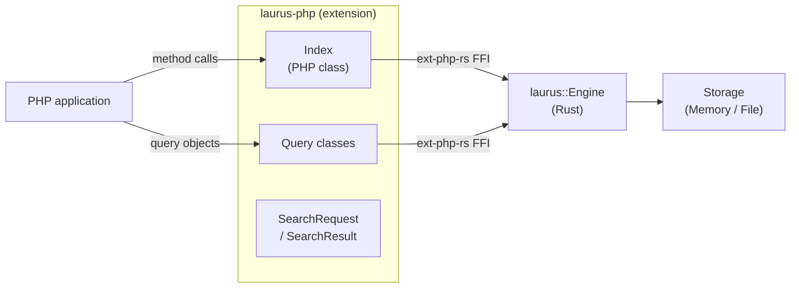

# PHP Binding Overview

The `laurus` PHP extension provides PHP bindings for the Laurus search engine. It is built as a native Rust extension using [ext-php-rs](https://github.com/davidcole1340/ext-php-rs), giving PHP programs direct access to Laurus's lexical, vector, and hybrid search capabilities with near-native performance.

## Features

- **Lexical Search** -- Full-text search powered by an inverted index with BM25 scoring
- **Vector Search** -- Approximate nearest neighbor (ANN) search using Flat, HNSW, or IVF indexes
- **Hybrid Search** -- Combine lexical and vector results with fusion algorithms (RRF, WeightedSum)
- **Rich Query DSL** -- Term, Phrase, Fuzzy, Wildcard, NumericRange, Geo, Boolean, Span queries
- **Text Analysis** -- Tokenizers, filters, stemmers, and synonym expansion
- **Flexible Storage** -- In-memory (ephemeral) or file-based (persistent) indexes
- **Idiomatic PHP API** -- Clean, intuitive PHP classes under the `Laurus\` namespace

## Architecture



The PHP classes are thin wrappers around the Rust engine.
Each call crosses the ext-php-rs FFI boundary once; the Rust engine
then executes the operation entirely in native code.

Although the Rust engine uses async I/O internally, all PHP
methods are exposed as **synchronous** functions. Each method
calls `tokio::Runtime::block_on()` under the hood to bridge
async Rust to synchronous PHP.

## Quick Start

```php
<?php

use Laurus\Index;

// Create an in-memory index
$index = new Index();

// Index documents
$index->putDocument("doc1", ["title" => "Introduction to Rust", "body" => "Systems programming language."]);
$index->putDocument("doc2", ["title" => "PHP for Web Development", "body" => "Web applications with PHP."]);
$index->commit();

// Search
$results = $index->search("title:rust", 5);
foreach ($results as $r) {
    printf("[%s] score=%.4f  %s\n", $r->getId(), $r->getScore(), $r->getDocument()["title"]);
}
```

## Sections

- [Installation](laurus-php/installation.md) -- How to install the extension
- [Quick Start](laurus-php/quickstart.md) -- Hands-on introduction with examples
- [API Reference](laurus-php/api_reference.md) -- Complete class and method reference
- [Development](laurus-php/development.md) -- Building from source and running tests
