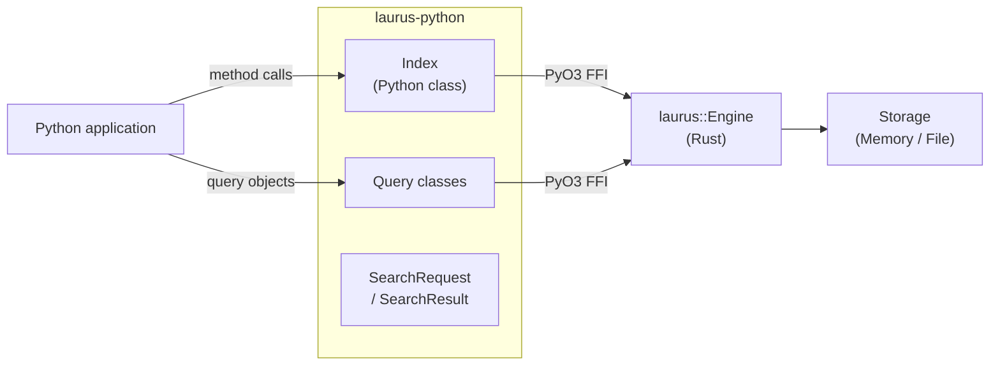

# Python Binding Overview

The `laurus-python` package provides Python bindings for the Laurus search engine. It is built as a native Rust extension using [PyO3](https://github.com/PyO3/pyo3) and [Maturin](https://github.com/PyO3/maturin), giving Python programs direct access to Laurus's lexical, vector, and hybrid search capabilities with near-native performance.

## Features

- **Lexical Search** -- Full-text search powered by an inverted index with BM25 scoring
- **Vector Search** -- Approximate nearest neighbor (ANN) search using Flat, HNSW, or IVF indexes
- **Hybrid Search** -- Combine lexical and vector results with fusion algorithms (RRF, WeightedSum)
- **Rich Query DSL** -- Term, Phrase, Fuzzy, Wildcard, NumericRange, Geo, Boolean, Span queries
- **Text Analysis** -- Tokenizers, filters, stemmers, and synonym expansion
- **Flexible Storage** -- In-memory (ephemeral) or file-based (persistent) indexes
- **Pythonic API** -- Clean, intuitive Python classes with full type information

## Architecture



The Python classes are thin wrappers around the Rust engine. Each call crosses the PyO3 FFI boundary once; the Rust engine then executes the query entirely in native code.

## Quick Start

```python
import laurus

# Create an in-memory index
index = laurus.Index()

# Index documents
index.put_document("doc1", {"title": "Introduction to Rust", "body": "Systems programming language."})
index.put_document("doc2", {"title": "Python for Data Science", "body": "Data analysis with Python."})
index.commit()

# Search
results = index.search("title:rust", limit=5)
for r in results:
    print(f"[{r.id}] score={r.score:.4f}  {r.document['title']}")
```

## Sections

- [Installation](laurus-python/installation.md) -- How to install the package
- [Quick Start](laurus-python/quickstart.md) -- Hands-on introduction with examples
- [API Reference](laurus-python/api_reference.md) -- Complete class and method reference
