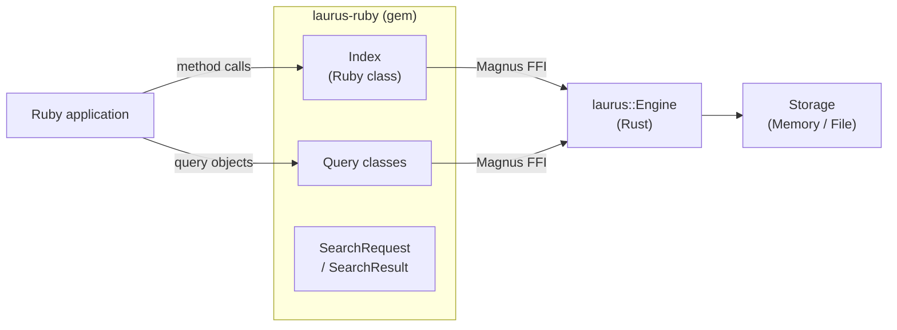

# Ruby Binding Overview

The `laurus` gem provides Ruby bindings for the Laurus search engine. It is built as a native Rust extension using [Magnus](https://github.com/matsadler/magnus) and [rb_sys](https://github.com/oxidize-rb/rb-sys), giving Ruby programs direct access to Laurus's lexical, vector, and hybrid search capabilities with near-native performance.

## Features

- **Lexical Search** -- Full-text search powered by an inverted index with BM25 scoring
- **Vector Search** -- Approximate nearest neighbor (ANN) search using Flat, HNSW, or IVF indexes
- **Hybrid Search** -- Combine lexical and vector results with fusion algorithms (RRF, WeightedSum)
- **Rich Query DSL** -- Term, Phrase, Fuzzy, Wildcard, NumericRange, Geo, Boolean, Span queries
- **Text Analysis** -- Tokenizers, filters, stemmers, and synonym expansion
- **Flexible Storage** -- In-memory (ephemeral) or file-based (persistent) indexes
- **Idiomatic Ruby API** -- Clean, intuitive Ruby classes under the `Laurus::` namespace

## Architecture



The Ruby classes are thin wrappers around the Rust engine.
Each call crosses the Magnus FFI boundary once; the Rust engine
then executes the operation entirely in native code.

Although the Rust engine uses async I/O internally, all Ruby
methods are exposed as **synchronous** functions. Each method
calls `tokio::Runtime::block_on()` under the hood to bridge
async Rust to synchronous Ruby.

## Quick Start

```ruby
require "laurus"

# Create an in-memory index
index = Laurus::Index.new

# Index documents
index.put_document("doc1", { "title" => "Introduction to Rust", "body" => "Systems programming language." })
index.put_document("doc2", { "title" => "Ruby for Web Development", "body" => "Web applications with Ruby." })
index.commit

# Search
results = index.search("title:rust", limit: 5)
results.each do |r|
  puts "[#{r.id}] score=#{format('%.4f', r.score)}  #{r.document['title']}"
end
```

## Sections

- [Installation](laurus-ruby/installation.md) -- How to install the gem
- [Quick Start](laurus-ruby/quickstart.md) -- Hands-on introduction with examples
- [API Reference](laurus-ruby/api_reference.md) -- Complete class and method reference
- [Development](laurus-ruby/development.md) -- Building from source and running tests
