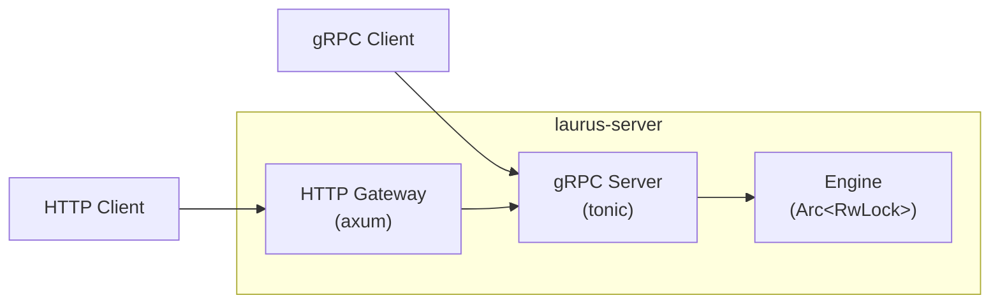

# Server Overview

The `laurus-server` crate provides a gRPC server with an optional HTTP/JSON gateway for the Laurus search engine. It keeps the engine resident in memory, eliminating per-command startup overhead.

## Features

- **Persistent engine** -- The index stays open across requests; no WAL replay on every call
- **Full gRPC API** -- Index management, document CRUD, commit, and search (unary + streaming)
- **HTTP Gateway** -- Optional HTTP/JSON gateway alongside gRPC for REST-style access
- **Health checking** -- Standard health check endpoint for load balancers and orchestrators
- **Graceful shutdown** -- Pending changes are committed automatically on Ctrl+C / SIGINT
- **TOML configuration** -- Optional config file with CLI and environment variable overrides

## Architecture



The gRPC server always runs. The HTTP Gateway is optional and proxies HTTP/JSON requests to the gRPC server internally.

## Quick Start

```bash
# Start with default settings (gRPC on port 50051)
laurus serve

# Start with HTTP Gateway
laurus serve --http-port 8080

# Start with a configuration file
laurus serve --config config.toml
```

## Sections

- [Getting Started](laurus-server/getting_started.md) -- Startup options and first steps
- [Configuration](laurus-server/configuration.md) -- TOML configuration, environment variables, and priority
- [gRPC API Reference](laurus-server/grpc_api.md) -- Full API documentation for all services and RPCs
- [HTTP Gateway](laurus-server/http_gateway.md) -- HTTP/JSON endpoint reference
